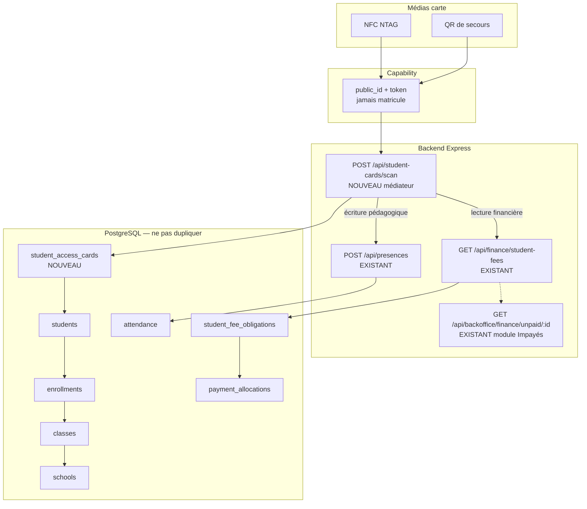

# AUDIT-CARTE-01 — Carte Élève / Présence NFC-QR / Contrôle Impayés

**Type :** audit d’architecture (caractérisation) — **aucune implémentation**  
**Statut :** Audit **OUVERT** — NO-GO implémentation jusqu’à décision CTO  
**Base :** `develop` @ `ae9fa504` (`fix(authz): P1-12 deny school domain for ALL_PRIVILEGES-only (#855)`)  
**Date :** 2026-10-01  
**Contraintes honorées :** aucun DDL request-time, aucune migration exécutée, aucun merge, aucun code métier.

---

## 0. Nature du lot

| Champ | Valeur |
|--------|--------|
| ID | **AUDIT-CARTE-01** |
| Nature | **Audit uniquement** |
| Implémentation métier | **INTERDITE** dans ce lot |
| Migration / DDL | **INTERDIT** |
| PR Ready / merge | **INTERDIT** |
| Livrable | Matrice, flux cible, schéma, découpage PR **futur** |

### Méthode

1. Cartographier Backend, PostgreSQL, Web et Mobile sur Students, Enrollments, Classes, Attendance, Payments/Fees, QR/NFC, permissions.  
2. Identifier les modèles et endpoints **canoniques** déjà existants.  
3. Vérifier ce qui peut être réutilisé **sans duplication**.  
4. Classer chaque brique : **EXISTANT / RÉUTILISABLE / MANQUANT / À MODIFIER / RISQUE**.  
5. Proposer le **minimum** de tables / colonnes / endpoints pour un futur chantier, sans l’exécuter.

Il n’y a **pas de couche Prisma**. L’autorité de persistance est **PostgreSQL** (`backend/db/schema.sql` + migrations) via `postgresRepository` et dépôts spécialisés. HTTP = monolithe Express `backend/server.js`.

---

## 1. Verdict exécutif

Somafrik **peut** porter une carte physique élève **sans recréer** Élèves, Inscriptions, Classes, Présences ni Finance. Le chantier est un **nouveau médiateur d’identification** (`cardToken` opaque → élève), pas un nouveau métier.

| Question | Réponse d’audit |
|----------|-----------------|
| Une carte / un `cardToken` existe-t-il ? | **Non.** Aucune table, colonne, route ou écran. |
| NFC / scan QR produit existe-t-il ? | **Non.** NFC Android est **explicitement bloqué**. Aucun scanner QR mobile. |
| Le QR actuel peut-il servir de carte ? | **Non pour le contrôle d’accès.** QR bulletin legacy = JSON statique (matricule + notes). QR bulletin v2 = capability révocable, **réutilisable comme pattern crypto**, pas comme identifiant élève. |
| Le pointage quotidien existe-t-il ? | **Oui.** `POST /api/presences` + `UNIQUE (school_id, student_id, attendance_date)`. |
| L’impayé existe-t-il ? | **Oui, avec deux définitions.** Dette ouverte ≠ module Impayés. |
| L’impayé bloque-t-il la présence ? | **Non.** Aucun gate finance sur l’appel. |
| Faut-il écrire `IMPAYÉ=true` sur la puce ? | **Non — interdit.** La situation change ; elle doit rester calculée serveur. |
| NTAG + QR statique suffisent-ils pour un contrôle d’accès fort ? | **Non.** Suffisant pour une **identification scolaire** (qui prétend être cet élève). Insuffisant pour une **authentification anti-clonage**. |

**Recommandation d’architecture (pas encore une ADR acceptée) :**

1. NFC = canal principal, QR = secours. Les deux transportent le **même** capability opaque.  
2. Scan **authentifié staff**, jamais public.  
3. Présence et finance sont **deux lectures / écritures indépendantes** après résolution `Carte → Élève → inscription active → classe → établissement`.  
4. Impayé **informatif par défaut** : la dette ne corrompt jamais l’appel.  
5. V1 **online-only** pour le scan (la finance n’a pas de vérité hors ligne).  
6. Réutiliser le contrat crypto des bulletins (token ≥128 bits, SHA-256, révocation) — **ne pas** réutiliser le JSON bulletin legacy.

---

## 2. Périmètre visuel de la carte (futur)

| Zone visuelle | Source actuelle | Verdict |
|---------------|-----------------|---------|
| Photo élève | Colonne `students.photo_url` (vide à la création) ; type document `PHOTO` (dossier admin, pas portrait API) | **MANQUANT** pipeline upload / affichage / impression |
| Nom / prénom | `students.first_name`, `students.last_name` | **RÉUTILISABLE** — impression optionnelle (audit UX ultérieur) |
| Matricule Somafrik | `students.student_code` (= `login_code` = `identity_code`) | **RÉUTILISABLE** en clair sur le recto ; **interdit** comme secret NFC/QR |
| Classe actuelle | `enrollments.class_id` via C18 | **RÉUTILISABLE** à l’impression, **stale** après transfert ; le scan doit **re-résoudre** |
| Code QR | Aucun QR carte | **MANQUANT** — payload = capability, pas le matricule |
| Identifiant technique de carte | Inexistant | **MANQUANT** — `public_id` + `token_hash` |

Le QR **ne doit pas** être le seul mécanisme. NFC et QR sont deux **médias** du même `cardToken`.

---

## 3. Flux cible (canonique)

```
Scan NFC | QR de secours
        │
        ▼
  cardToken opaque (public_id + secret)
        │  staff JWT + school scope
        ▼
  Lookup hash constant-time
        │
        ├─ carte absente / révoquée / perdue / remplacée → 404/409, aucun pointage
        │
        ▼
  students (school_id, student_id)
        │
        ▼
  enrollment active (année courante, statut roster)
        │
        ├─ pas d’inscription active / classe absente → 409, aucun pointage
        │
        ▼
  classes + schools
        │
        ├──────────────┐
        ▼              ▼
   PRÉSENCE         FINANCE
   (indépendant)    (indépendant)
        │              │
        ▼              ▼
 POST /api/presences   GET student-fees
 upsert jour           projection live
 Présent | Retard      À jour | Partiel |
                       Échéance impayée |
                       Situation à vérifier
```

**Règle d’or :** le média (NFC/QR) ne transporte **ni dette, ni montant, ni téléphone parent, ni statut pédagogique**. Uniquement un jeton opaque et révocable.

---

## 4. Schéma d’architecture cible



Le médiateur `scan` **orchestre**. Il n’invente pas un second référentiel élèves, un second appel, ni un second solde.

---

## 5. Cartographie de l’existant

### 5.1 Élèves / inscriptions / classes

| Brique | Canonique | Preuve |
|--------|-----------|--------|
| Table `students` | Oui | `backend/db/schema.sql` — `student_code UNIQUE` global, `school_id`, `photo_url`, `parent_phone`, `parent_email` |
| Table `enrollments` | Oui | `UNIQUE (student_id, academic_year_id)` ; C18 : `PRE_REGISTERED` → `APPROVED` → `ENROLLED` ; terminaux `TRANSFERRED` / `CLOSED` |
| Table `classes` | Oui | `school_id` + `academic_year_id` ; `class_code UNIQUE` |
| Matricule | Oui | `student_code` = `login_code` = `identity_code` ; trigger `somafrik_assign_permanent_student_identity` (`backend/db/studentGeneralIdentityPg.js`) |
| Photo portrait | Colonne seulement | INSERT force `photo_url = ''` ; PATCH identité **ne touche pas** la photo |
| Carte / badge / NFC UID | **Absent** | Aucune occurrence produit |

**Inscription « active » — trois lectures non identiques :**

| Contexte | Règle | Fichier |
|----------|--------|---------|
| Roster classe | `lower(status) IN ('active','enrolled')` | `ROSTER_ENROLLMENT_SQL` — `studentEnrollmentC18.js` |
| Fiche / annuaire | + `approved` | `CURRENT_ENROLLMENT_SQL` — `classStudentsRepository.js` |
| Mobile L1 | `DISTINCT ON (student_id)` parmi roster, `updated_at DESC` | `classStudentsRepository.js` / `mobileSyncStudents.js` |
| Web fiche | `selectCurrentStudentEnrollment` (année + `APPROVED`/`ENROLLED`/`SUSPENDED`) | `web/src/lib/studentEnrollmentSelection.ts` |

**Écart à résoudre avant carte :** le scan doit choisir **une** règle. Recommandation : **roster année courante** (`is_current` + `ROSTER_ENROLLMENT_SQL` + `class_id IS NOT NULL`), identique à l’autorité de `POST /api/presences` (`activeEnrollmentMatchesRequestedClass`).

**Changement de classe :** `POST /api/students/:id/enrollments/:enrollmentId/assign-class` met à jour **la même** ligne d’année (`UNIQUE student_id, academic_year_id`). La carte imprimée devient stale ; le token **ne doit pas** encoder la classe.

**Multi-établissement :** un élève a **un** `school_id`. Un transfert **clôt** (`TRANSFERRED`) ; il ne déplace pas la ligne. La carte source doit être **révoquée**. Le scope API vient de `users.school_id` → `schools.login_code` (`enrollmentSchoolScope.js`), jamais du JWT seul.

**Endpoints élèves canoniques :**

| Méthode | Route | Rôle |
|---------|--------|------|
| GET | `/api/students` | Annuaire (expose `parentPhone`) |
| GET | `/api/students/:id` | Fiche (matricule ou UUID) |
| GET | `/api/students/:id/enrollments` | Historique C18 |
| POST | `.../assign-class`, `.../transfer`, `.../close` | Machine C18 |
| GET | `/api/classes/:classCode/students` | Roster |
| POST | `/api/classes/:classCode/students` | Création + inscription |

### 5.2 Présences

| Brique | Canonique | Preuve |
|--------|-----------|--------|
| Table | `attendance` | `UNIQUE (school_id, student_id, attendance_date)` — grain **jour**, pas séance |
| Statuts | `present` / `late` / `absent` / `excused` | `toAttendanceStatus` / `fromAttendanceStatus` — Présent, Retard, Absent, Justifié |
| Écriture | `POST /api/presences` | `withIdempotency` + `upsertAttendance` `ON CONFLICT DO UPDATE` |
| Lecture | `GET /api/presences`, `GET /api/students/:id/presences` | RBAC `Présences:READ` |
| Planning | **Non lié** | Aucune inférence Retard depuis `course_schedules` |
| `hour` client | Envoyé, **non persisté** | Audit D3.5 |

**Double pointage aujourd’hui :**

1. Contrainte UNIQUE PostgreSQL — un second scan **met à jour** la ligne du jour.  
2. Idempotency HTTP (`Idempotency-Key`).  
3. Outbox mobile `presenceIntentionId(classId, date)`.

Ce n’est **pas** une interdiction de rescanner : c’est une **fusion**. Un scan NFC puis un QR le même jour = **un** enregistrement. Un changement de statut (Absent → Présent) **écrase**. Les notifications parents ne se déclenchent que lors d’une **transition vers** `absent` / `late`.

**Autorisation d’écriture — point bloquant pour un portail / kiosque :**

- Enseignant : `teacher_assignments` **active** sur la classe.  
- Admin / Préfet / Secrétaire : `teacherId` **explicite** d’un enseignant affecté, sinon `409 ATTENDANCE_TEACHER_UNRESOLVED`.  
- `created_by` existe au schéma mais **n’est pas écrit** sur l’INSERT actuel.

Un lecteur « bête » ou un vigile **ne peut pas** pointer avec le contrat actuel sans JWT staff + enseignant pédagogique. C’est le principal écart fonctionnel du pointage carte.

**Hors ligne :** l’outbox mobile couvre `presences`. Le sync L1 (`/api/mobile-sync/l1/*`) **n’inclut pas** les présences. V1 scan carte : **online-only** recommandé.

### 5.3 Finance / impayés — deux définitions

Il n’existe **pas** de table `Invoice`, `Installment` ou `Debt`. Les échéances sont des **lignes** `student_fee_obligations` (`period_key`, `due_date`).

**Formule de solde (autorité) :**

```
balance = max(0, amountDue − paidAmount − exemption)
```

`paidAmount` cible = Σ `payment_allocations` actives. `discount` est hors formule V1.

**Statut d’obligation** (`obligationStatusFromBalance` / trigger PG), ordre figé :

1. `Exonéré` si exemption ≥ dû  
2. `Payé` si balance ≤ 0  
3. `Partiellement payé` si paid > 0 (**prioritaire sur l’échéance**)  
4. `En retard` si `due_date` < aujourd’hui  
5. sinon `À payer`

**Définition A — dette ouverte (allocation / scan « à jour ? ») :**

`isOpenObligation` / `collectOpenObligationsFromProjection` : `balance > 0` et statut ∉ {Payé, Exonéré, Annulé}.  
Une échéance **future** « À payer » est une dette ouverte.

**Définition B — module Impayés (UI / relances) :**

`unpaidService.js` : statut ∈ {À payer, Partiellement payé, En retard}, `balance > 0`, **et** (échéance dépassée **ou** déjà `En retard` **ou** `Partiellement payé`).  
Une échéance future « À payer » **n’apparaît pas** au ledger Impayés. Un **partiel avant échéance** **apparaît**.

**Aucune tolérance / grâce calendaire.** Seul cooldown = 3 jours entre relances.

**« Non imputé »** est un statut de **paiement** (cash non alloué), pas une obligation. À mapper vers **Situation à vérifier**, pas vers Échéance impayée.

**Endpoints canoniques :**

| Route | Usage scan |
|-------|------------|
| `GET /api/finance/student-fees?studentId=` | **Source de vérité** pour badge financier |
| `GET /api/backoffice/finance/unpaid/:studentId` | Module Impayés uniquement (404 si hors ledger) |
| `GET /api/payments` | Détecter cash non imputé |

**Interdit pour le scan :** `MvpBusinessService.getStudentBalance` (montant annuel mock 40 000) ; recalcul client `web/src/lib/fees.ts`.

**L’impayé élève ne bloque aujourd’hui ni inscription, ni présence, ni bulletin.** Seul le **SaaS établissement** (`schoolSubscriptionAccessService`) bloque l’accès plateforme — autre domaine.

### 5.4 QR / NFC / Mobile / permissions

| Brique | État |
|--------|------|
| QR bulletin v2 | Capability `publicId.token`, hash SHA-256, AES-256-GCM, états `ACTIVE` / `SUPERSEDED` / `REVOKED` — `backend/contracts/reportCard/contract.js` |
| QR bulletin legacy | JSON `{ matricule, average, schoolCode }` — **clonable, PII, à ne pas recopier** |
| NFC produit | Placeholder réglages « NFC et webhooks » |
| Permission Android NFC | **Bloquée** : `Mobile/app.config.js`, `withSomafrikAndroidSecurity.js`, assert `verify-native-prebuild.js` |
| Scanner QR mobile | **Absent** (`expo-camera` / barcode / `nfc-manager` absents de `Mobile/package.json`) |
| Caméra | Photo de **compte** seulement |
| Appel mobile | Roster manuel `TeacherAttendanceScreen.tsx` |
| RBAC présence | `Présences:CREATE` / `UPDATE` / `READ` — `rbacService.js` |
| RBAC finance | `Impayés:READ`, `Paiements:READ`, `Frais & tarifs:READ` |
| Enseignant × finance | Matrice : Enseignant **« - »** sur Paiements — un prof qui scanne **ne doit pas** recevoir montants/détail dette sans droit |
| Révocation existante | Sessions (`revoke-all`, password reset), push devices, `user_roles`, capability bulletin — **pas de carte** |

---

## 6. Définition proposée pour le badge scan

À partir de **`GET /api/finance/student-fees`** (projection obligations + allocations), **pas** d’un bit sur la carte :

| Badge | Règle (alignée code actuel) |
|-------|------------------------------|
| **À jour** | Aucune obligation ouverte (`collectOpenObligationsFromProjection` vide). Les échéances futures restent une **dette ouverte** : ce n’est **pas** « à jour » au sens A. Si le produit veut coller au **module Impayés**, une échéance future seule peut s’afficher À jour — **décision CTO obligatoire**. |
| **Paiement partiel** | Au moins une ligne `Partiellement payé`. |
| **Échéance impayée** | Au moins une ligne `balance > 0` et (`En retard` ou `due_date` passée), aligné `isOverdueStudentFee`. |
| **Situation à vérifier** | Sync finance en échec ; pas d’obligations alors qu’une grille devrait exister ; devises mixtes ; paiements `Non imputé` sans dette ouverte ; élève hors scope ; 403. |

Priorité d’affichage recommandée si plusieurs lignes : **Situation à vérifier > Échéance impayée > Paiement partiel > À jour**.

**Décision produit à trancher :** « À jour » = zéro dette ouverte (A) **ou** hors ledger Impayés (B). L’audit **ne choisit pas** à la place du métier ; il constate que les deux existent déjà.

---

## 7. Minimum de nouvelles tables / colonnes / endpoints

Aucun DDL request-time. Toute évolution future = **migration boot / fichier SQL versionné**, comme le reste de Somafrik.

### 7.1 Une table nouvelle (référentiels existants inchangés)

**`student_access_cards`** — médiateur uniquement :

| Colonne | Rôle |
|---------|------|
| `id` UUID PK | Interne |
| `school_id` FK `schools` | Frontière tenant |
| `student_id` FK `students` | **Seul** lien personne |
| `public_id` UNIQUE | Face imprimable / URI (non devinable) |
| `token_hash` | SHA-256 du secret — jamais le plaintext |
| `medium` | `nfc`, `qr`, `nfc_qr` |
| `status` | `issued` / `active` / `lost` / `revoked` / `replaced` |
| `issued_at`, `revoked_at`, `revoke_reason` | Cycle de vie |
| `replaced_by_card_id` FK self | Remplacement sans réutiliser le secret |
| `created_by_user_id` | Audit |
| `last_scan_at` | Signal faible de fraude (optionnel V1) |

Optionnel V1.1 : `student_access_card_events` append-only (scan, révocation).

**Ne pas ajouter** sur `students` : `impaye`, `nfc_uid` seul, `qr_payload` métier.  
**Ne pas ajouter** sur `attendance` : `card_id` en V1 (le grain jour suffit ; `created_by` existant peut être **renseigné**, c’est une **modification** du write path, pas une nouvelle table).

### 7.2 Endpoints nouveaux (médiateur)

| Méthode | Route | Authz proposée | Comportement |
|---------|--------|----------------|--------------|
| POST | `/api/student-cards` | `Élèves:CREATE` ou module `Cartes:CREATE` | Émet le token **une fois**, stocke le hash |
| GET | `/api/students/:id/cards` | `Élèves:READ` | Liste (sans secret) |
| POST | `/api/student-cards/:id/lost` | UPDATE | `lost` + révocation |
| POST | `/api/student-cards/:id/revoke` | UPDATE | Révocation admin |
| POST | `/api/student-cards/:id/replace` | UPDATE | Nouvelle ligne, ancienne `replaced` |
| POST | `/api/student-cards/scan` | `Présences:CREATE` **ou** `Cartes:SCAN` | Vérifie capability ; résout chaîne ; **optionnellement** upsert présence ; **optionnellement** projette finance **si** `Impayés:READ` \| `Paiements:READ` \| `Frais:READ` |

Pas d’équivalent public `/verify` (contrairement aux bulletins). Un QR photographié ne doit pas être vérifiable par un anonyme.

### 7.3 Réutilisation obligatoire (zéro duplication)

| Besoin | Réutiliser |
|--------|------------|
| Identité élève | `students` + `classStudentsRepository` |
| Classe / année | `enrollments` C18 + `classes` + `academic_years.is_current` |
| Pointage | `upsertAttendance` / `POST /api/presences` |
| Anti-doublon jour | UNIQUE existante + idempotency |
| Finance | `listFinanceStudentFees` + `obligationStatusFromBalance` + `collectOpenObligationsFromProjection` |
| Tenant | `presenceSchoolScope` / `financeSchoolScope` / `enrollmentSchoolScope` (membership `login_code`) |
| Crypto jeton | Pattern `verificationSecret.js` (générer / hasher / compare constant-time) — **nouveau wrapping AAD** (`public_id`, `card_id`, `school_id`), pas les champs bulletin |
| Révocation | Pattern sessions + `verification_status` bulletin |

---

## 8. Matrice EXISTANT / RÉUTILISABLE / MANQUANT / À MODIFIER / RISQUE

| # | Brique | Classification | Détail | Risque |
|---|--------|----------------|--------|--------|
| 1 | `students` + matricule | EXISTANT + RÉUTILISABLE | Identité humaine et login | Matricule **énumérable** et public — ne jamais s’en servir comme token |
| 2 | Photo portrait | MANQUANT | `photo_url` mort ; `PHOTO` = pièce dossier | Carte visuelle incomplète ; pas un blocker scan |
| 3 | Nom / prénom | RÉUTILISABLE | Colonnes stables | PII sur le plastique : décision UX, pas technique |
| 4 | Inscription active | EXISTANT + À MODIFIER (contrat unique) | 3 règles divergent | Mauvais élève / mauvaise classe au portail |
| 5 | Changement de classe C18 | RÉUTILISABLE | Même enrollment, `class_effective_date` | Impression stale ; token OK si opaque |
| 6 | Transfert multi-école | RÉUTILISABLE | `TRANSFERRED` clôt | Carte oubliée = accès fantôme si non révoquée |
| 7 | `attendance` jour | RÉUTILISABLE | UNIQUE + upsert | Un scan ≠ une séance ; Retard non calculé |
| 8 | `POST /api/presences` | RÉUTILISABLE | Contrat unique d’écriture | Kiosque bloqué par `teacherId` / affectation |
| 9 | Auteur pédagogique | À MODIFIER | `created_by` non peuplé ; teacher obligatoire hors Enseignant | Falsification d’auteur ou 409 au portail |
| 10 | Inférence Retard | MANQUANT | Pas de lien planning | Le scan doit envoyer Présent **ou** Retard explicitement |
| 11 | Outbox présence | RÉUTILISABLE plus tard | Mobile déjà | Hors ligne V1 : finance menteuse |
| 12 | Obligations / allocations | RÉUTILISABLE | SoT finance | Deux définitions d’impayé |
| 13 | Module Impayés | RÉUTILISABLE (ledger) | Plus strict que dette ouverte | Badge « À jour » ambigu |
| 14 | Flag `IMPAYÉ` sur puce | INTERDIT | N’existe pas, ne pas créer | Stale immédiat |
| 15 | Capability bulletin | RÉUTILISABLE (pattern) | Token + hash + revoke | Clonage photo jusqu’à révocation |
| 16 | QR bulletin legacy | RISQUE — ne pas réutiliser | JSON matricule + moyenne | PII + clone trivial |
| 17 | `cardToken` / table cartes | MANQUANT | — | Greenfield |
| 18 | Endpoint scan | MANQUANT | — | Doit rester staff + tenant |
| 19 | Module RBAC `Cartes` | MANQUANT | Peut réutiliser Élèves + Présences au début | Enseignant verrait la finance s’il n’y a pas de gate par sous-objet |
| 20 | NFC Android | À MODIFIER | Permission **bloquée** + verify native | Play policy / surface attack |
| 21 | Scanner QR mobile | MANQUANT | Pas de dépendance | Canal de secours inexistant |
| 22 | Impression carte | MANQUANT | Pas de template « carte scolaire » | Hors V1 scan |
| 23 | Liste `GET /api/students` | RISQUE PII | `parentPhone` aux rôles `Élèves:READ` (dont Enseignant) | Le DTO scan ne doit **pas** recopier ce mapper |
| 24 | Sync L1 mobile | RÉUTILISABLE (identité minimale) | Déjà sans téléphone / photo | Cache offline ≠ vérité finance |
| 25 | Grain présence journée | RISQUE produit | Un statut / jour / école | Incompatible avec un tourniquet par cours sans nouvelle table `attendance_sessions` |
| 26 | Vocabulaire `active` vs `ENROLLED` | À MODIFIER (dette connue) | Dualité SQL / C18 | Faux négatif roster au scan |
| 27 | Format matricule doc vs runtime | RISQUE doc | Doc EL-SEQ3 vs trigger SEQ5 + initiales élève ; CHECK accepte les deux | Impression / support |
| 28 | Platform Super Admin | EXISTANT deny | `platformPersonalDataGuard` | Scan école interdit au platform sans scope |
| 29 | Offline finance | MANQUANT | — | Afficher un badge stale hors ligne = même erreur que `IMPAYÉ` sur puce |
| 30 | Clonage NTAG / photo QR | RISQUE | UID NTAG et QR statique se copient | Identification ≠ authentification forte |

---

## 9. Sécurité

### 9.1 Contenu autorisé sur NFC / QR

**Autorisé :** `public_id` + secret capability (URI courte), éventuellement un préfixe `somafrik:card:`.

**Interdit :** dette, montant, téléphone parent, email, date de naissance, adresse, statut pédagogique, `school_id` interne, JWT, matricule comme seul payload.

### 9.2 Clonage

| Média | Effort de copie | Contre-mesure V1 | Limite |
|-------|-----------------|------------------|--------|
| QR statique | Photo / photocopie | Révocation serveur ; token 128 bits | Le clone marche **jusqu’à** révocation |
| NFC NTAG21x | Cloneur RF bon marché (UID + pages) | Même capability + révocation | UID n’est **pas** un secret |
| NFC crypto (DESFire / SUN / HMAC) | Plus dur | Évolution ultérieure | Hors minimum V1 |

**Verdict :** NTAG + QR de secours = **identification scolaire** acceptable (portail établissement, appel). **Pas** un contrôle d’accès bâtiment / anti-fraude fort. Une évolution « NFC authentifié » est un lot **séparé**, après usage réel.

Ne pas vendre la V1 comme « infalsifiable ».

### 9.3 Carte perdue / révoquée / remplacée

Réutiliser le vocabulaire déjà compris (sessions, bulletins) :

1. Perdue → `lost` + secret mort.  
2. Remplacée → nouvelle ligne, `replaced_by_card_id`, ancien secret mort.  
3. Une seule carte `active` par élève et par établissement (contrainte à trancher : 1 vs N médias NFC+QR = **une** carte logique `nfc_qr`).  
4. Transfert / archive élève → révocation en cascade (hook C18 / `studentLifecyclePg`, **à ajouter plus tard**, pas un second cycle de vie).

### 9.4 Hors ligne

| Donnée | Offline V1 |
|--------|------------|
| Présence | Possible via outbox existant, **après** résolution locale d’un allowlist — **non recommandé** en V1 |
| Finance | **Interdit** hors ligne (reproduirait `IMPAYÉ` sur puce) |
| Décision | Scan V1 **fail-closed** sans réseau |

### 9.5 Multi-établissement et scope

Le scan doit ignorer tout `schoolCode` client et résoudre via **membership** (`presenceSchoolScope` / `financeSchoolScope`). Une carte d’un établissement B présentée à A = 404/403, pas de fuite d’identité.

### 9.6 DTO scan (anti-PII)

Réponse minimale :

- identité : prénom, nom (si UX retenu), matricule, photo URL **autorisée**, `classCode` / `className` **live**  
- présence : statut jour actuel + résultat upsert  
- finance : **badge + éventuellement solde agrégé**, seulement si le principal a un droit finance ; **jamais** `parentPhone` / `parentEmail`

---

## 10. Compatibilité présence — empêcher les doubles pointages

**Déjà garanti au grain Somafrik (1 statut / élève / jour / école).**

Pour le scan :

1. Appeler **le même** `upsertAttendance` (pas d’INSERT parallèle).  
2. Clé d’idempotency = `(school, student, date, intendedStatus)` ou `Idempotency-Key` client.  
3. NFC puis QR le même jour = update, pas doublon.  
4. Ne **pas** créer `attendance_sessions` en V1 — ce serait un **changement de métier** (appel par cours), hors mandat carte.

Si le produit veut un portique « entrée matin / sortie soir », le modèle actuel **ne le porte pas**. Il faudrait un lot présence distinct, pas une colonne carte.

---

## 11. Décisions à trancher avant tout code (CTO / métier)

| ID | Décision | Recommandation d’audit |
|----|----------|------------------------|
| D1 | Impayé informatif vs bloquant | **Informatif** — aligné à l’existant (aucun gate pédagogique) |
| D2 | « À jour » = définition A ou B | À trancher ; documenter dans une ADR avant le DTO |
| D3 | Nom/prénom imprimés | UX ; techniquement disponible |
| D4 | Photo obligatoire pour émettre une carte | Non bloquant scan ; bloquant impression |
| D5 | Qui a le droit de scanner | Préfet / Secrétaire / Enseignant affecté ; pas Parent / Élève |
| D6 | Kiosque sans `teacherId` | Nouveau chemin `created_by` staff **ou** service enseignant « Accueil » — **À MODIFIER** présences |
| D7 | V1 online-only | Oui |
| D8 | Une carte active / élève | Oui (`nfc_qr` unique) |
| D9 | NFC Android (débloquer permission) | Lot mobile **séparé** + revue Play / `verify-native-prebuild` |
| D10 | NFC crypto ultérieur | Après V1, pas dans le minimum |

---

## 12. Découpage PR **futur** (non exécuté)

Aucun de ces PR n’est ouvert par cet audit. Ordre imposé par les dépendances et la gouvernance Somafrik (Draft → CI → review CTO → merge `develop`).

| PR | Contenu | Dépend | Interdit dans le PR |
|----|---------|--------|---------------------|
| **PR0 — Contrat** | ADR + contrat figé (états carte, AAD, DTO scan, D1–D10) sur le modèle LOT0 bulletins | — | Routes, tables, UI |
| **PR1 — DDL cartes** | Migration versionnée `student_access_cards` + CHECK status + unique partielle 1 carte active / élève / école | PR0 | Handler HTTP métier, DDL request-time |
| **PR2 — Cycle de vie** | Issue / list / lost / revoke / replace + RBAC + tests tenant | PR1 | Présence, finance, Mobile |
| **PR3 — Scan resolve** | `POST /api/student-cards/scan` : token → élève → enrollment roster année courante → classe. **Sans** write présence | PR2 | Upsert présence, montants |
| **PR4 — Scan → présence** | Adapter vers `upsertAttendance` existant ; idempotency ; D6 si kiosque | PR3 | Nouvelle table attendance |
| **PR5 — Scan → finance** | Projection badge via `listFinanceStudentFees` ; gate RBAC finance ; **zéro** write finance | PR3 | Recalcul client, flag carte |
| **PR6 — Web émission** | Impression / PDF carte (photo, matricule, QR) | PR2 + pipeline photo si D4 | NFC |
| **PR7 — Mobile QR secours** | Dépendance scanner + écran staff | PR3–PR5 | Débloquer NFC |
| **PR8 — Mobile NFC** | Retirer `android.permission.NFC` de la blocklist **uniquement** après revue sécurité native | PR7 | Élargir les autres permissions bloquées |

Chaque PR d’implémentation future exigera un **diff GitHub indépendant CTO** avant merge — conformément à la gouvernance rappelée dans le mandat.

---

## 13. Hors périmètre de cet audit

- Maquette UX recto/verso et choix d’imprimer le nom.  
- Choix fournisseur cartes / imprimante / encodage NTAG.  
- Contrôle d’accès bâtiment, cantine, transport.  
- Présence par séance / cours.  
- Paiement au scan.  
- Application parent qui scanne la carte de l’enfant.

---

## 14. Index des preuves

| Domaine | Fichiers |
|---------|----------|
| Schéma élèves / inscriptions / présences | `backend/db/schema.sql` |
| Identité élève | `backend/db/studentGeneralIdentityPg.js`, `backend/lib/studentCanonicalIdentifier.js`, `docs/audits/STUDENT-CANONICAL-IDENTIFIER.md` |
| Roster / fiche | `backend/db/classStudentsRepository.js`, `backend/lib/studentEnrollmentC18.js` |
| Présences write | `backend/db/postgresRepository.js` (`upsertAttendance`), `backend/lib/presencesAttendanceAuthz.js`, `backend/lib/presenceSchoolScope.js`, `backend/lib/attendanceUniqueness.js` |
| Routes | `backend/server.js` (`/api/presences`, `/api/students`, `/api/finance/student-fees`, `/api/backoffice/finance/unpaid`) |
| RBAC | `backend/services/rbacService.js`, `backend/lib/financeRbacRouteMatrix.js`, `backend/data.js` |
| Finance | `backend/lib/financeDomainInvariants.js`, `backend/db/financeSchema.js`, `backend/db/financePgStore.js`, `backend/services/unpaidService.js`, `backend/lib/financeWebMobileWriteContract.js` |
| QR bulletin | `backend/contracts/reportCard/contract.js`, `backend/contracts/reportCard/verificationSecret.js`, `backend/lib/bulletinTemplate.js` |
| Mobile NFC block | `Mobile/app.config.js`, `Mobile/plugins/withSomafrikAndroidSecurity.js`, `Mobile/scripts/verify-native-prebuild.js` |
| Appel mobile | `Mobile/src/screens/TeacherAttendanceScreen.tsx`, `Mobile/src/lib/attendanceOffline.ts` |
| Documents PHOTO | `web/src/lib/studentDocuments.ts` |
| Docs présence / sécu | `docs/ux/design-system/AUDIT-D3.5-presences.md`, `docs/project/SECURITY.md`, `docs/project/DATABASE.md` |

---

## 15. Conclusion

**GO architecture, NO-GO implémentation immédiate.**

Le socle métier (élève, inscription, classe, appel journalier, obligations, RBAC tenant) **existe et doit être réutilisé**. Ce qui manque est un **médiateur d’identification révocable** plus un **contrat unique** d’inscription active, un **chemin kiosque** pour l’auteur de l’appel, un **badge finance informatif** dérivé de `student-fees`, et — plus tard — les **médias** NFC/QR mobile.

Le plus petit écart sûr :

1 table `student_access_cards` + 6 routes cycle de vie/scan + 0 copie des référentiels + 0 bit financier sur la puce.

Prochaine étape humaine : trancher D1–D10 et n’ouvrir **PR0 (contrat)** qu’après ce diff GitHub indépendant.
