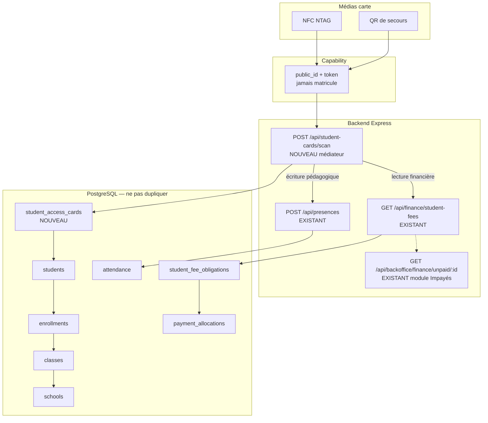

# AUDIT-CARTE-01 — Carte Élève / Présence NFC-QR / Contrôle Impayés

**Type :** audit d’architecture (caractérisation) — **aucune implémentation**  
**Statut :** **AUDIT-CARTE-01 CLOSED** — orientation architecture **validée CTO**, clôture documentaire sur **#876** / `develop@8cb187d7`  
**PR de clôture :** [#876](https://github.com/Somafrik-education/Somafrik/pull/876) — branche `cursor/audit-carte-01-94fc`  
**PR historique :** [#857](https://github.com/Somafrik-education/Somafrik/pull/857) — **CLOSED WITHOUT MERGE**  
**Date initiale :** 2026-10-01  
**Complément CTO :** 2026-10-01 — paramétrage, non-régression Présences, gates Stores, contrat D1/D2/D7/D8  
**Replay `f95c3f38` :** 2026-10-04 — ROLE-LABELS produit mergé ; aucune carte  
**Resync `8cb187d7` :** 2026-10-05 — merge #875 (clôture admin ROLE-LABELS) ; #856/#857 closed without merge  
**Contraintes honorées :** aucun DDL request-time, aucune migration exécutée, aucun code métier, aucun manifeste Android/iOS, aucune dépendance QR/NFC. **CARTE-PR0 non ouverte jusqu’au merge de #876.**

### Traçabilité des SHA (ne pas confondre)

| Référence | SHA | Signification |
|-----------|-----|----------------|
| Caractérisation initiale | `develop` @ `ae9fa504` (`#855`) | SHA **lu** lors du premier dépôt d’audit. |
| Base historique de #857 | `develop` @ `2a1df064` (`#853`) | **CLOSED WITHOUT MERGE.** |
| Replay #876 (premier) | `develop` @ `f95c3f3864d7841fd0ee9a6ec2ea30a251528dbf` | Merge #874. Base **alors** du premier replay. |
| Base live obligatoire | `develop` @ `8cb187d7eb49fbb366cf7ecaba9bbf87bfae8306` | Merge #875. **Base live de ce resync.** |
| Branche de replay | `cursor/audit-carte-01-94fc` | Audit-only. |

---

## 0.bis Replay `develop@f95c3f38` (2026-10-04)

Cartographie rejouée. **Aucun constat d’architecture invalidé.** CARTE-PR0 **non ouverte**.

| # | Constat historique | Live @ `f95c3f38` | Verdict |
|---|--------------------|-------------------|---------|
| 1 | Pas de carte élève / `cardToken` | Aucune table, colonne, route `student_card*` hors ce document | **INCHANGÉ** |
| 2 | `school_settings` + GET/PATCH, 3 scalaires | `period_mode`, `default_scale`, `report_card_mode` — allowlist `patchSchoolSettings` identique | **INCHANGÉ** — extension future toujours ici |
| 3 | NFC Android bloqué | `Mobile/app.config.js` + `withSomafrikAndroidSecurity.js` : `android.permission.NFC` blocked | **INCHANGÉ** |
| 4 | Pas de scanner QR carte ; QR bulletin existe | Capability bulletin `/verify/rc` + JSON legacy ; aucun `expo-camera` / BarCode Mobile | **INCHANGÉ** |
| 5 | `POST /api/presences` + UNIQUE jour | `schema.sql` + upsert `ON CONFLICT (school_id, student_id, attendance_date)` | **INCHANGÉ** |
| 6 | Appels manuels Web/Mobile | `PresencesPage` + `TeacherAttendanceScreen` → `/presences` | **INCHANGÉ** |
| 7 | Impayés existent ; **pas** de gate finance sur l’appel | Authz présence = classe/inscription + `write_presence` SaaS | **INCHANGÉ** |
| 8 | `students.photo_url`, `student_code` | Colonnes présentes ; `login_code` = projection API | **INCHANGÉ** |
| 9 | Classe via `enrollments.class_id` | JOIN enrollments inchangé | **INCHANGÉ** |
| 10 | Pas de `FEATURE_RULES` / `VITE_*` carte | Confirmé | **INCHANGÉ** |
| 11 | Lots mergés après #857 | ADMIN-02C→07, ROLE-LABELS #871–#874 | **Hors carte** — n’ajoutent ni QR/NFC ni flags |

**CARTE-PR0 (après merge de #876 seulement) :** étendre uniquement `school_settings` + `PATCH /api/school-settings` avec `student_card_enabled` et sous-options QR/NFC/contrôle financier, **toutes `false`**. Aucun QR/NFC. Aucun changement Présences.

D1 / D2 / D7 / D8 / invariant Présences restent **figés**.

---

## 0.ter Resync `develop@8cb187d7` (2026-10-05)

Après merge #875, #876 était **ahead 1 / behind 2**. Rebase sur `origin/develop@8cb187d7`. Cartographie relancée.

| Lot administratif | Statut |
|---|---|
| #875 ROLE-LABELS clôture | **MERGED** `8cb187d7` — docs/tests only |
| #856 replay sécurité P0/P1 | **CLOSED WITHOUT MERGE** |
| #857 AUDIT-CARTE-01 stale | **CLOSED WITHOUT MERGE** |
| ROLE-LABELS produit | **fermé** |

| # | Constat | Live @ `8cb187d7` | Verdict |
|---|---------|-------------------|---------|
| 1 | Pas de carte élève / `cardToken` | Aucun `student_card*` dans `backend/` | **INCHANGÉ** |
| 2 | `school_settings` 3 scalaires | `period_mode` / `default_scale` / `report_card_mode` | **INCHANGÉ** |
| 3 | NFC Android bloqué | `android.permission.NFC` toujours blocked | **INCHANGÉ** |
| 4–11 | Présences manuelles, UNIQUE jour, impayés hors gate, pas de flags carte | Identiques à §0.bis | **INCHANGÉ** |

#875 n’ajoute **aucun** produit carte (replay ROLE-LABELS + preuves machine uniquement). **AUDIT-CARTE-01 CLOSED sur #876.** **CARTE-PR0 non ouverte jusqu’au merge de #876.**

---

## 0. Nature du lot

| Champ | Valeur |
|--------|--------|
| ID | **AUDIT-CARTE-01** |
| Nature | **Audit uniquement — clôture #876** |
| Implémentation métier | **INTERDITE** dans ce lot |
| Migration / DDL | **INTERDIT** |
| PR d’audit #876 | Clôture documentaire. Merge **après** le dernier diff indépendant de **#876**. |
| Livrable | Matrice, flux cible, schéma, paramétrage, gates Stores, découpage PR **futur** |
| CARTE-PR0 | **NON OUVERTE jusqu’au merge de #876** |

### Méthode

1. Cartographier Backend, PostgreSQL, Web et Mobile sur Students, Enrollments, Classes, Attendance, Payments/Fees, QR/NFC, permissions.  
2. Identifier les modèles et endpoints **canoniques** déjà existants.  
3. Vérifier ce qui peut être réutilisé **sans duplication**.  
4. Classer chaque brique : **EXISTANT / RÉUTILISABLE / MANQUANT / À MODIFIER / RISQUE**.  
5. Proposer le **minimum** de tables / colonnes / endpoints pour un futur chantier, sans l’exécuter.

Il n’y a **pas de couche Prisma**. L’autorité de persistance est **PostgreSQL** (`backend/db/schema.sql` + migrations) via `postgresRepository` et dépôts spécialisés. HTTP = monolithe Express `backend/server.js`.

---

## 1. Verdict exécutif

Somafrik **peut** porter une carte physique élève **sans recréer** Élèves, Inscriptions, Classes, Présences ni Finance. Le chantier est un **nouveau médiateur d’identification** (`cardToken` opaque → élève), pas un nouveau métier.

| Question | Réponse d’audit |
|----------|-----------------|
| Une carte / un `cardToken` existe-t-il ? | **Non.** Aucune table, colonne, route ou écran. |
| NFC / scan QR produit existe-t-il ? | **Non.** NFC Android est **explicitement bloqué**. Aucun scanner QR mobile. |
| Le QR actuel peut-il servir de carte ? | **Non pour le contrôle d’accès.** QR bulletin legacy = JSON statique (matricule + notes). QR bulletin v2 = capability révocable, **réutilisable comme pattern crypto**, pas comme identifiant élève. |
| Le pointage quotidien existe-t-il ? | **Oui.** `POST /api/presences` + `UNIQUE (school_id, student_id, attendance_date)`. |
| L’impayé existe-t-il ? | **Oui, avec deux définitions.** Dette ouverte ≠ module Impayés. |
| L’impayé bloque-t-il la présence ? | **Non.** Aucun gate finance sur l’appel. |
| Faut-il écrire `IMPAYÉ=true` sur la puce ? | **Non — interdit.** La situation change ; elle doit rester calculée serveur. |
| NTAG + QR statique suffisent-ils pour un contrôle d’accès fort ? | **Non.** Suffisant pour une **identification scolaire** (qui prétend être cet élève). Insuffisant pour une **authentification anti-clonage**. |

**Orientation architecture : validée CTO. Fermeture d’audit : oui / CLOSED. Implémentation : non.**

1. NFC = canal principal, QR = secours. Les deux transportent le **même** capability opaque.  
2. Scan **authentifié staff**, jamais public.  
3. Présence et finance sont **deux lectures / écritures indépendantes** après résolution `Carte → Élève → inscription active → classe → établissement`.  
4. **D1 figé :** impayé **informatif** — la dette ne corrompt jamais l’appel.  
5. **D7 figé :** V1 **online-only** (la finance n’a pas de vérité hors ligne).  
6. **D8 figé :** une **carte logique active** par élève et établissement (`nfc_qr`).  
7. **D2 figé :** badge « À jour » = sens métier **B** (réellement impayé / échu), pas la dette ouverte A.  
8. QR/NFC est un **canal supplémentaire**. Les appels manuels Web/Mobile **restent** le chemin canonique.  
9. Fonctionnalité **désactivable** via le paramétrage établissement existant (`school_settings`). Défaut = **off**.  
10. Réutiliser le contrat crypto des bulletins (token ≥128 bits, SHA-256, révocation) — **ne pas** réutiliser le JSON bulletin legacy.

---

## 1.1 Contrat figé CTO (complément)

Ces décisions sont **normatives pour tout chantier futur**. Elles ne valent pas autorisation d’implémenter.

| ID | Décision | Statut |
|----|----------|--------|
| **D1** | Contrôle impayé **informatif**. Le scan enregistre la présence même en anomalie financière. Aucun gate pédagogique. | **Figé** |
| **D2** | Badge « À jour » = définition **B** (module Impayés) : échéance future « À payer » **n’affiche pas** l’élève comme débiteur en anomalie. Partiel avant échéance = **Paiement partiel**. Échéance dépassée = **Échéance impayée**. | **Figé** |
| **D7** | V1 scan **online-only**, fail-closed sans réseau. | **Figé** |
| **D8** | **Une** carte logique `active` par élève et par établissement (médias NFC+QR = la même carte). | **Figé** |
| **Présences** | Carte désactivée ⇒ comportement **strictement identique à aujourd’hui**. Carte activée ⇒ appels manuels Web/Mobile **conservés**. QR/NFC = canal **en plus**, jamais un remplacement. | **Figé** |

D3, D4, D5, D6, D9, D10 restent ouverts (voir §11). **CARTE-PR0 non ouverte jusqu’au merge de #876.**

---

## 2. Périmètre visuel de la carte (futur)

| Zone visuelle | Source actuelle | Verdict |
|---------------|-----------------|---------|
| Photo élève | Colonne `students.photo_url` (vide à la création) ; type document `PHOTO` (dossier admin, pas portrait API) | **MANQUANT** pipeline upload / affichage / impression |
| Nom / prénom | `students.first_name`, `students.last_name` | **RÉUTILISABLE** — impression optionnelle (audit UX ultérieur) |
| Matricule Somafrik | `students.student_code` (= `login_code` = `identity_code`) | **RÉUTILISABLE** en clair sur le recto ; **interdit** comme secret NFC/QR |
| Classe actuelle | `enrollments.class_id` via C18 | **RÉUTILISABLE** à l’impression, **stale** après transfert ; le scan doit **re-résoudre** |
| Code QR | Aucun QR carte | **MANQUANT** — payload = capability, pas le matricule |
| Identifiant technique de carte | Inexistant | **MANQUANT** — `public_id` + `token_hash` |

Le QR **ne doit pas** être le seul mécanisme. NFC et QR sont deux **médias** du même `cardToken`.

---

## 3. Flux cible (canonique)

```
Scan NFC | QR de secours
        │
        ▼
  cardToken opaque (public_id + secret)
        │  staff JWT + school scope
        ▼
  Lookup hash constant-time
        │
        ├─ carte absente / révoquée / perdue / remplacée → 404/409, aucun pointage
        │
        ▼
  students (school_id, student_id)
        │
        ▼
  enrollment active (année courante, statut roster)
        │
        ├─ pas d’inscription active / classe absente → 409, aucun pointage
        │
        ▼
  classes + schools
        │
        ├──────────────┐
        ▼              ▼
   PRÉSENCE         FINANCE
   (indépendant)    (indépendant)
        │              │
        ▼              ▼
 POST /api/presences   GET student-fees
 upsert jour           projection live
 Présent | Retard      À jour | Partiel |
                       Échéance impayée |
                       Situation à vérifier
```

**Règle d’or :** le média (NFC/QR) ne transporte **ni dette, ni montant, ni téléphone parent, ni statut pédagogique**. Uniquement un jeton opaque et révocable.

---

## 4. Schéma d’architecture cible



Le médiateur `scan` **orchestre**. Il n’invente pas un second référentiel élèves, un second appel, ni un second solde.

---

## 5. Cartographie de l’existant

### 5.1 Élèves / inscriptions / classes

| Brique | Canonique | Preuve |
|--------|-----------|--------|
| Table `students` | Oui | `backend/db/schema.sql` — `student_code UNIQUE` global, `school_id`, `photo_url`, `parent_phone`, `parent_email` |
| Table `enrollments` | Oui | `UNIQUE (student_id, academic_year_id)` ; C18 : `PRE_REGISTERED` → `APPROVED` → `ENROLLED` ; terminaux `TRANSFERRED` / `CLOSED` |
| Table `classes` | Oui | `school_id` + `academic_year_id` ; `class_code UNIQUE` |
| Matricule | Oui | `student_code` = `login_code` = `identity_code` ; trigger `somafrik_assign_permanent_student_identity` (`backend/db/studentGeneralIdentityPg.js`) |
| Photo portrait | Colonne seulement | INSERT force `photo_url = ''` ; PATCH identité **ne touche pas** la photo |
| Carte / badge / NFC UID | **Absent** | Aucune occurrence produit |

**Inscription « active » — trois lectures non identiques :**

| Contexte | Règle | Fichier |
|----------|--------|---------|
| Roster classe | `lower(status) IN ('active','enrolled')` | `ROSTER_ENROLLMENT_SQL` — `studentEnrollmentC18.js` |
| Fiche / annuaire | + `approved` | `CURRENT_ENROLLMENT_SQL` — `classStudentsRepository.js` |
| Mobile L1 | `DISTINCT ON (student_id)` parmi roster, `updated_at DESC` | `classStudentsRepository.js` / `mobileSyncStudents.js` |
| Web fiche | `selectCurrentStudentEnrollment` (année + `APPROVED`/`ENROLLED`/`SUSPENDED`) | `web/src/lib/studentEnrollmentSelection.ts` |

**Écart à résoudre avant carte :** le scan doit choisir **une** règle. Recommandation : **roster année courante** (`is_current` + `ROSTER_ENROLLMENT_SQL` + `class_id IS NOT NULL`), identique à l’autorité de `POST /api/presences` (`activeEnrollmentMatchesRequestedClass`).

**Changement de classe :** `POST /api/students/:id/enrollments/:enrollmentId/assign-class` met à jour **la même** ligne d’année (`UNIQUE student_id, academic_year_id`). La carte imprimée devient stale ; le token **ne doit pas** encoder la classe.

**Multi-établissement :** un élève a **un** `school_id`. Un transfert **clôt** (`TRANSFERRED`) ; il ne déplace pas la ligne. La carte source doit être **révoquée**. Le scope API vient de `users.school_id` → `schools.login_code` (`enrollmentSchoolScope.js`), jamais du JWT seul.

**Endpoints élèves canoniques :**

| Méthode | Route | Rôle |
|---------|--------|------|
| GET | `/api/students` | Annuaire (expose `parentPhone`) |
| GET | `/api/students/:id` | Fiche (matricule ou UUID) |
| GET | `/api/students/:id/enrollments` | Historique C18 |
| POST | `.../assign-class`, `.../transfer`, `.../close` | Machine C18 |
| GET | `/api/classes/:classCode/students` | Roster |
| POST | `/api/classes/:classCode/students` | Création + inscription |

### 5.2 Présences

| Brique | Canonique | Preuve |
|--------|-----------|--------|
| Table | `attendance` | `UNIQUE (school_id, student_id, attendance_date)` — grain **jour**, pas séance |
| Statuts | `present` / `late` / `absent` / `excused` | `toAttendanceStatus` / `fromAttendanceStatus` — Présent, Retard, Absent, Justifié |
| Écriture | `POST /api/presences` | `withIdempotency` + `upsertAttendance` `ON CONFLICT DO UPDATE` |
| Lecture | `GET /api/presences`, `GET /api/students/:id/presences` | RBAC `Présences:READ` |
| Planning | **Non lié** | Aucune inférence Retard depuis `course_schedules` |
| `hour` client | Envoyé, **non persisté** | Audit D3.5 |

**Double pointage aujourd’hui :**

1. Contrainte UNIQUE PostgreSQL — un second scan **met à jour** la ligne du jour.  
2. Idempotency HTTP (`Idempotency-Key`).  
3. Outbox mobile `presenceIntentionId(classId, date)`.

Ce n’est **pas** une interdiction de rescanner : c’est une **fusion**. Un scan NFC puis un QR le même jour = **un** enregistrement. Un changement de statut (Absent → Présent) **écrase**. Les notifications parents ne se déclenchent que lors d’une **transition vers** `absent` / `late`.

**Autorisation d’écriture — point bloquant pour un portail / kiosque :**

- Enseignant : `teacher_assignments` **active** sur la classe.  
- Admin / Préfet / Secrétaire : `teacherId` **explicite** d’un enseignant affecté, sinon `409 ATTENDANCE_TEACHER_UNRESOLVED`.  
- `created_by` existe au schéma mais **n’est pas écrit** sur l’INSERT actuel.

Un lecteur « bête » ou un vigile **ne peut pas** pointer avec le contrat actuel sans JWT staff + enseignant pédagogique. C’est le principal écart fonctionnel du pointage carte.

**Hors ligne :** l’outbox mobile couvre `presences`. Le sync L1 (`/api/mobile-sync/l1/*`) **n’inclut pas** les présences. V1 scan carte : **online-only** recommandé.

### 5.3 Finance / impayés — deux définitions

Il n’existe **pas** de table `Invoice`, `Installment` ou `Debt`. Les échéances sont des **lignes** `student_fee_obligations` (`period_key`, `due_date`).

**Formule de solde (autorité) :**

```
balance = max(0, amountDue − paidAmount − exemption)
```

`paidAmount` cible = Σ `payment_allocations` actives. `discount` est hors formule V1.

**Statut d’obligation** (`obligationStatusFromBalance` / trigger PG), ordre figé :

1. `Exonéré` si exemption ≥ dû  
2. `Payé` si balance ≤ 0  
3. `Partiellement payé` si paid > 0 (**prioritaire sur l’échéance**)  
4. `En retard` si `due_date` < aujourd’hui  
5. sinon `À payer`

**Définition A — dette ouverte (allocation / scan « à jour ? ») :**

`isOpenObligation` / `collectOpenObligationsFromProjection` : `balance > 0` et statut ∉ {Payé, Exonéré, Annulé}.  
Une échéance **future** « À payer » est une dette ouverte.

**Définition B — module Impayés (UI / relances) :**

`unpaidService.js` : statut ∈ {À payer, Partiellement payé, En retard}, `balance > 0`, **et** (échéance dépassée **ou** déjà `En retard` **ou** `Partiellement payé`).  
Une échéance future « À payer » **n’apparaît pas** au ledger Impayés. Un **partiel avant échéance** **apparaît**.

**Aucune tolérance / grâce calendaire.** Seul cooldown = 3 jours entre relances.

**« Non imputé »** est un statut de **paiement** (cash non alloué), pas une obligation. À mapper vers **Situation à vérifier**, pas vers Échéance impayée.

**Endpoints canoniques :**

| Route | Usage scan |
|-------|------------|
| `GET /api/finance/student-fees?studentId=` | **Source de vérité** pour badge financier |
| `GET /api/backoffice/finance/unpaid/:studentId` | Module Impayés uniquement (404 si hors ledger) |
| `GET /api/payments` | Détecter cash non imputé |

**Interdit pour le scan :** `MvpBusinessService.getStudentBalance` (montant annuel mock 40 000) ; recalcul client `web/src/lib/fees.ts`.

**L’impayé élève ne bloque aujourd’hui ni inscription, ni présence, ni bulletin.** Seul le **SaaS établissement** (`schoolSubscriptionAccessService`) bloque l’accès plateforme — autre domaine.

### 5.4 QR / NFC / Mobile / permissions

| Brique | État |
|--------|------|
| QR bulletin v2 | Capability `publicId.token`, hash SHA-256, AES-256-GCM, états `ACTIVE` / `SUPERSEDED` / `REVOKED` — `backend/contracts/reportCard/contract.js` |
| QR bulletin legacy | JSON `{ matricule, average, schoolCode }` — **clonable, PII, à ne pas recopier** |
| NFC produit | Placeholder réglages « NFC et webhooks » |
| Permission Android NFC | **Bloquée** : `Mobile/app.config.js`, `withSomafrikAndroidSecurity.js`, assert `verify-native-prebuild.js` |
| Scanner QR mobile | **Absent** (`expo-camera` / barcode / `nfc-manager` absents de `Mobile/package.json`) |
| Caméra | Photo de **compte** seulement |
| Appel mobile | Roster manuel `TeacherAttendanceScreen.tsx` |
| RBAC présence | `Présences:CREATE` / `UPDATE` / `READ` — `rbacService.js` |
| RBAC finance | `Impayés:READ`, `Paiements:READ`, `Frais & tarifs:READ` |
| Enseignant × finance | Matrice : Enseignant **« - »** sur Paiements — un prof qui scanne **ne doit pas** recevoir montants/détail dette sans droit |
| Révocation existante | Sessions (`revoke-all`, password reset), push devices, `user_roles`, capability bulletin — **pas de carte** |

### 5.5 Paramétrage / capabilities — audit de l’existant

La carte **doit pouvoir être éteinte**. Elle **ne doit pas** inventer un second système de configuration. Inventaire des mécanismes déjà présents :

| Mécanisme | Rôle réel | Par établissement ? | Convient pour activer « Carte élève » ? |
|-----------|-----------|---------------------|----------------------------------------|
| **`school_settings` + `GET/PATCH /api/school-settings`** | Scalaires établissement LOT 4 : `period_mode`, `default_scale`, `report_card_mode` | **Oui** | **Oui — étendre cette table et cette API.** C’est le store canonique de paramètres établissement. Trigger `AFTER INSERT ON schools` + backfill existent déjà. |
| `schoolSubscriptionAccessService.FEATURE_RULES` | Cycle de vie **SaaS** (`full` / `limited` / `blocked`) : `write_presence`, `write_notes`, `connect`… | Via l’abonnement | **Non.** Coupler la carte à l’impayé **SaaS** casserait l’invariant Présences (`write_presence` doit rester indépendant). Un add-on payant éventuel est un lot **ultérieur**, pas le master switch. |
| `web/src/lib/featureFlags.ts` | Flags **globaux** env (`VITE_ENABLE_MARKETPLACE`, démo) | Non | **Non.** |
| `schools.profile_payload` JSONB | Extras de profil (slogan, couleur, `schoolYear` orphelin) | Oui | **Non.** LOT 4 a **quitté** le JSON pour les paramètres. |
| `school_academic_configs.config_payload` | Legacy strippé (`allowCustom*`, etc.) | — | **Non.** Écriture académique JSON **interdite**. |
| `school_notification_settings` | Matrice événement × destinataire × canal | Oui | **Non.** Domaine Communications. Ne pas y piggybacker. |
| RBAC fonctionnel (`module_key` + `Présences:*`) | **Qui** a le droit | Rôle | **Orthogonal.** Nécessaire pour émettre/scanner, **insuffisant** pour activer le produit école. |
| Hub Paramètres « Intégrations » | `ComingSoonState` — « NFC et webhooks » | — | **Non.** Écran mort, **pas** un store. Ne pas y loger la carte. |

**Minimum futur (colonnes, pas une table parallèle)** — à ajouter **plus tard** sur `school_settings`, défaut **false** (non-régression) :

| Colonne proposée | Défaut | Sens |
|------------------|--------|------|
| `student_card_enabled` | `false` | Master **Carte élève**. Off ⇒ aucun issue, aucun scan, aucun écran carte. |
| `student_card_qr_enabled` | `false` | Sous-option QR de secours. Ignorée si master off. |
| `student_card_nfc_enabled` | `false` | Sous-option NFC. Ignorée si master off. **Ne débloque pas** la permission Android (gate PR8). |
| `student_card_finance_check_enabled` | `false` | Sous-option **contrôle financier informatif** (D1). Off ⇒ le scan peut quand même pointer ; **pas** de badge finance. |

Règles :

1. Master off ⇒ les trois sous-options sont **sans effet**. Comportement Présences = **aujourd’hui**.  
2. QR ou NFC on **sans** master ⇒ traité comme off (fail-closed).  
3. Finance on **sans** master ⇒ off. Finance on + master on + RBAC finance absent ⇒ présence OK, DTO finance omis (même règle qu’un enseignant sans Paiements).  
4. UI : section **Paramètres établissement** via le PATCH `school-settings` existant (`Paramètres Établissement:UPDATE`). **Pas** de nouveau hub, **pas** d’écran Intégrations, **pas** de `VITE_*`.  
5. Lecture fail-closed : colonne absente / false = fonctionnalité absente.

L’architecture **permet** ces quatre booléens : `patchSchoolSettings` n’accepte aujourd’hui que `periodMode` / `defaultScale` / `reportCardMode` ; un futur allowlist étendu reste **le même endpoint**. C’est une **extension**, pas un système parallèle.

---

## 6. Définition proposée pour le badge scan

À partir de **`GET /api/finance/student-fees`** (projection obligations + allocations), **pas** d’un bit sur la carte :

| Badge | Règle (alignée code actuel) |
|-------|------------------------------|
| **À jour** | **D2 figé = B.** L’élève n’est **pas** au ledger Impayés : pas d’échéance dépassée, pas de ligne `En retard`, pas de `Partiellement payé` affiché comme anomalie d’impayé. Une échéance future « À payer » **ne** fait **pas** apparaître l’élève comme débiteur en anomalie. |
| **Paiement partiel** | Au moins une ligne `Partiellement payé` (y compris avant échéance — déjà dans le module Impayés). |
| **Échéance impayée** | Au moins une ligne `balance > 0` et (`En retard` ou `due_date` passée), aligné `isOverdueStudentFee`. |
| **Situation à vérifier** | Sync finance en échec ; pas d’obligations alors qu’une grille devrait exister ; devises mixtes ; paiements `Non imputé` sans dette ouverte ; élève hors scope ; 403 ; sous-option finance off alors que le staff a demandé le badge. |

Priorité d’affichage recommandée si plusieurs lignes : **Situation à vérifier > Échéance impayée > Paiement partiel > À jour**.

**D2 figé CTO :** ne **pas** utiliser la définition A (toute dette ouverte) pour le badge scan. `collectOpenObligationsFromProjection` reste l’outil d’**allocation**, pas le libellé portail.

---

## 7. Minimum de nouvelles tables / colonnes / endpoints

Aucun DDL request-time. Toute évolution future = **migration boot / fichier SQL versionné**, comme le reste de Somafrik.

### 7.0 Colonnes de paramétrage (pas une table parallèle)

Étendre **`school_settings`** (mêmes `GET/PATCH /api/school-settings`) avec les quatre booléens du §5.5, défaut `false`. Aucune table `student_card_settings`. Aucun flag env. Aucun `FEATURE_RULES` SaaS en V1.

### 7.1 Une table nouvelle (référentiels existants inchangés)

**`student_access_cards`** — médiateur uniquement :

| Colonne | Rôle |
|---------|------|
| `id` UUID PK | Interne |
| `school_id` FK `schools` | Frontière tenant |
| `student_id` FK `students` | **Seul** lien personne |
| `public_id` UNIQUE | Face imprimable / URI (non devinable) |
| `token_hash` | SHA-256 du secret — jamais le plaintext |
| `medium` | `nfc`, `qr`, `nfc_qr` |
| `status` | `issued` / `active` / `lost` / `revoked` / `replaced` |
| `issued_at`, `revoked_at`, `revoke_reason` | Cycle de vie |
| `replaced_by_card_id` FK self | Remplacement sans réutiliser le secret |
| `created_by_user_id` | Audit |
| `last_scan_at` | Signal faible de fraude (optionnel V1) |

Optionnel V1.1 : `student_access_card_events` append-only (scan, révocation).

**Ne pas ajouter** sur `students` : `impaye`, `nfc_uid` seul, `qr_payload` métier.  
**Ne pas ajouter** sur `attendance` : `card_id` en V1 (le grain jour suffit ; `created_by` existant peut être **renseigné**, c’est une **modification** du write path, pas une nouvelle table).

### 7.2 Endpoints nouveaux (médiateur)

| Méthode | Route | Authz proposée | Comportement |
|---------|--------|----------------|--------------|
| POST | `/api/student-cards` | `Élèves:CREATE` ou module `Cartes:CREATE` | Émet le token **une fois**, stocke le hash |
| GET | `/api/students/:id/cards` | `Élèves:READ` | Liste (sans secret) |
| POST | `/api/student-cards/:id/lost` | UPDATE | `lost` + révocation |
| POST | `/api/student-cards/:id/revoke` | UPDATE | Révocation admin |
| POST | `/api/student-cards/:id/replace` | UPDATE | Nouvelle ligne, ancienne `replaced` |
| POST | `/api/student-cards/scan` | `Présences:CREATE` **ou** `Cartes:SCAN` | Master off ⇒ 404/403, **aucun** write présence. Master on : capability → chaîne ; upsert présence **optionnel** ; finance **si** sous-option + RBAC Impayés/Paiements/Frais |

Tous les endpoints cartes sont **no-op / refus** si `student_card_enabled = false`. Ils ne doivent **jamais** court-circuiter `POST /api/presences` manuel.

Pas d’équivalent public `/verify` (contrairement aux bulletins). Un QR photographié ne doit pas être vérifiable par un anonyme.

### 7.3 Réutilisation obligatoire (zéro duplication)

| Besoin | Réutiliser |
|--------|------------|
| Activation produit | **`school_settings`** (`student_card_*`, défaut false) via `PATCH /api/school-settings` |
| Identité élève | `students` + `classStudentsRepository` |
| Classe / année | `enrollments` C18 + `classes` + `academic_years.is_current` |
| Pointage | `upsertAttendance` / `POST /api/presences` |
| Anti-doublon jour | UNIQUE existante + idempotency |
| Finance | `listFinanceStudentFees` + `obligationStatusFromBalance` + `collectOpenObligationsFromProjection` |
| Tenant | `presenceSchoolScope` / `financeSchoolScope` / `enrollmentSchoolScope` (membership `login_code`) |
| Crypto jeton | Pattern `verificationSecret.js` (générer / hasher / compare constant-time) — **nouveau wrapping AAD** (`public_id`, `card_id`, `school_id`), pas les champs bulletin |
| Révocation | Pattern sessions + `verification_status` bulletin |

---

## 8. Matrice EXISTANT / RÉUTILISABLE / MANQUANT / À MODIFIER / RISQUE

| # | Brique | Classification | Détail | Risque |
|---|--------|----------------|--------|--------|
| 1 | `students` + matricule | EXISTANT + RÉUTILISABLE | Identité humaine et login | Matricule **énumérable** et public — ne jamais s’en servir comme token |
| 2 | Photo portrait | MANQUANT | `photo_url` mort ; `PHOTO` = pièce dossier | Carte visuelle incomplète ; pas un blocker scan |
| 3 | Nom / prénom | RÉUTILISABLE | Colonnes stables | PII sur le plastique : décision UX, pas technique |
| 4 | Inscription active | EXISTANT + À MODIFIER (contrat unique) | 3 règles divergent | Mauvais élève / mauvaise classe au portail |
| 5 | Changement de classe C18 | RÉUTILISABLE | Même enrollment, `class_effective_date` | Impression stale ; token OK si opaque |
| 6 | Transfert multi-école | RÉUTILISABLE | `TRANSFERRED` clôt | Carte oubliée = accès fantôme si non révoquée |
| 7 | `attendance` jour | RÉUTILISABLE | UNIQUE + upsert | Un scan ≠ une séance ; Retard non calculé |
| 8 | `POST /api/presences` | RÉUTILISABLE | Contrat unique d’écriture | Kiosque bloqué par `teacherId` / affectation |
| 9 | Auteur pédagogique | À MODIFIER | `created_by` non peuplé ; teacher obligatoire hors Enseignant | Falsification d’auteur ou 409 au portail |
| 10 | Inférence Retard | MANQUANT | Pas de lien planning | Le scan doit envoyer Présent **ou** Retard explicitement |
| 11 | Outbox présence | RÉUTILISABLE plus tard | Mobile déjà | Hors ligne V1 : finance menteuse |
| 12 | Obligations / allocations | RÉUTILISABLE | SoT finance | Deux définitions d’impayé |
| 13 | Module Impayés | RÉUTILISABLE (ledger) | D2 figé = B pour le badge scan | Ne pas utiliser la dette ouverte A comme libellé portail |
| 14 | Flag `IMPAYÉ` sur puce | INTERDIT | N’existe pas, ne pas créer | Stale immédiat |
| 15 | Capability bulletin | RÉUTILISABLE (pattern) | Token + hash + revoke | Clonage photo jusqu’à révocation |
| 16 | QR bulletin legacy | RISQUE — ne pas réutiliser | JSON matricule + moyenne | PII + clone trivial |
| 17 | `cardToken` / table cartes | MANQUANT | — | Greenfield |
| 18 | Endpoint scan | MANQUANT | — | Doit rester staff + tenant |
| 19 | Module RBAC `Cartes` | MANQUANT | Peut réutiliser Élèves + Présences au début | Enseignant verrait la finance s’il n’y a pas de gate par sous-objet |
| 20 | NFC Android | À MODIFIER | Permission **bloquée** + verify native | Play policy / surface attack |
| 21 | Scanner QR mobile | MANQUANT | Pas de dépendance | Canal de secours inexistant |
| 22 | Impression carte | MANQUANT | Pas de template « carte scolaire » | Hors V1 scan |
| 23 | Liste `GET /api/students` | RISQUE PII | `parentPhone` aux rôles `Élèves:READ` (dont Enseignant) | Le DTO scan ne doit **pas** recopier ce mapper |
| 24 | Sync L1 mobile | RÉUTILISABLE (identité minimale) | Déjà sans téléphone / photo | Cache offline ≠ vérité finance |
| 25 | Grain présence journée | RISQUE produit | Un statut / jour / école | Incompatible avec un tourniquet par cours sans nouvelle table `attendance_sessions` |
| 26 | Vocabulaire `active` vs `ENROLLED` | À MODIFIER (dette connue) | Dualité SQL / C18 | Faux négatif roster au scan |
| 27 | Format matricule doc vs runtime | RISQUE doc | Doc EL-SEQ3 vs trigger SEQ5 + initiales élève ; CHECK accepte les deux | Impression / support |
| 28 | Platform Super Admin | EXISTANT deny | `platformPersonalDataGuard` | Scan école interdit au platform sans scope |
| 29 | Offline finance | MANQUANT | — | Afficher un badge stale hors ligne = même erreur que `IMPAYÉ` sur puce |
| 30 | Clonage NTAG / photo QR | RISQUE | UID NTAG et QR statique se copient | Identification ≠ authentification forte |
| 31 | `school_settings` | RÉUTILISABLE (à étendre) | Store canonique paramètres établissement | **Ne pas** créer `student_card_settings` |
| 32 | `FEATURE_RULES` SaaS | RISQUE si mal utilisé | Cycle de vie abo, pas un switch produit | Coupler carte ↔ `write_presence` casserait §10.0 |
| 33 | `featureFlags.ts` env | INTERDIT pour la carte | Flags globaux démo/marketplace | Pas de `VITE_ENABLE_STUDENT_CARD` |
| 34 | Hub Intégrations ComingSoon | INTERDIT comme store | Écran mort « NFC et webhooks » | Parallel UX, zéro persistance |
| 35 | Appels manuels Web/Mobile | RÉUTILISABLE + **non-régression** | Canal canonique, carte = additif | Retirer/masquer l’appel = **NO-GO** |
| 36 | `CAMERA` Android actuelle | EXISTANT (photo compte) | `app.json` + verify native | PR7 = **nouvelle finalité** Store, pas un « déjà OK » |
| 37 | GATE-QR-STORES | **GATE-QR-STORES CLOSED** #887 `26e42c4c` | `docs/audits/GATE-QR-STORES-camera-qr.md` — GO technique PR7 | **CARTE-PR7 OPEN / DRAFT** #889. CARTE-PR8 toujours bloquée. GATE-NFC-STORES toujours requis. |
| 38 | GATE-NFC-STORES | **OPEN / DRAFT** | `docs/audits/GATE-NFC-STORES.md` — GO technique PR8, aucun code Mobile | **Bloque PR8** jusqu’au merge. CARTE-PR8 non ouverte. |

---

## 9. Sécurité

### 9.1 Contenu autorisé sur NFC / QR

**Autorisé :** `public_id` + secret capability (URI courte), éventuellement un préfixe `somafrik:card:`.

**Interdit :** dette, montant, téléphone parent, email, date de naissance, adresse, statut pédagogique, `school_id` interne, JWT, matricule comme seul payload.

### 9.2 Clonage

| Média | Effort de copie | Contre-mesure V1 | Limite |
|-------|-----------------|------------------|--------|
| QR statique | Photo / photocopie | Révocation serveur ; token 128 bits | Le clone marche **jusqu’à** révocation |
| NFC NTAG21x | Cloneur RF bon marché (UID + pages) | Même capability + révocation | UID n’est **pas** un secret |
| NFC crypto (DESFire / SUN / HMAC) | Plus dur | Évolution ultérieure | Hors minimum V1 |

**Verdict :** NTAG + QR de secours = **identification scolaire** acceptable (portail établissement, appel). **Pas** un contrôle d’accès bâtiment / anti-fraude fort. Une évolution « NFC authentifié » est un lot **séparé**, après usage réel.

Ne pas vendre la V1 comme « infalsifiable ».

### 9.3 Carte perdue / révoquée / remplacée

Réutiliser le vocabulaire déjà compris (sessions, bulletins) :

1. Perdue → `lost` + secret mort.  
2. Remplacée → nouvelle ligne, `replaced_by_card_id`, ancien secret mort.  
3. **D8 figé :** une seule carte logique `active` par élève et par établissement (médias NFC+QR = `nfc_qr`, un seul secret).  
4. Transfert / archive élève → révocation en cascade (hook C18 / `studentLifecyclePg`, **à ajouter plus tard**, pas un second cycle de vie).

### 9.4 Hors ligne

| Donnée | Offline V1 |
|--------|------------|
| Présence | Possible via outbox existant, **après** résolution locale d’un allowlist — **non recommandé** en V1 |
| Finance | **Interdit** hors ligne (reproduirait `IMPAYÉ` sur puce) |
| Décision | Scan V1 **fail-closed** sans réseau |

### 9.5 Multi-établissement et scope

Le scan doit ignorer tout `schoolCode` client et résoudre via **membership** (`presenceSchoolScope` / `financeSchoolScope`). Une carte d’un établissement B présentée à A = 404/403, pas de fuite d’identité.

### 9.6 DTO scan (anti-PII)

Réponse minimale :

- identité : prénom, nom (si UX retenu), matricule, photo URL **autorisée**, `classCode` / `className` **live**  
- présence : statut jour actuel + résultat upsert  
- finance : **badge + éventuellement solde agrégé**, seulement si le principal a un droit finance ; **jamais** `parentPhone` / `parentEmail`

---

## 10. Compatibilité présence — non-régression et doubles pointages

### 10.0 Invariant figé — non-régression Présences

> **Carte désactivée = comportement Somafrik strictement identique à aujourd’hui.**

Preuves de « aujourd’hui » à ne pas altérer :

| Surface | Contrat actuel à conserver |
|---------|----------------------------|
| Web | `PresencesPage.tsx` — appel manuel par classe, chips Présent / Retard / Absent / Justifié |
| Mobile | `TeacherAttendanceScreen.tsx` — roster manuel, outbox `presences` |
| HTTP | `POST /api/presences` + `requireSchoolSubscriptionFeature("write_presence")` + `Présences:CREATE\|UPDATE` |
| Persistance | `UNIQUE (school_id, student_id, attendance_date)` + `ON CONFLICT DO UPDATE` |

**Même lorsque la carte est activée :**

- les appels manuels Web et Mobile **restent disponibles** et **suffisants** ;
- QR/NFC est un **canal supplémentaire** d’identification vers le **même** `upsertAttendance` ;
- aucun écran d’appel existant n’est retiré, masqué, ni rendu dépendant de `student_card_enabled` ;
- `write_presence` / RBAC Présences **ne** passent **pas** par le master carte.

Tests de non-régression **obligatoires** avant tout merge futur de scan : Maestro `07-attendance` / `12-attendance-mutation`, `presenceTenant.http.pg.test.js`, parcours Web PresencesPage — **verts avec carte off et avec carte on**.

### 10.1 Doubles pointages

**Déjà garanti au grain Somafrik (1 statut / élève / jour / école).**

Pour le scan :

1. Appeler **le même** `upsertAttendance` (pas d’INSERT parallèle).  
2. Clé d’idempotency = `(school, student, date, intendedStatus)` ou `Idempotency-Key` client.  
3. NFC puis QR le même jour = update, pas doublon.  
4. Ne **pas** créer `attendance_sessions` en V1 — ce serait un **changement de métier** (appel par cours), hors mandat carte.

Si le produit veut un portique « entrée matin / sortie soir », le modèle actuel **ne le porte pas**. Il faudrait un lot présence distinct, pas une colonne carte.

---

## 11. Décisions — figées vs encore ouvertes

| ID | Décision | Statut |
|----|----------|--------|
| D1 | Impayé informatif vs bloquant | **Figé : informatif** |
| D2 | « À jour » = A (dette ouverte) ou B (impayé/échu) | **Figé : B** |
| D3 | Nom/prénom imprimés | Ouvert (UX) |
| D4 | Photo obligatoire pour émettre une carte | Ouvert |
| D5 | Qui a le droit de scanner | Ouvert — recommandation : Préfet / Secrétaire / Enseignant affecté ; pas Parent / Élève |
| D6 | Kiosque sans `teacherId` | Ouvert — `created_by` staff **ou** teacher « Accueil » |
| D7 | V1 online-only | **Figé : oui** |
| D8 | Une carte logique active / élève / établissement | **Figé : oui** |
| D9 | NFC Android (débloquer permission) | Ouvert — **bloqué par GATE-NFC-STORES** |
| D10 | NFC crypto ultérieur | Ouvert — après V1 |

**Présences actuelles obligatoirement conservées** — figé, voir §10.0.

---

## 12. Découpage PR **futur** (non exécuté) et gates Stores

Aucun PR d’implémentation n’est ouvert par cette clôture. **CARTE-PR0 reste non ouverte jusqu’au merge de #876.** Les PR futurs d’implémentation suivent : Draft → CI → review CTO → merge `develop`, **plus** les gates Stores ci-dessous.

### 12.1 GATE-QR-STORES — clos

**GATE-QR-STORES CLOSED.** Dossier : `docs/audits/GATE-QR-STORES-camera-qr.md`, mergé par **#887** (`26e42c4c`). Il retient `expo-camera@~17.0.10` (SDK 54, licence MIT) et conclut **GO PR7** si `recordAudioAndroid: false`, micro iOS désactivé, et la chaîne caméra duale unique. **CARTE-PR7 OPEN / DRAFT** (#889) : lot d’implémentation scanner QR. Il reste **DRAFT / HOLD** jusqu’à l’ordre `ready et merge`. **CARTE-PR8 toujours bloquée.** **GATE-NFC-STORES toujours requis.**

La revue contrôle au minimum :

| Point | État actuel (preuve) | Exigence de la revue |
|-------|----------------------|----------------------|
| Dépendance choisie | Toujours **absente** de `Mobile/package.json` | Dossier : `expo-camera@~17.0.10`, MIT, non installée ici ; NFC interdit dans le même lot |
| `CAMERA` Android | Déjà déclarée pour **photo de compte** (`Mobile/app.json` `permissions: ["CAMERA"]` ; `verify-native-prebuild.js` / `verify-mobile-security.js` l’exigent) | Second usage (scan QR) = **nouvelle finalité** Play. Mettre à jour Data safety (`docs/mobile/PLAY-STORE-DATA-INVENTORY.md` : « Photo de compte » seulement aujourd’hui). Ne pas élargir à `READ_MEDIA_IMAGES`. |
| iOS `Info.plist` / usage description | `expo-image-picker` : *« Somafrik utilise l'appareil photo pour prendre la photo du compte. »* — **pas** de string scan QR | `NSCameraUsageDescription` doit couvrir **les deux** usages (compte **et** scan carte), ou la revue refuse. |
| Expo / prebuild | Plugin image-picker uniquement | Prebuild + asserts `verify-native-prebuild` / `verify-mobile-release-readiness` **verts** après la dépendance |
| Demande de permission | Caméra aujourd’hui au flux photo compte | **Uniquement au moment du scan** (pas au login, pas au boot). Refus / refus permanent : scan QR **indisponible**, appel manuel **intact** (invariant §10.0) |
| Déclarations Store | Inventaire Play sans NFC, caméra = photo compte | Questionnaire Play + App Store Privacy : caméra = scan d’identifiant scolaire **en plus** de la photo compte ; pas de tracking |

Tant que **CARTE-PR7** n’est pas mergée, le scanner QR n’est pas en production. Le gate Stores, lui, est **clos**.

### 12.2 GATE-NFC-STORES — bloque PR8

Dossier **OPEN / DRAFT** : `docs/audits/GATE-NFC-STORES.md`. Verdict technique **GO CARTE-PR8** sous conditions figées. **CARTE-PR8 n’est pas ouverte.** Le gate reste DRAFT / HOLD jusqu’au merge. Aucune permission NFC n’est débloquée ici.

**PR8 a son gate NFC séparé.** Il ne démarre pas avec PR7.

| Point | État actuel | Exigence |
|-------|-------------|----------|
| Permission Android NFC | **Bloquée** : `app.config.js` `blockedPermissions`, `withSomafrikAndroidSecurity.js`, assert `verify-native-prebuild.js` (`NFC présent` = échec) | Revue Play + raison d’usage ; retirer NFC **seulement** de la blocklist, **sans** toucher RECORD_AUDIO / LOCATION / CONTACTS / etc. |
| iOS Core NFC | Absent (`ios` sans `NFCReaderUsageDescription` / entitlements) | Revue App Store + entitlement NFC ; iPhone sans NFC ⇒ QR de secours |
| Dépendance | Aucune `nfc-manager` / `expo-nfc` | Lot isolé après GATE-QR-STORES **et** GATE-NFC-STORES |
| Hardware NTAG | Non traité | Hors Stores ; clonage déjà au §9 |

### 12.3 Table des PR futurs

| PR | Contenu | Dépend | Interdit dans le PR |
|----|---------|--------|---------------------|
| **CARTE-PR0 — Paramétrage** | Extension `school_settings` : `student_card_enabled` + sous-options QR/NFC/finance, toutes `false` | **Merge de #876** | QR/NFC, routes carte, tables, UI, changement Présences. **Ne pas ouvrir avant le merge de #876.** |
| **PR1 — DDL cartes + settings** | Migration `student_access_cards` + colonnes `school_settings` §5.5 (défaut `false`) | PR0 | Handler HTTP métier, DDL request-time |
| **PR2 — Cycle de vie** | Issue / list / lost / revoke / replace + RBAC + tests tenant ; **respect master off** | PR1 | Présence, finance, Mobile |
| **PR3 — Scan resolve** | `POST /api/student-cards/scan` ; 404/403 si master off | PR2 | Upsert présence, montants |
| **PR4 — Scan → présence** | Adapter vers `upsertAttendance` existant ; **non-régression appels manuels** | PR3 | Nouvelle table attendance ; retirer UI d’appel |
| **PR5 — Scan → finance** | Badge D2=B via `listFinanceStudentFees` **si** sous-option finance + RBAC | PR3 | Recalcul client, flag carte, gate bloquant |
| **PR6 — Web émission** | Impression / PDF ; gated par master | PR2 + photo si D4 | NFC |
| **GATE-QR-STORES** | **CLOS** #887 | — | Réouvrir le scanner NFC dans le même lot |
| **PR7 — Mobile QR secours** | **CARTE-PR7 OPEN / DRAFT** #889 — scanner QR Mobile | PR3–PR5 **et GATE-QR-STORES CLOSED** | Débloquer NFC ; livrer le défaut micro du plugin |
| **GATE-NFC-STORES** | **OPEN / DRAFT** — `docs/audits/GATE-NFC-STORES.md` | — | Code Mobile ; ouvrir CARTE-PR8 |
| **PR8 — Mobile NFC** | Retirer NFC de la blocklist **uniquement** après le gate | PR7 **et GATE-NFC-STORES clos** | Élargir les autres permissions bloquées |

Chaque PR d’implémentation future exigera un **diff GitHub indépendant CTO** avant merge.

---

## 13. Hors périmètre de cet audit

- Maquette UX recto/verso et choix d’imprimer le nom.  
- Choix fournisseur cartes / imprimante / encodage NTAG.  
- Contrôle d’accès bâtiment, cantine, transport.  
- Présence par séance / cours.  
- Paiement au scan.  
- Application parent qui scanne la carte de l’enfant.  
- **CARTE-PR0** et tout code métier — **non ouverts jusqu’au merge de #876**.  
- **CARTE-PR8 / NFC** — bloqué par GATE-NFC-STORES. **CARTE-PR7** reste DRAFT jusqu’à `ready et merge`.
- **GATE-NFC-STORES** : dossier OPEN / DRAFT `docs/audits/GATE-NFC-STORES.md` (revue Stores rédigée ; pas de code Mobile).

---

## 14. Index des preuves

| Domaine | Fichiers |
|---------|----------|
| Schéma élèves / inscriptions / présences | `backend/db/schema.sql` |
| Identité élève | `backend/db/studentGeneralIdentityPg.js`, `backend/lib/studentCanonicalIdentifier.js`, `docs/audits/STUDENT-CANONICAL-IDENTIFIER.md` |
| Roster / fiche | `backend/db/classStudentsRepository.js`, `backend/lib/studentEnrollmentC18.js` |
| Présences write | `backend/db/postgresRepository.js` (`upsertAttendance`), `backend/lib/presencesAttendanceAuthz.js`, `backend/lib/presenceSchoolScope.js`, `backend/lib/attendanceUniqueness.js` |
| Routes | `backend/server.js` (`/api/presences`, `/api/students`, `/api/finance/student-fees`, `/api/backoffice/finance/unpaid`) |
| RBAC | `backend/services/rbacService.js`, `backend/lib/financeRbacRouteMatrix.js`, `backend/data.js` |
| Finance | `backend/lib/financeDomainInvariants.js`, `backend/db/financeSchema.js`, `backend/db/financePgStore.js`, `backend/services/unpaidService.js`, `backend/lib/financeWebMobileWriteContract.js` |
| QR bulletin | `backend/contracts/reportCard/contract.js`, `backend/contracts/reportCard/verificationSecret.js`, `backend/lib/bulletinTemplate.js` |
| Mobile NFC block | `Mobile/app.config.js`, `Mobile/plugins/withSomafrikAndroidSecurity.js`, `Mobile/scripts/verify-native-prebuild.js` |
| GATE-QR-STORES | `docs/audits/GATE-QR-STORES-camera-qr.md` (**CLOS** #887) |
| GATE-NFC-STORES | `docs/audits/GATE-NFC-STORES.md` (**OPEN / DRAFT**) |
| Appel mobile | `Mobile/src/screens/TeacherAttendanceScreen.tsx`, `Mobile/src/lib/attendanceOffline.ts` |
| Documents PHOTO | `web/src/lib/studentDocuments.ts` |
| Docs présence / sécu | `docs/ux/design-system/AUDIT-D3.5-presences.md`, `docs/project/SECURITY.md`, `docs/project/DATABASE.md` |
| Paramètres établissement | `backend/db/schoolSettingsSchema.js`, `backend/lib/schoolSettingsManagement.js`, `backend/lib/schoolSettingsService.js`, `docs/project/CURRENT-SETTINGS-INVENTORY.md` |
| Abonnement SaaS (à ne pas confondre) | `backend/services/schoolSubscriptionAccessService.js` (`FEATURE_RULES`, `write_presence`) |
| Flags env | `web/src/lib/featureFlags.ts` |
| Hub Paramètres / Intégrations | `web/src/pages/parametres/SettingsHubPage.tsx`, `SettingsPlaceholders.tsx` |
| Caméra / Play | `Mobile/app.json`, `Mobile/scripts/verify-mobile-security.js`, `docs/mobile/PLAY-STORE-DATA-INVENTORY.md` |

---

## 15. Conclusion — clôture AUDIT-CARTE-01

**Verdict : AUDIT-CARTE-01 CLOSED.**  
**PR de clôture : #876.**  
**Base canonique : `develop@8cb187d7eb49fbb366cf7ecaba9bbf87bfae8306`.**

Orientation architecture : **PASS**. Produit dans cette PR : **aucun**. Implémentation : **NO-GO jusqu’au merge de #876**. **CARTE-PR0 non ouverte jusqu’au merge de #876.**

Le socle métier (élève, inscription, classe, appel journalier, obligations, RBAC tenant, `school_settings`) **existe et doit être réutilisé**. Ce qui manque reste un **médiateur d’identification révocable**, un **contrat unique** d’inscription active, un **chemin kiosque** éventuel, un **badge finance informatif D2=B**, l’**extension** (pas un clone) de `school_settings`, et — seulement après gates Stores — les **médias** QR puis NFC.

Contrat déjà figé : **D1 informatif**, **D2 = B (impayé/échu)**, **D7 online-only**, **D8 une carte logique**, **Présences manuelles conservées**, master carte **off par défaut**.

Le plus petit écart sûr **après le merge de #876** :

colonnes `school_settings` (défaut false) + 1 table `student_access_cards` + 6 routes cycle de vie/scan + 0 copie des référentiels + 0 bit financier sur la puce + 0 régression d’appel manuel.

**Prochaine action après merge de #876 :** CARTE-PR0 peut être ouverte sous mandat CTO. Jusqu’à ce merge, **CARTE-PR0 reste non ouverte.**  
#857 est **CLOSED WITHOUT MERGE** — ne plus la relire comme cible de review.
