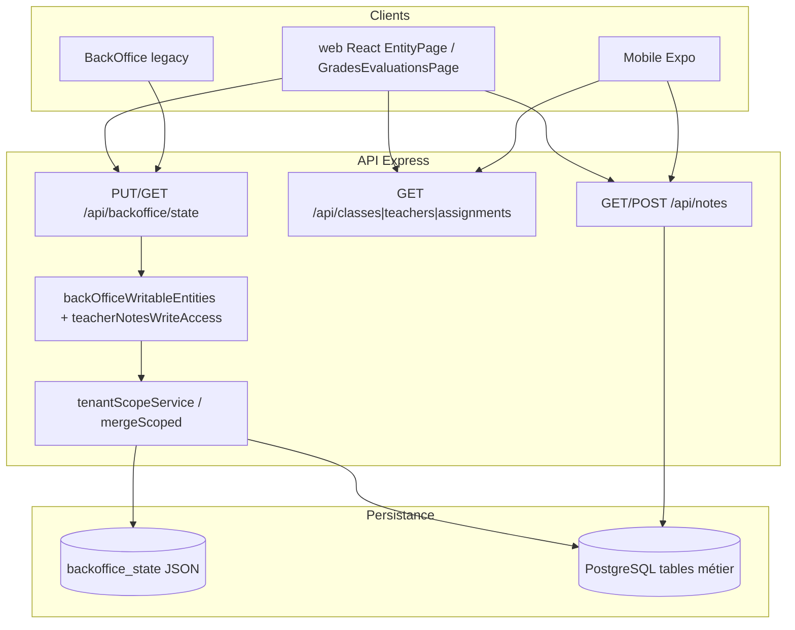

# AUDIT-PRE-E1 — Consolidation classes, enseignants, affectations et notes

**Statut :** Phase 0 — Diagnostic initial (cartographie)  
**Décision GO / NO-GO E1 :** ⏳ **Différée** — aucune exécution de gate complète dans cette livraison  
**Date :** 2026-07-26  
**Branche :** `cursor/audit-pre-e1-foundations-8ed4`  
**Base :** `develop` @ `a93ea9e7`  
**Périmètre code :** lecture seule — **aucune correction applicative** dans cette PR  
**Correspondance produit :** E1 = ouverture **Bulletins** (roadmap Phase E / lot D3.7 / release v1.1)

> Contexte CTO : la gouvernance documentaire est en place. Avant d’ouvrir les bulletins, valider la chaîne métier  
> **Classe → Enseignant → Affectation → Évaluation → Note**.

---

## 0. Synthèse exécutive (Phase 0)

| Question | Réponse Phase 0 |
|----------|-----------------|
| Les 4 modules existent-ils ? | **Oui** — surfaces web + API + schéma PG + tests partiels |
| Source d’écriture dominante ? | **`PUT /api/backoffice/state`** (blob JSON) pour Classes / Enseignants / Affectations / Évaluations / Notes web |
| Notes ont-elles une voie REST dédiée ? | **Oui** — `GET/POST /api/notes` (+ sync PG D3.6b) ; mobile privilégie ce chemin |
| Affectations ont-elles une page dédiée ? | **Non** — UI dans modal enseignants ; route `/affectations` → redirect |
| Isolation / RBAC déjà audités ? | Partiellement (S1.4, HOTFIX sync/RBAC notes) — **pas de gate pré-E1 consolidée** |
| Peut-on décider GO E1 maintenant ? | **Non** — cartographie seule ; phases V1–V7 requises |
| Corrections dans cette PR ? | **Interdites** — documenter puis, si besoin, PR correctives séparées |

**Hypothèse de risque dominante (à prouver ou infirmer) :** dualité JSON BO ↔ PostgreSQL + liens « stringly-typed » (`className`, `subject`) + suppressions surtout côté client → risque de corruption / orphelins pour les futurs bulletins.

---

## 1. Périmètre

### In scope

| Module | Alias produit | Surfaces principales |
|--------|---------------|----------------------|
| **Classes** | D3.2 | Liste `/etablissement/classes`, élèves de classe |
| **Enseignants** | D3.3 | Liste `/etablissement/enseignants` |
| **Affectations** | D2.8d1 | Workflow modal enseignants + `GET /api/assignments` |
| **Notes** | D3.6 | Outil `/notes` + `POST /api/notes` + PG `evaluations`/`grades` |

### Out of scope (explicit)

- Développement Bulletins (D3.7 / E1 implémentation)
- Refactoring EntityPage / ToolLayout
- Finance, Présences (hors chaîne bulletin), SYNC-04 sauf impact lecture
- Corrections fonctionnelles (réservées à des PR ultérieures après anomalies documentées)

### Mapping gouvernance

| Terme mission | Terme dépôt |
|---------------|-------------|
| E1 — Bulletins scolaires | Phase E / D3.7 / RELEASES `v1.1 — Bulletins` |
| Prérequis E1 | Classes + Enseignants + Affectations + Notes stabilisés |
| Convention d’audit UX existante | `docs/ux/design-system/AUDIT-D*.md` |
| Convention choisie pour cet audit consolidé | `docs/audits/AUDIT-PRE-E1-FOUNDATIONS.md` (demande CTO) |

---

## 2. Architecture observée



### 2.1 Source de vérité (état observé — à confirmer en V2)

| Entité | PG (`schema.sql`) | Snapshot BO JSON | Voie d’écriture web dominante | Commentaire |
|--------|-------------------|------------------|-------------------------------|-------------|
| School | `schools` | `schools` / scope `schoolCode` | Admin / onboarding | Tenant racine |
| AcademicYear | `academic_years` | `academicConfigs[schoolCode]` | `PUT /academic-config` + state | Dualité config / PG |
| Period / Term | `terms` | périodes config + string `period` notes | Config + notes | Risque d’ambiguïté bulletin |
| Class | `classes` | `classes[]` | **state** | Lecture enrichie `GET /api/classes` |
| Student | `students` + `enrollments` | `students[]` (`className` string) | state / parcours C1 | Lien classe souvent nominal |
| Teacher | `teachers` | `teachers[]` | **state** | Sync user↔teacher |
| Subject | `subjects` + `subject_class_assignments` | `courses[]` | state | Noms string dans affectations |
| Assignment | `teacher_assignments` UNIQUE(teacher,class,subject,year,role) | `assignments[]` | **state** | UI non autonome |
| Evaluation | `evaluations` | `evaluations[]` | **state** → sync PG | Pas de REST `/api/evaluations` |
| Grade | `grades` (+ index unique post-migration) | `notes[]` | state **et** `POST /api/notes` | Canonique PG déclaré D3.6b |
| Bulletin | **aucune table** | `bulletins[]` | state | Hors E0 ; risque E1 |

### 2.2 Relations cibles pour le bulletin

```
School
  └── AcademicYear
        ├── Term / Period
        ├── Class
        │     ├── Enrollment → Student
        │     └── SubjectClassAssignment → Subject
        └── TeacherAssignment → Teacher + Class + Subject + Year
              └── Evaluation → Class + Subject + Teacher? + Term
                    └── Grade → Student + Evaluation (+ score/status/coeff/max)
```

**Point d’attention :** le runtime web s’appuie encore largement sur des clés métier textuelles (`className`, `subject`, `period`) en plus des UUID PG.

---

## 3. Cartographie des quatre modules

### A. Classes

| Couche | Chemins |
|--------|---------|
| Pages | `web/src/pages/etablissement/ClassesListPage.tsx`, `ClassStudentsPage.tsx` |
| Assembleur | `web/src/pages/EntityPage.tsx` (`entity="classes"`) |
| Règles client | `web/src/lib/classRules.ts` (unicité, suppression) |
| Catalogue | `web/src/lib/entityModules.ts` (`classes`) |
| Routes | `PermissionRoute view="classes"` → `/etablissement/classes` |
| API lecture | `GET /api/classes` |
| API écriture | **`PUT /api/backoffice/state`** (`classes`) — pas de CRUD REST dédié |
| PG | `classes` (`school_id`, `academic_year_id`, `class_code` UNIQUE) |
| Mobile / legacy | `Mobile/src/screens/ClassesScreen.tsx`, `BackOffice/app.js` |
| Audits antérieurs | `docs/ux/design-system/AUDIT-D3.2-classes.md`, rapports D3.2* |

**Suppression (client) :** refuse si élèves inscrits, cours, créneaux planning.  
**Non couvert explicitement dans `validateClassDeletion` :** affectations, évaluations, notes → **risque à vérifier côté serveur / PG**.

### B. Enseignants

| Couche | Chemins |
|--------|---------|
| Pages | `web/src/pages/etablissement/TeachersListPage.tsx` |
| Règles client | `web/src/lib/teacherRules.ts`, `userTeacherSync.ts`, `pedagogyGovernance.ts` |
| API lecture | `GET /api/teachers` (`requirePermission`) |
| API écriture | **`PUT /api/backoffice/state`** (`teachers`) |
| PG | `teachers` (`school_id`, `user_id?`, `teacher_code` UNIQUE) |
| Services | `backend/services/userTeacherSyncService.js`, `lib/teacherEntryRules.js` |
| Docs | `RAPPORT-D3.3-enseignants.md` (pas d’`AUDIT-D3.3-*` dédié) |

**Suppression (client) :** bloque si affectations, matières, planning, classe responsable, user, contact.  
**Non listé dans `analyzeTeacherDeletion` :** évaluations / notes référencant `teacherId` → **risque orphelin à confirmer**.

### C. Affectations

| Couche | Chemins |
|--------|---------|
| UI | `web/src/pages/entity-page/teacherAssignmentWorkflow.ts` (modal enseignants) |
| Helpers | `web/src/lib/assignments.ts` |
| Route | `/affectations` → redirect `/etablissement/enseignants` |
| API lecture | `GET /api/assignments` (filtre enseignant possible) |
| API écriture | **`PUT /api/backoffice/state`** (`assignments`, souvent avec `teachers`/`courses`) |
| PG | `teacher_assignments` + unicité composite |
| Docs | `RAPPORT-D2.8d1-affectations-enseignants.md` |

**Risque UI :** listes déroulantes doivent être bornées à l’établissement actif — à prouver hors client.

### D. Notes (évaluations + grades)

| Couche | Chemins |
|--------|---------|
| Page outil | `web/src/pages/GradesEvaluationsPage.tsx` (`/notes`) |
| Composants | `web/src/components/grades/*` |
| Domaine | `evaluations.ts`, `gradeBook.ts`, `gradePermissions.ts` |
| API | `GET/POST /api/notes`, `GET /api/students/:id/notes`, report PDF |
| Sync / intégrité | `gradesBoPersistence.js`, `gradeUniqueness.js`, `evaluationAttachment.js`, `teacherNotesWriteAccess.js`, `noteConcurrency.js` |
| PG | `evaluations`, `grades` (checks score/status ; unique post-migration) |
| Mobile | `TeacherGradesScreen` → `POST /api/notes` |
| Docs | `AUDIT-D3.6-notes.md`, `CONTRAT-D3.6b-notes.md`, HOTFIX-SYNC-01/02/03, `KNOWN-ISSUE-NOTES-01` (clôturée code, préprod à confirmer) |

---

## 4. RBAC & multi-tenant — inventaire (non encore exécuté)

### 4.1 Écriture via `PUT /api/backoffice/state` (`backOfficeWritableEntities.js`)

| Rôle | classes | teachers | assignments | notes / evaluations | auditLog |
|------|---------|----------|-------------|---------------------|----------|
| Superadmin | Oui (toutes clés sauf auditLog) | Oui | Oui | Oui | **Jamais client** |
| Admin School | Oui | Oui | Oui | Oui | Non |
| Préfet / Proviseur / Dir. adjoint | Oui | Oui | Oui | Oui | Non |
| Directeur | Oui | Oui | Oui | Oui | Non |
| Secrétaire | Non | Non | Non | Non | Non |
| Enseignant (matrice ROLE_WRITABLE) | Non | Non | Non | **Non dans la map** | Non |
| Enseignant (HOTFIX-SYNC-03) | Non | Non | Non | **Oui sous conditions** (`teacherNotesWriteAccess`) | Non |
| Non authentifié | Refus | Refus | Refus | Refus | Refus |

> **Règle d’audit :** ne pas déduire les droits depuis l’UI. Chaque cellule « À vérifier » de la mission doit être prouvée par appel API (401/403 + absence de persistance).

### 4.2 Matrice cible à remplir en V3

| Module | Action | Superadmin | Admin établissement | Enseignant | Non autorisé |
|--------|--------|------------|---------------------|------------|--------------|
| Classes | Lire | À vérifier | À vérifier | À vérifier | Refus |
| Classes | Écrire | À vérifier | À vérifier | Refus attendu | Refus |
| Enseignants | Lire | À vérifier | À vérifier | Selon besoin | Refus |
| Enseignants | Écrire | À vérifier | À vérifier | Refus attendu | Refus |
| Affectations | Lire | À vérifier | À vérifier | Périmètre attendu | Refus |
| Affectations | Écrire | À vérifier | À vérifier | Selon règle | Refus |
| Notes | Lire | À vérifier | À vérifier | Périmètre affectation | Refus |
| Notes | Écrire | À vérifier | Selon permission | Périmètre affectation | Refus |

### 4.3 Isolation établissement

Mécanismes observés :

- `backend/services/tenantScopeService.js`
- `mergeScopedBackOfficeState` / `applyClientScopeToState`
- Filtres `schoolCode` / `school_id` sur lectures

Scénarios critiques (protocole V6) : Admin A ne doit jamais voir/modifier classes, enseignants, affectations ni notes de B.

---

## 5. API — mécanismes réellement utilisés

| Module | Lecture | Écriture | Remarque pré-E1 |
|--------|---------|----------|-----------------|
| Classes | `GET /api/classes` | `PUT /api/backoffice/state` | Pas de REST CRUD |
| Enseignants | `GET /api/teachers` | idem | Permission matrix |
| Affectations | `GET /api/assignments` | idem | Doublons PG UNIQUE |
| Évaluations | via state / snapshot | state → sync PG | Pas de `/api/evaluations` |
| Notes | `GET /api/notes` (+ state) | state **et** `POST /api/notes` | Double chemin |
| Bulletins (hors scope) | EntityPage / PDF | state JSON only | **Non structuré PG** |

### Évaluation préliminaire du bus `PUT /api/backoffice/state`

| Critère | Observation Phase 0 | Impact E1 |
|---------|----------------------|-----------|
| Atomicité | Merge partiel + outbox client | Risque concurrence / double soumission |
| Payload | Collections larges possibles | Sur-écriture si scope faible |
| auditLog | Enrichi serveur ; client rejeté (S1.4 / hotfixes) | À rejouer en V4 |
| Acceptabilité E1 | **Indécise** | Soit acceptable avec garde-fous prouvés, soit **blocker** si fuites / orphelins |

---

## 6. Interface — points de contrôle (V5)

Pour chaque module, vérifier :

- loading / empty / error
- confirmation suppression
- anti double-clic / disable submit
- toast succès + reload données
- mobile / desktop
- a11y minimale
- absence d’actions si permission absente (**UI ≠ sécurité**)

Surfaces :

| Module | UI | Pattern |
|--------|----|---------|
| Classes | EntityPage liste | CRUD modales |
| Enseignants | EntityPage liste | CRUD + modal affectations |
| Affectations | Modal uniquement | Pas de liste dédiée |
| Notes | `GradesEvaluationsPage` ToolLayout | Form évaluation + grille notes |

---

## 7. Tests existants vs manquants

### 7.1 Présents (inventaire)

| Zone | Fichiers / scripts |
|------|--------------------|
| UI Classes | `ClassesListPage.test.tsx`, `ClassStudentsPage.test.tsx` |
| UI Enseignants | `TeachersListPage.test.tsx` |
| Affectations workflow | `teacherAssignmentWorkflow.test.ts` |
| UI Notes | `GradesEvaluationsPage.test.tsx` |
| Merge / outbox | `backofficeStateMerge.test.ts`, sync outbox tests associés |
| Contrat notes PG | `noteContract.test.js`, `gradesBoPersistence.test.js`, `gradeUniqueness.test.js`, `evaluationAttachment.test.js`, `evaluationSyncRepository.test.js`, `gradesMigrationOrder.test.js` |
| RBAC notes enseignant | `teacherNotesWriteAccess.test.js`, `backend/scripts/verify-rbac-admin-01.js` |
| E2E chaînes | `verify-e2e-0004-classes-config.js`, `0006-teacher-assignment.js`, `0008-grades-chain.js`, `0013-teacher-journey.js`, `0028-teacher-planning-grades.js`, mobile classes `0020`/`0021` |
| Intégrité | `verify-data-integrity-chain.js`, `verify-business-rules.js` |

### 7.2 Couverture par exigence pré-E1

| Exigence minimum | État observé | Gap |
|------------------|--------------|-----|
| Validation métier notes (bornes, coeff, absences) | Partielle (`noteContract`, e2e-grades-rules) | Matérialiser défauts détectés en V1/V4 |
| RBAC API 4 modules | Fort sur notes/enseignant + S1.4 ; faible sur classes/enseignants/affectations isolation croisée | Matrice V3 complète |
| Isolation établissement | Helpers tenant + e2e admin ; pas de suite dédiée A↔B sur les 4 modules | Scénario V6 |
| Persistance après reload | E2E partiels ; pas de protocole Ctrl+Shift+R documenté CTO | V6 |
| Relations chaîne complète | `0008` proche ; à étendre reload + multi-tenant + suppressions dangereuses | Scénario intégré V1 |
| Suppressions / orphelins | Règles client ; peu de preuves serveur FK/refus | V2 + V6 |
| Tests faibles / UI-only | List pages = chrome / forbidden UI | Ne pas compter comme preuve API |

### 7.3 Scénario intégré minimum requis (à exécuter / compléter)

```
Créer classe
→ créer enseignant
→ créer affectation enseignant/matière/classe/année
→ créer évaluation
→ saisir plusieurs notes
→ recharger (nouvelle session / hard refresh)
→ vérifier persistance + relations (IDs / schoolCode / term / subject)
```

**Statut Phase 0 :** `verify-e2e-0008-grades-chain.js` couvre une chaîne proche mais **ne remplace pas** le protocole CTO multi-établissement + suppressions dangereuses + hard refresh.

---

## 8. Scénarios — existants vs manquants (checklist)

Légende : ✅ couvert par test/script identifiable · ⚠️ partiel / client-only · ❌ absent · 🔍 à exécuter manuellement

### A. Classes

| Scénario | Statut |
|----------|--------|
| Création / consultation / modification | ⚠️ EntityPage + e2e 0004 |
| Suppression | ⚠️ `classRules` client |
| Persistance après rechargement | 🔍 |
| Unicité / validation | ⚠️ |
| Classe avec élèves / notes / affectations | ⚠️ élèves+cours ; **notes/affectations non dans classRules** |
| Filtrage établissement / fuite | 🔍 |
| Superadmin / Admin / non autorisé | ⚠️ UI forbidden ; API 🔍 |

### B. Enseignants

| Scénario | Statut |
|----------|--------|
| CRUD + persistance | ⚠️ |
| Champs obligatoires / doublons | ⚠️ |
| Rattachement établissement | 🔍 |
| RBAC visibilité | 🔍 |
| Suppression avec affectations | ⚠️ client |
| Suppression avec notes/évaluations | ❌ non listé dans blockers client |
| Orphelins post-suppression | 🔍 |

### C. Affectations

| Scénario | Statut |
|----------|--------|
| CRUD + persistance | ⚠️ workflow + e2e 0006 |
| Prévention doublons | ⚠️ PG UNIQUE ; BO JSON 🔍 |
| Cohérence enseignant/classe/matière/année/école | 🔍 |
| Interdit cross-établissement | 🔍 **critique E1** |
| Options UI bornées au tenant actif | 🔍 |
| Comportement si classe/matière/enseignant supprimé | 🔍 |
| RBAC écriture refusée | 🔍 |

### D. Notes

| Scénario | Statut |
|----------|--------|
| CRUD note + évaluation | ⚠️ e2e 0008 + unit PG |
| Saisie par élève / par classe | ⚠️ UI |
| Liens matière / enseignant / affectation / période | ⚠️ |
| Type, coeff, max, décimales, bornes | ⚠️ contrats |
| Absence / non noté | ⚠️ `grade_status` PG |
| Droits lecture/écriture + isolation | ⚠️ HOTFIX-03 ; préprod 🔍 |
| Élève ∈ classe ; matière affectée ; enseignant autorisé ; année cohérente | 🔍 exhaustif |

---

## 9. Risques identifiés (hypothèses — classification provisoire)

> Ces items sont des **risques à vérifier**, pas encore des anomalies confirmées.  
> Classification indicative pour prioriser V1–V7 ; la classification définitive suivra les preuves.

| ID | Risque | Sévérité provisoire | Module | Pourquoi E1 |
|----|--------|---------------------|--------|-------------|
| R-01 | Bus d’écriture unique `PUT /api/backoffice/state` pour 4 modules | CRITICAL | Transversal | Corruption / sur-écriture / courses |
| R-02 | Dualité JSON BO ↔ PG (classes, teachers, assignments, evaluations, notes) | CRITICAL | Transversal | Source de vérité ambiguë pour calcul bulletin |
| R-03 | Liens métier textuels (`className`, `subject`, `period`) vs UUID | CRITICAL | Relations | Assemblage bulletin ambigu |
| R-04 | `validateClassDeletion` ignore affectations / évaluations / notes | CRITICAL | Classes | Suppression destructrice possible |
| R-05 | `analyzeTeacherDeletion` ignore notes / évaluations | MAJOR | Enseignants | Orphelins teacher_id |
| R-06 | Pas de page Affectations ; options UI à prouver côté serveur | MAJOR | Affectations | Cross-tenant via IDs forgés |
| R-07 | `grades.evaluation_id` nullable + unique index post-migration | CRITICAL | Notes | Notes non reliées → NO-GO si confirmé en prod/préprod |
| R-08 | Pas de table PG `bulletins` | INFORMATION (E1) | Bulletins | E1 devra définir source dérivée des grades |
| R-09 | Triple GradeBook (web/backend/mobile) historiquement divergent | MAJOR | Notes | Moyennes bulletin incohérentes |
| R-10 | UI RBAC ≠ preuve API | MAJOR | RBAC | Fausse confiance |
| R-11 | Legacy `BackOffice/` mute les mêmes entités | MAJOR | API | Contournement parcours web |
| R-12 | KNOWN-ISSUE-NOTES-01 clôturée code mais validation préprod cochée partiellement | MAJOR | Notes | Sync enseignant encore à gate |
| R-13 | Absence de suite automatisée isolation A↔B sur les 4 modules | CRITICAL | Multi-tenant | Fuite = NO-GO obligatoire |
| R-14 | Concurrence / double soumission state + outbox | MAJOR | API | Doublons notes / pertes ACK |

---

## 10. Matrice synthétique (état Phase 0 — non gate)

| Module | Fonctionnel | RBAC | Isolation | Persistance | Tests | Statut |
|--------|-------------|------|-----------|-------------|-------|--------|
| Classes | ⚠️ Observé | 🔍 À prouver API | 🔍 | 🔍 | Partiels UI/e2e | **AUDIT EN COURS** |
| Enseignants | ⚠️ Observé | 🔍 | 🔍 | 🔍 | Partiels | **AUDIT EN COURS** |
| Affectations | ⚠️ Observé | 🔍 | 🔍 | 🔍 | Workflow + e2e 0006 | **AUDIT EN COURS** |
| Notes | ⚠️ Observé (+PG) | ⚠️ HOTFIX-03 | 🔍 | ⚠️ contrats | Unit + e2e 0008 | **AUDIT EN COURS** |

Légende cellule : ✅ OK · ⚠️ partiel · ❌ KO · 🔍 non exécuté.

---

## 11. Plan de vérification découpé (sous-phases)

Aucune correction avant clôture de la Phase 0 et accord CTO sur le plan.

### V0 — Cartographie *(cette PR)*

- [x] Inventaire composants / services / routes / RBAC / tests
- [x] Scénarios existants vs manquants
- [x] Risques provisoires
- [x] Plan V1–V7
- [ ] Revue CTO du diagnostic

### V1 — Chaîne métier intégrée (automatisée)

Objectif : matérialiser le scénario Classe → Enseignant → Affectation → Évaluation → Notes → reload.

Actions :

1. Exécuter `verify-e2e-0004`, `0006`, `0008`, `0013` / `0028` sur environnement contrôlé
2. Compléter **uniquement** les tests nécessaires pour figer comportements/défauts (pas de refactor)
3. Documenter résultats dans ce fichier (§ Résultats fonctionnels)

### V2 — Modèle de données & intégrité

1. Tracer source de vérité réelle (lecture authoritative snapshot PG vs JSON)
2. Vérifier contraintes UNIQUE / FK / suppressions PG vs règles client
3. Chercher orphelins (`evaluation_id` null, teacher/class manquants)
4. Lister données bulletin insuffisamment structurées

### V3 — RBAC API (matrice)

Pour chaque cellule de §4.2 :

1. Appel API authentifié
2. Attendre 401/403 si interdit
3. Vérifier **aucune** persistance
4. Vérifier absence de fuite payload / audit falsifiable

Scripts d’appui : `verify-rbac-admin-01.js`, `teacherNotesWriteAccess.test.js`, extensions minimales si gaps.

### V4 — Audit API & bus state

1. Recenser payloads réels des 4 modules
2. Double soumission / concurrence
3. Tentatives `auditLog` client
4. Tentatives modification collections hors permission
5. Décision argumentée : state acceptable pour E1 **ou** risque à traiter avant bulletins

### V5 — Interface

Parcours manuel/checklist §6 sur Superadmin, Admin établissement, Enseignant, rôle sans permission.

### V6 — Protocole préproduction CTO

#### Jeu de données minimum

- Établissement A, Établissement B
- 1 admin / établissement
- 2 classes (A), 1 classe (B)
- 2 enseignants, 2 matières, plusieurs élèves
- Plusieurs affectations, évaluations, notes

#### Scénarios critiques

1. **Isolation** — Admin A : lecture/écriture B impossibles (classes, enseignants, affectations, notes)
2. **Chaîne métier** — cohérence après déconnexion, reconnexion, Ctrl+Shift+R, nouvelle session
3. **Suppressions dangereuses** — enseignant avec affectation ; classe avec notes ; affectation utilisée par évaluation ; matière liée à notes  
   Attendu : refus propre **ou** cascade maîtrisée **ou** archivage — jamais destruction silencieuse

### V7 — Synthèse décisionnelle

Compléter dans ce document :

- résultats fonctionnels / RBAC / multi-tenant / API
- dette & anomalies classées **BLOCKER / CRITICAL / MAJOR / MINOR / INFORMATION**
- recommandations
- **décision finale : GO E1 · GO conditionnel · NO-GO**

### Règle de décision (rappel mission)

| Décision | Conditions |
|----------|------------|
| **GO E1** | 0 BLOCKER, 0 CRITICAL ; RBAC + isolation + persistance OK ; relations cohérentes ; pas de risque corruption bulletin ; tests critiques verts |
| **GO conditionnel** | Uniquement MINOR documentées, sans impact calcul/données bulletin |
| **NO-GO** | Fuite inter-établissements ; écriture sans permission ; notes mal reliées ; orphelins ; suppression destructrice ; incohérence reload ; source de vérité notes douteuse ; calcul bulletin impossible/ambigu |

---

## 12. Livrables & contraintes PR

| Livrable | Statut |
|----------|--------|
| Document `docs/audits/AUDIT-PRE-E1-FOUNDATIONS.md` | ✅ Phase 0 |
| PR Draft dédiée | ✅ (cette branche) |
| Séparation d’avec PR documentaire gouvernance (#83 / docs project) | ✅ branche distincte |
| Pas de feature / pas de gros refactor / pas d’UX non nécessaire | ✅ |
| Undraft / merge | ❌ uniquement après validation CTO explicite |
| Correctifs | ❌ hors Phase 0 — PR séparées après anomalies documentées |

---

## 13. Prochaine action demandée au CTO

1. Valider la cartographie et le plan V1–V7  
2. Autoriser l’exécution V1 (tests + compléments strictement nécessaires)  
3. Ne pas ouvrir le développement Bulletins tant que V7 n’a pas produit GO / GO conditionnel / NO-GO

---

## 14. Journal

| Date | Événement |
|------|-----------|
| 2026-07-26 | Phase 0 — cartographie initiale sur `develop` @ `a93ea9e7` ; aucune correction code |
)
