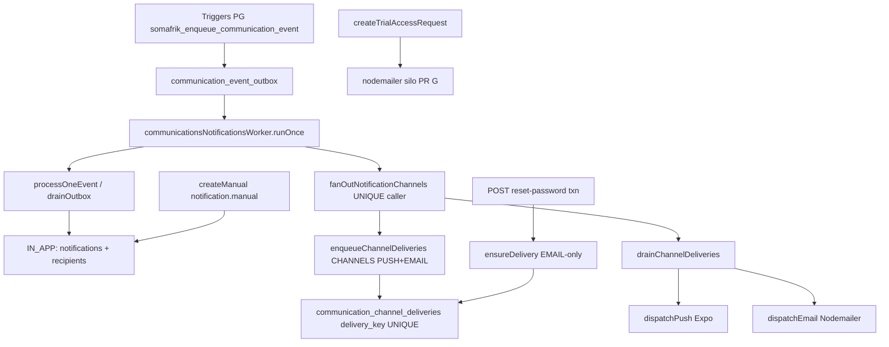

# PR D — Audit dispatcher unifié IN_APP | PUSH | EMAIL

**Date :** 8 septembre 2026  
**Branche :** `cursor/communications-dispatcher-audit-7fd4`  
**Base :** `origin/develop` après merge #547  
**Périmètre :** audit + RED légitimes. Aucun GREEN. Aucun runtime métier.

STOP obligatoire après ce livrable. Attendre GO CTO.

---

## 0. Synthèse CTO (lire en premier)

Le point critique est le **§12 : un seul propriétaire du fan-out PUSH/EMAIL**.

Aujourd’hui, après #545, **le worker C4 est l’unique caller runtime** de `fanOutNotificationChannels` :

```text
runOnce()
  → drainOutbox() / processOneEvent()     UNIQUE persist IN_APP
  → fanOutNotificationChannels()          UNIQUE enqueue+drain PUSH/EMAIL
```

`processOneEvent` ne connaît ni Expo ni SMTP (#545 / RED-COM-01b, GREEN).  
Le reset #547 écrit une delivery EMAIL via `ensureDelivery` puis s’appuie sur **le même drain**.  
La demande d’essai reste un silo SMTP (PR G).

Un dispatcher ajouté **à côté** de ce caller enverrait PUSH/EMAIL une première fois, puis le worker C4 les renverrait. C’est le risque P1 de double delivery.

**Recommandation unique (détail §13) :** le dispatcher futur est une **couche de politique mince**, pas un second sender. Le worker après persist reste l’unique propriétaire d’exécution du fan-out C4. Le GREEN devra **remplacer** l’appel `fanOutNotificationChannels` (ou l’envelopper une seule fois), jamais l’ajouter en parallèle.

---

## 1. Architecture exacte actuelle après #547

```text
Événement métier (trigger PG)
        ↓
communication_event_outbox          event_key UNIQUE  type:uuid
        ↓
worker runOnce
   ├─ drainOutbox → processOneEvent
   │     communication_notifications     event_key UNIQUE
   │     notification_recipients         (notification_id, user_id) UNIQUE
   │     = IN_APP persist  (aucun provider)
   └─ fanOutNotificationChannels(processed)
         enqueueChannelDeliveries        CHANNELS = [PUSH, EMAIL] figé
         drainChannelDeliveries          SKIP LOCKED + stale → skipped
            ├─ PUSH  Expo   listActiveForUser(user_id, school_id, backend_environment)
            └─ EMAIL Nodemailer SMTP_* + MAIL_FROM

Parallèle #547 :
  POST reset-password
    → txn PG (hash + révocation sessions + must_change_password)
    → ensureDelivery(EMAIL, delivery_key=auth.password.reset:userId:resetId)
    → COMMIT
    → même drainChannelDeliveries (worker)

Silo hors orchestration (PR G) :
  trialAccessRequestNotification.notifyTrialAccessRequest
    → nodemailer direct / setImmediate
```

Il n’existe **aucun** `dispatchCommunication`, **aucun** `communicationsDispatcher.js`, **aucune** politique explicite `eventType → canaux`.

IN_APP n’est pas un `channel` SQL. IN_APP = persistance `communication_notifications` + `notification_recipients`.

---

## 2. Diagramme actuel



---

## 3. Inventaire des décisions de canaux

Les décisions actuelles sont **implicites** (emplacement du code), jamais une liste `channels[]`.

| Décision observée | Où | Mécanisme |
|---|---|---|
| IN_APP pour 5 eventTypes C4 | `eventSpec` + `processOneEvent` | persist notification si recipients non vides |
| PUSH+EMAIL pour tout C4 drainé | `CHANNELS` figé dans le fan-out | enqueue 2 lignes / destinataire, skip à l’envoi si pas de device / pas d’email / SMTP absent |
| IN_APP seulement | `createManual` | insert direct notifications ; **pas** d’outbox → le worker ne fan-out pas |
| EMAIL seulement | reset #547 | `ensureDelivery({ channel: "EMAIL" })` ; pas d’outbox, pas de PUSH, pas d’IN_APP |
| EMAIL silo (hors deliveries) | demande d’essai | Nodemailer sync / `setImmediate` |
| IN_APP plateforme (hors C4) | `platform-announcements` | tables plateforme distinctes |
| « canal » finance relance | `financeService.createReminder` | ledger `payment_reminders`, `channel` défaut `"notification"` ; **aucun** SMTP/Expo/C4 |
| Invitations | — | **aucun** envoi trouvé dans le Backend |
| Abonnements | CRUD plateforme | **aucun** envoi communication trouvé |

Aucune combinaison explicite `IN_APP + PUSH` sans EMAIL : le fan-out C4 enqueue toujours les deux, puis skippe à l’envoi.

---

## 4. Fichiers / services / tables concernés

| Rôle | Fichier |
|---|---|
| Outbox + IN_APP persist | `backend/lib/communicationsNotificationsService.js` |
| Worker unique caller fan-out | `backend/lib/communicationsNotificationsWorker.js` |
| PUSH/EMAIL enqueue+drain+providers | `backend/lib/communicationChannelFanout.js` |
| Schéma C4 + triggers | `backend/db/communicationsNotificationsSchema.js` |
| Migration deliveries | `backend/db/migrations/20260907_communication_channel_deliveries.sql` |
| Reset EMAIL durable | `backend/lib/passwordResetNotification.js` + `backend/server.js` `POST /api/users/:id/reset-password` |
| SMTP silo essai | `backend/lib/trialAccessRequestNotification.js` |
| Ciblage PUSH tenant | `backend/db/mobilePushDevicesStore.js` |
| Env PUSH | `backend/lib/mobilePushDevicesService.js` `resolvePushBackendEnvironment` |
| Expo SDK | `backend/lib/expoPushService.js` (uniquement via fan-out) |

Tables : `communication_event_outbox`, `communication_notifications`, `notification_recipients`, `communication_channel_deliveries`, `mobile_push_devices`.  
Pas de colonne `backend_environment` sur les deliveries (l’env est résolu **à l’envoi** PUSH).

---

## 5. Matrice événement → canaux actuels

Légende : **actuel** / *techniquement possible sans nouveau provider* / **recommandation CTO (pas un GO produit)**.

| Événement / commande | Actuel | Possible | Recommandation CTO (conceptuel) |
|---|---|---|---|
| `communication.message.created` | IN_APP + enqueue PUSH+EMAIL | les 3 | `[IN_APP, PUSH]` — EMAIL conversationnel non justifié |
| `communication.announcement.published` | IN_APP + enqueue PUSH+EMAIL | les 3 | `[IN_APP, PUSH]` ; EMAIL optionnel produit |
| `attendance.student.absent` | IN_APP + enqueue PUSH+EMAIL | les 3 | `[IN_APP, PUSH]` ; EMAIL optionnel produit |
| `pedagogy.grade.published` | IN_APP + enqueue PUSH+EMAIL | les 3 | `[IN_APP, PUSH]` |
| `finance.payment.recorded` | IN_APP + enqueue PUSH+EMAIL | les 3 | `[IN_APP, PUSH]` ; EMAIL optionnel produit |
| `notification.manual:*` | IN_APP only | PUSH/EMAIL si on branchait le fan-out | rester IN_APP until GO |
| `auth.password.reset` | EMAIL durable only | IN_APP/PUSH possibles mais **interdits** | `[EMAIL]` strict (#547) |
| Demande d’essai | SMTP silo | deliveries EMAIL | **PR G**, hors PR D |
| Platform announcements | IN_APP plateforme | C4 | hors PR D (lot F) |
| Relances finance | ledger, pas d’envoi | dispatcher | hors PR D |
| Invitations / abonnements | aucun canal comms | — | ne pas inventer |

Ces recommandations **ne sont pas** à implémenter sans preuve produit / GO.

---

## 6. Matrice persistance / idempotence / retry par canal

| Canal | Persistance | Idempotence | Retry | Stale processing | Provider |
|---|---|---|---|---|---|
| IN_APP | outbox `event_key` UNIQUE + notification `event_key` UNIQUE + recipients `(notification_id, user_id)` | même event = 1 notification | outbox `failed` + `available_at` +5s | claim `processing` 2 min puis retraitement outbox | aucun |
| PUSH | `communication_channel_deliveries` | `delivery_key` UNIQUE `{event_key}:{userId}:PUSH` ; `ON CONFLICT DO NOTHING` | `failed` backoff 5s×2^n cap 15 min, max 8 | `processing` > 2 min → **skipped** `stale_processing_no_redelivery` (at-most-once, envoi potentiellement perdu) | Expo |
| EMAIL C4 / reset | même table | `{event_key}:{userId}:EMAIL` ou `auth.password.reset:{userId}:{resetId}` | idem | idem | Nodemailer SMTP_* |
| EMAIL essai | aucune | aucune | `setImmediate` fire-and-forget | n/a | Nodemailer silo |

Clés dispatcher (cible, non implémentée) :

- IN_APP : continuer `event_key` (`{eventType}:{sourceUuid}`)
- PUSH/EMAIL : continuer `{event_key}:{userId}:{CHANNEL}`  
  Le suffixe canal **évite les collisions** entre IN_APP / PUSH / EMAIL.
- Reset : **ne pas** réécrire la clé #547.

Double appel dispatcher / retry HTTP / restart / concurrence workers : `ON CONFLICT (delivery_key) DO NOTHING` + `SKIP LOCKED` + stale→skipped. Un dispatcher qui **changerait** le format de clé casserait cette idempotence et provoquerait un double send.

---

## 7. Analyse tenant

### PUSH (#544, à conserver)

Ciblage à l’envoi : `user_id` + `school_id` + `backend_environment`  
Preuve : `mobilePushDevicesStore.js` `listActiveForUser` (l.66–80) + `dispatchPush` (l.340–354) + `scopedDevices` (l.329–337).  
Tests GREEN : `mobilePushDevices.tenant.test.js` RED-COM-02, `communicationChannelFanout.test.js` « école A ne cible jamais un token de l’école B », AUDIT-COM-02.

Cas obligatoire A/B : un user_id réutilisé sur l’école B ne reçoit pas le PUSH de l’école A — le SQL exige les deux UUID. Residual : la table deliveries n’a pas `backend_environment` ; l’isolation env est appliquée au send, pas à l’enqueue. Suffisant tant que `dispatchPush` reste le seul chemin Expo.

### EMAIL

`getUserEmail` : `users.id AND school_id AND status=active` (`communicationChannelFanout.js` l.165–172). Une adresse de l’école B n’est pas utilisée pour une delivery school A.

### IN_APP

`requireSchool` + `school_id` sur notifications et recipients. `eventSpec` filtre toutes les sources par `school_id`.

### Reset

`assertUsersTargetAccess` + `schoolId` sur la delivery. Pas d’IN_APP/PUSH.

Aucun chemin audité n’envoie une communication A vers une destination **uniquement** B. Risque d’escalade si un futur dispatcher omet `schoolId` au `ensureDelivery` ou liste les devices par `user_id` seul — interdit par #544.

---

## 8. Isolation des pannes

Déjà en place pour C4 :

- Persist IN_APP commitée **avant** tout provider (`runOnce` drain puis fan-out).
- Échec Expo : delivery PUSH `failed`, EMAIL peut `sent` ; la notification in-app reste (`communicationChannelFanout.test.js` « in-app reste persistée si Expo échoue »).
- Échec SMTP : idem inverse.
- `fanOutNotificationChannels` catch : log + `[]`, ne rollback pas l’outbox.
- Reset : SMTP **hors** txn Auth (GREEN-COM-03B). Échec mailer ≠ rollback hash/sessions.

Cible dispatcher : **ne pas** envelopper IN_APP+PUSH+EMAIL dans une txn distribuée synchrone avec les providers. Enqueue durable puis drain indépendant par ligne.

---

## 9. Analyse double fan-out (§12) — propriétaire unique

### Qui enqueue / drain aujourd’hui

| Action | Unique propriétaire actuel | Preuve |
|---|---|---|
| Décision IN_APP (oui/non + recipients) | `eventSpec` + `processOneEvent` | `communicationsNotificationsService.js` l.433–578 |
| Appel runtime `fanOutNotificationChannels` | **uniquement** `runOnce` | worker l.14–28 ; AUDIT-COM-05 |
| Enqueue PUSH+EMAIL C4 | `enqueueChannelDeliveries` via ce caller | fanout l.287–315, l.451–475 |
| Enqueue EMAIL reset | `enqueuePasswordResetNotification` dans la txn Auth | `passwordResetNotification.js` l.46–66 |
| Drain PUSH/EMAIL | `drainChannelDeliveries` appelé depuis `fanOutNotificationChannels` | drain **toutes** les lignes pending/failed, pas seulement `processed` |
| SMTP essai | silo, **pas** deliveries | `trialAccessRequestNotification.js` |

`enqueueChannelDeliveries` est idempotent : un second passage worker ne duplique pas (`ON CONFLICT DO NOTHING`).  
Le danger n’est **pas** le re-enqueue C4. Le danger est un **second producteur** qui crée une **autre** `delivery_key` pour le même événement logique, ou qui appelle Expo/SMTP en plus du drain.

### Options d’emplacement (mandat A–E)

| Option | Description | Double fan-out | Verdict |
|---|---|---|---|
| A. Producteur métier | server.js / finance / auth appellent PUSH/EMAIL | **Oui** si le worker continue | Rejeté |
| B. `processOneEvent` | fan-out dans la persist IN_APP | casse RED-COM-01b ; reset hors outbox | Rejeté |
| C. Worker après persist | état actuel | Non, tant qu’il reste unique caller | **Conserver comme unique exécuteur C4** |
| D. Dispatcher sender parallèle | nouvelle façade qui enqueue/drain **et** worker inchangé | **Oui — P1** | Rejeté |
| D′. Dispatcher = unique fonction appelée par le worker | `runOnce` → dispatcher mince qui délègue à persist déjà faite + enqueue policy-aware + drain existant | Non | **GREEN cible** |
| E. Policy map sans nouveau module | `eventType → channels` lu par `enqueueChannelDeliveries` | Non si worker reste unique caller | Acceptable si trop mince pour un fichier |

### Qui doit être l’UNIQUE propriétaire

**Exécution PUSH/EMAIL C4 : C — worker après persist**, via une unique fonction (aujourd’hui `fanOutNotificationChannels`, demain éventuellement `dispatchCommunication` **à la place**, pas en plus).

**Politique de canaux : D′** — liste explicite par `eventKey` / `eventType`, dédupliquée, fail-closed, sans secrets.

**Reset : producteur Auth** pour `ensureDelivery(EMAIL)` uniquement ; le worker drain reste le sender SMTP. Ne pas faire fan-out C4 sur `auth.password.reset`.

**Demande d’essai : personne dans PR D** (PR G).

---

## 10. Fail-closed

| Entrée | Comportement actuel | Cible |
|---|---|---|
| `channels = ["SMS"]` | pas d’API dispatcher ; CHECK SQL refuse SMS sur PG ; **memory/drain** : `channel === "EMAIL" ? email : push` → **SMS traité comme PUSH** | erreur contrôlée / skipped `unsupported_channel` ; aucun provider |
| `null` / `undefined` / malformé | idem fallback PUSH | reject |
| doublons `["PUSH","PUSH"]` | `CHANNELS` figé, pas de dédup API | dédup puis enqueue 1× |
| canal supporté | PUSH/EMAIL only | allow-list figée `IN_APP \| PUSH \| EMAIL` |

Preuve du trou drain : `communicationChannelFanout.js` l.416–423.  
CHECK : schema l.217, migration l.9.  
RED légitime : **RED-COM-04F**.

Pas de fallback implicite EMAIL↔PUSH aujourd’hui pour un canal **connu** : EMAIL va à `dispatchEmail`, le reste à `dispatchPush`. C’est précisément le défaut fail-closed.

---

## 11. Observabilité

Champs déjà disponibles :

| Champ | Où |
|---|---|
| `event_key` | outbox, notifications, deliveries |
| `delivery_key` | deliveries UNIQUE |
| `notification_id` | deliveries (nullable pour reset) |
| `school_id` / `user_id` | recipients + deliveries |
| `channel` / `status` / `attempts` / `last_error` / `provider_ref` | deliveries |
| timestamps | `created_at`, `updated_at`, `available_at`, `claimed_at`, `sent_at`, outbox `processed_at` |

**Pas de nouvelle table.** **Pas de nouvelle colonne** pour le dispatcher mince : réutiliser `event_key` + `delivery_key` + `channel`.  
`backend_environment` n’a pas besoin d’être persisté sur deliveries si le send PUSH continue de le résoudre. À réévaluer seulement si l’audit d’un incident le exige.

Logs worker : `[communications-c4] event skipped` / `channel fan-out failed` / `outbox dispatch failed`. Suffisant pour PR D.

---

## 12. Comparaison des options (rappel)

Voir §9. La comparaison utile pour le GREEN :

1. **Ne rien faire** — politique PUSH+EMAIL pour tout C4, pas de fail-closed API, reset et essai en silos.  
2. **Policy map dans `enqueueChannelDeliveries`** — plus petit diff, unique caller conservé, pas de façade testable `dispatchCommunication`.  
3. **Dispatcher mince appelé une seule fois par `runOnce`** — contrat auditable, délégation, fail-closed, pas de second sender.  
4. **Dispatcher appelé depuis les producteurs + worker** — double fan-out. Interdit.

---

## 13. UNE recommandation CTO

Adopter **l’option D′** au GREEN (pas maintenant) :

1. Introduire `backend/lib/communicationsDispatcher.js` **sans** `nodemailer` / Expo / Brevo.  
2. Contrat minimal :

   ```text
   dispatchCommunication({ eventKey, eventType, schoolId, recipients, channels, payload })
   ```

   - allow-list `IN_APP | PUSH | EMAIL`
   - dédup
   - fail-closed si canal inconnu / null / malformé
   - clés déterministes existantes
   - IN_APP → composants C4 existants (ne pas réimplémenter `processOneEvent`)
   - PUSH/EMAIL → `ensureDelivery` / enqueue existant, **jamais** SMTP/Expo directs

3. **`runOnce` devient l’unique caller** de cette façade pour les events C4 drainés. `fanOutNotificationChannels` est soit inliné dedans, soit appelé **uniquement** par elle.  
4. **Interdit :** second `require` + appel depuis `server.js`, `processOneEvent`, ou le reset.  
5. Reset reste `ensureDelivery(EMAIL)` dans la txn Auth ; drain inchangé.  
6. Demande d’essai inchangée (PR G).  
7. `CHANNELS` figé `[PUSH, EMAIL]` doit devenir **policy par eventType** (défaut conservateur = comportement actuel, jusqu’à GO produit pour retirer EMAIL).  
8. Aucune table nouvelle. Aucune préférence utilisateur. Aucun changement Web/Mobile.

---

## 14. P0 / P1 / P2 (preuves file:line)

### P0

Aucun P0 de production identifié **tant que** le GREEN n’ajoute pas un second sender. L’absence de dispatcher est un manque de politique, pas une faille d’envoi actuelle.

### P1

| ID | Écart | Preuve |
|---|---|---|
| P1-DISPATCHER / RED-COM-04A | Pas de façade capable de router explicitement IN_APP \| PUSH \| EMAIL | aucun `communicationsDispatcher.js` ; grep `dispatchCommunication` vide ; `CHANNELS` figé `communicationChannelFanout.js:13` ; enqueue l.296–309 toujours PUSH+EMAIL |
| P1-DOUBLE-FANOUT | Un dispatcher naïf + worker actuel = double PUSH/EMAIL | unique caller actuel `communicationsNotificationsWorker.js:23-28` ; `drainChannelDeliveries` draine **toutes** les pending l.404–438 |
| P1-FAIL-CLOSED / RED-COM-04F | Canal inconnu traité comme PUSH | `communicationChannelFanout.js:416-423` |
| P1-PROVIDER-IN-FANOUT / RED-COM-04J | La couche qui « dispatch » aujourd’hui importe Nodemailer + Expo | `communicationChannelFanout.js:8-11` — acceptable pour l’adaptateur ; **interdit** pour la future façade dispatcher |

### P2

| ID | Écart | Preuve |
|---|---|---|
| P2-MANUAL-NO-FANOUT | `createManual` IN_APP only (peut être voulu) | `communicationsNotificationsService.js:343-411` pas d’outbox |
| P2-TRIAL-SILO | SMTP hors deliveries | `trialAccessRequestNotification.js:47-62` ; `trialAccessRequests.js:56-66` `setImmediate` |
| P2-PLATFORM | Annonces plateforme hors C4 | `backend/server.js` routes `platform-announcements` |
| P2-FINANCE-REMINDER | Relance = ledger, pas un envoi | `financeService.js:842-887` |
| P2-DELIVERY-NO-ENV | `backend_environment` absent des deliveries | migration `20260907_communication_channel_deliveries.sql` |

---

## 15. Tests existants exécutés + résultats

Exécution locale 8 septembre 2026, `DATABASE_URL` **absent** → suites PG **SKIP**, aucune base partagée utilisée.

Backend `npm ci --prefix backend --ignore-scripts` requis : `nodemailer` n’était pas installé dans ce workspace.

| Suite | Besoin PG | Résultat |
|---|---|---|
| `communicationsChannelFanout.red-com-01.test.js` | non | **GREEN** 3/3 |
| `communicationChannelFanout.test.js` | non | **GREEN** (idempotence, tenant A/B, pannes Expo/SMTP, stale) |
| `communicationsPasswordReset.red.test.js` | non | **GREEN** 8/8 (contrats #547) |
| `passwordResetNotification.test.js` | non | **GREEN** 4/4 |
| `mobilePushDevices.tenant.test.js` | non | **GREEN** 3/3 RED-COM-02 |
| `communicationsGlobalArchitecture.audit.test.js` | non | AUDIT-COM-01/02/04 **GREEN** ; AUDIT-COM-03 **échec regex préexistant** (voir note) |
| `communicationsDispatcher.red.test.js` | non | **RED-COM-04A / 04F / 04J FAIL attendu** ; AUDIT-COM-05 **GREEN** |
| `communicationsC4.http.pg.test.js` / bootstrap | `DATABASE_URL` | **SKIP** — variable absente |

Lot GREEN fan-out + reset + tenant (hors audit global) : **31 pass / 0 fail**.

Note AUDIT-COM-03 : le `doesNotMatch(/status\s*=\s*'processing'.*claimed_at/s)` matche le `UPDATE … SET status='processing', claimed_at=` du claim légitime. RED-COM-01c, plus précis (`status = 'processing' AND claimed_at` dans le WHERE), reste GREEN. **Pas corrigé ici** (interdit GREEN / hors périmètre). Ce n’est pas un trou de redelivery.

RED-COM-04F preuve runtime : `pushCalled === true` pour `channel: "SMS"` — le drain a bien emprunté `dispatchPush`.

---

## 16. Nouveaux RED + justification

| RED | Légitime ? | Justification |
|---|---|---|
| **RED-COM-04A** | oui | Trou réel : pas de dispatcher / pas de politique explicite |
| RED-COM-04B | non | Déjà GREEN : enqueue idempotent `communicationChannelFanout.test.js` |
| RED-COM-04C | non | Déjà GREEN : RED-COM-01b / AUDIT-COM-01 (`processOneEvent` sans provider) |
| RED-COM-04D | non | Comportement actuel déjà vrai : enqueue ne crée pas d’IN_APP ; reset GREEN-COM-03-c4 ; pas de dispatcher à tester |
| RED-COM-04E | non | Déjà GREEN : « in-app reste persistée si Expo/SMTP échoue » ; fan-out hors persist |
| **RED-COM-04F** | oui | Trou réel fail-closed dans `drainChannelDeliveries` |
| RED-COM-04G | non | Déjà GREEN RED-COM-02 / AUDIT-COM-02 |
| RED-COM-04H | non | Idempotence deliveries GREEN ; pas de dispatcher à double-appeler |
| RED-COM-04I | non | GREEN-COM-03-c4 + unit reset EMAIL-only |
| **RED-COM-04J** | oui | La façade dispatcher n’existe pas encore ; le contrat « zéro SDK dans la façade » n’est pas matérialisé |

AUDIT-COM-05 (GREEN) fige le unique caller pour que le futur GREEN ne puisse pas ajouter un second `await fanOutNotificationChannels`.

---

## 17. Tests déjà GREEN réutilisés

- RED-COM-01 / 01b / 01c — fan-out après persist, persist sans provider, stale processing  
- RED-COM-02 — tenant PUSH  
- RED-COM-03A/D/G/H + GREEN-COM-03B/C/E/F/c4 — reset EMAIL durable  
- AUDIT-COM-01..04 — architecture globale  
- `communicationChannelFanout.test.js` — isolation pannes, école A/B, env preprod/prod, idempotence enqueue  
- `passwordResetNotification.test.js` — un seul SMTP, pas de secret dans le payload  

---

## 18. Non-régressions obligatoires pour le futur GREEN

Ne pas lancer de tests PG destructifs contre preprod/prod.

- Communications C1 / C2 / C3 / C4 (`verify:communications-c2|c3|c4`, e2e si applicable)
- Mobile Push N1
- `communicationsPasswordReset` + `passwordResetSessions`
- `communicationChannelFanout` + `communicationsGlobalArchitecture`
- Users tenant GP-003
- Auth sessions
- RBAC
- Admin User Creation
- Platform Announcements
- Demande d’essai / trial email
- secrets / sanitization
- PR Gates
- Architecture Audit

Le GREEN devra en plus : unique caller dispatcher, 04F fail-closed, 04J sans SDK, reset toujours EMAIL-only, #544 intact.

---

## 19. Risques résiduels

- At-most-once deliveries : crash après claim et avant provider → `skipped`, envoi perdu (déjà documenté #545).  
- Skip EMAIL/PUSH à l’envoi si pas de device / pas d’email / SMTP unset : l’intention existe en base (`pending`→`skipped`), pas un second canal de secours.  
- `createManual` n’est pas dans l’outbox : un GREEN qui fan-out « toutes les notifications » pourrait soudain pousher les manuelles.  
- Drain global : une delivery reset EMAIL est envoyée dès qu’un `runOnce` tourne, même sans event C4 — voulu. Un dispatcher qui re-enqueue le reset avec une autre clé = double mail.  
- Trial SMTP toujours hors durabilité.  
- CI rouge sur les RED 04A/04F/04J est **attendu** pour cette Draft. CI vert ≠ merge.

---

## 20–24. Gouvernance Git

| Item | Valeur |
|---|---|
| 20. Draft PR URL | https://github.com/Somafrik-education/Somafrik/pull/548 |
| 21. Base SHA `origin/develop` | `da7f2590e559f12e0e1d195f4b1ee3d2fb423413` (merge #547) |
| 22. HEAD SHA | `a8f1d85ddb36031d6693dad39c20a3ab9038e571` (commit d’audit RED ; un commit docs ultérieur peut avancer le tip) |
| 23. Ahead / behind | **ahead 1 / behind 0** vs `origin/develop` au commit d’audit |
| 24. Diffstat exact vs `origin/develop` | 4 files changed, 610 insertions(+) : `communicationsDispatcher.red.test.js`, `communications-dispatcher-prd-2026-09-08.md`, `verify-communications-c4.js` (+1), `communications-c4.yml` (+2) |

Diff autorisé : tests RED + document d’audit + câblage CI pour exécuter les RED. Aucun secret. Aucun runtime métier. Aucun fichier hors périmètre Communications / audit.

---

## Compatibilité #547 (rappel)

Le futur dispatcher **ne doit pas** : SMTP dans la txn Auth ; mot de passe en clair ; IN_APP ; PUSH ; casser révocation sessions / `must_change_password` ; changer le contrat admin sans GO.

Flux à conserver : RESET → txn PG → EMAIL delivery durable → COMMIT → worker SMTP.
