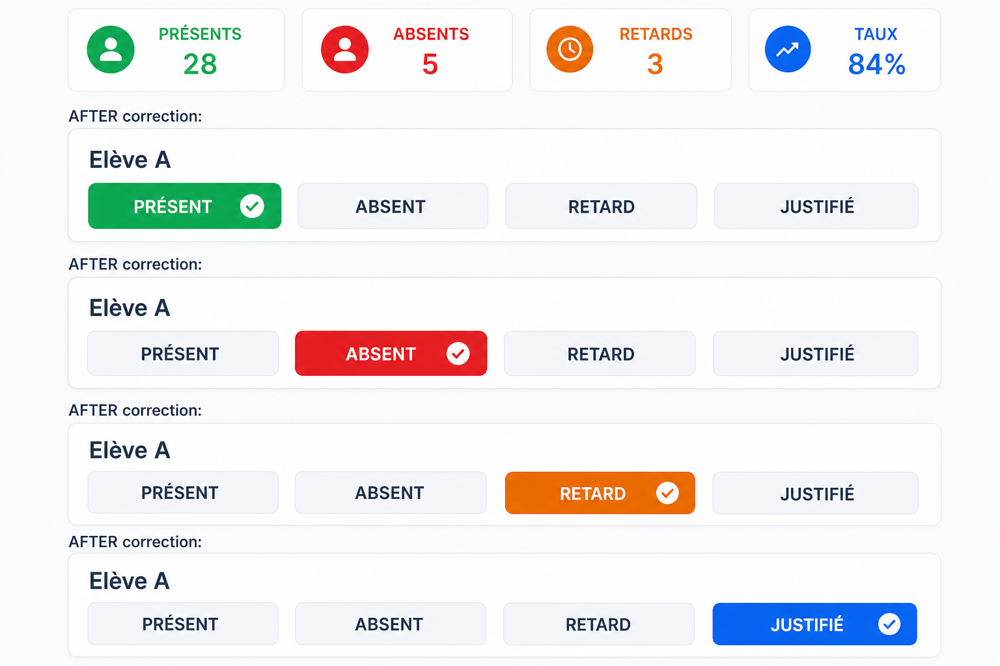

# Audit + correctif — Appel / Présences Mobile (E2E, vérité, couleurs)

Date : 2026-08-23  
Branche : `cursor/audit-e2e-attendance-status-colors-d0b9`  
Base : `origin/develop` (ne pas réutiliser #302 ni L10)

PR Draft uniquement. Aucun Ready. Aucun merge.

---

## Flux cartographié

```text
Utilisateur
  → TeacherAttendanceScreen
  → classe (teacherScopedClassLabels / scopedStudentsForSession)
  → roster filterStudentsByClassName
  → draft attendanceTruth (unset | draft | postgres)
  → Tout présent / bouton statut
  → Enregistrer → inFlightLock + intention + submitProtectedMutation
  → POST /api/presences + Idempotency-Key
  → pedagogyService.upsertAttendanceBatch (transaction)
  → attendance ON CONFLICT (school_id, student_id, attendance_date)
  → GET /api/presences
  → findTodayPresenceForStudent + rollCallEntryFromPresence
```

---

## Constats

| Constat | Gravité | Preuve | Cause racine | Correction |
| ------- | ------- | ------ | ------------ | ---------- |
| Sans présence du jour, chaque élève était initialisé `Présent` | **P0** | `rollCallInitialStatus()` retournait `"Présent"` ; KPI `getPresenceStats` avec fallback `?? "Présent"` | Formulaire = donnée métier | `hydrateRollCallStatus` → `null` ; KPI 0 % ; save bloqué si saisie incomplète |
| Hydratation prenait **n'importe quelle** présence, pas le jour | **P0** | `[...presencesData].reverse().find(presenceMatchesStudent)` sans filtre date | Confusion historique / jour | `findTodayPresenceForStudent` |
| Boutons sélectionnés tous `#0F172A` | **P1** | `statusActionActive: { backgroundColor: "#0F172A" }` | Thème unique absent | `ATTENDANCE_STATUS_THEME` vert/rouge/orange/bleu |
| Maestro `07-attendance.yaml` lecture seule | **P0 couverture** | `MUTATION_ATTENDANCE_BLOCKED_NO_QA_FIXTURE` ; pas de `attendance-action-` | Pas de fixture QA | Flux `12-attendance-mutation.yaml` + fixture `QA-APPEL` / `QA-ATT-` ; sans fixture = **BLOCKED**, pas SUCCESS |
| « Cours non renseignés » | **P2** | `classCourses.join(", ") \|\| "Cours non renseignés"` | Pas d'affectation cours, ou cours vide — pas d'invention | Fallback explicite `attendance-courses-fallback` |

### Décisions métier

| Sujet | Décision |
| ----- | -------- |
| Absence de saisie | ≠ présence confirmée. Label **Non saisi**. Aucun bouton selected. |
| Tout présent | Seule action de masse : draft `Présent` pour le roster, pas un POST. |
| Enregistrer | Refusé tant qu'un élève est unset. Pas de POST implicite. |
| Présent | Compté présent + assisté. `present=true` |
| Retard | Compté retard + assisté. `present=true` |
| Absent | Non présent. `present=false` |
| Justifié | **Absence justifiée** (D3.5b). Non présent. `present=false` |
| Taux | `attended / effectif roster` (unset = non assisté) |
| Couleurs | Présent `#16A34A` · Absent `#DC2626` · Retard `#D97706` · Justifié `#2563EB` · idle `#F1F5F9` / `#334155` |

---

## Contrat API / PostgreSQL

Inchangé :

- `POST /api/presences` + `withIdempotency`
- batch transactionnel `upsertAttendanceBatch`
- unicité `(school_id, student_id, attendance_date)`
- `Justifié` → `excused`

Mobile n'envoie plus de `Présent` pour un élève non saisi.

---

## E2E

| Verdict | Signification |
| ------- | ------------- |
| `SCAFFOLD_OK` | YAML + gate anti-faux-E2E |
| `MUTATION_ATTENDANCE_BLOCKED_NO_QA_FIXTURE` | Pas de `QA-APPEL-*` + 4× `QA-ATT-*` |
| `MUTATION_READY` | Fixture valide ; Maestro **peut** exécuter `12` |
| `MAESTRO_RUNTIME_SUCCESS` | APK + device + Maestro exit 0 |

Cette VM : **SCAFFOLD_OK**. Runtime mutation : **BLOCKED** (pas d'APK / Maestro / fixture provisionné). Ce n'est pas un SUCCESS.

Fixture (humain, préprod, préfixe QA uniquement) :

```bash
export SOMAFRIK_E2E_ATTENDANCE_CLASS=QA-APPEL-6A
export SOMAFRIK_E2E_ATTENDANCE_STUDENT_A=QA-ATT-A1
export SOMAFRIK_E2E_ATTENDANCE_STUDENT_B=QA-ATT-B1
export SOMAFRIK_E2E_ATTENDANCE_STUDENT_C=QA-ATT-C1
export SOMAFRIK_E2E_ATTENDANCE_STUDENT_D=QA-ATT-D1
```

Les identifiants doivent être les `student.id` du roster Mobile. Classe / élèves métier (ex. Nuru) **refusés**.

---

## Tests locaux

- `npm --prefix Mobile run verify:mobile-attendance-hydration` OK
- `npm --prefix Mobile run verify:mobile-ui-e2e-scaffold` OK
- `npm --prefix Mobile run test:mobile-ui-e2e-runtime` OK (41)
- `npm --prefix Mobile run verify:mobile-usability` OK
- `npm --prefix Mobile run typecheck` OK
- `npm --prefix Mobile run verify:mobile-no-false-writes` OK
- `npm --prefix Mobile run verify:mobile-data-truth` OK
- `npm --prefix Mobile run verify:mobile-network-resilience` OK
- `node backend/lib/presenceContract.test.js` OK
- `node backend/lib/attendanceUniqueness.test.js` OK
- Maestro runtime réel : **non exécuté** → BLOCKED

---

## Capture thème (preuve mapping, pas un APK)


