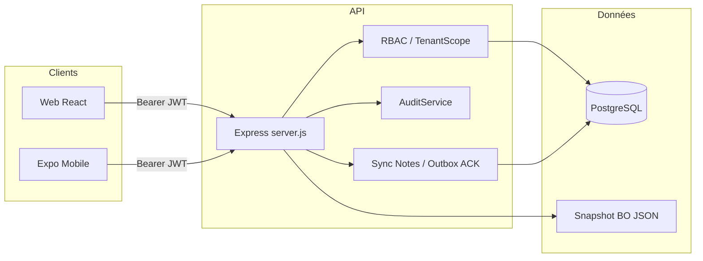
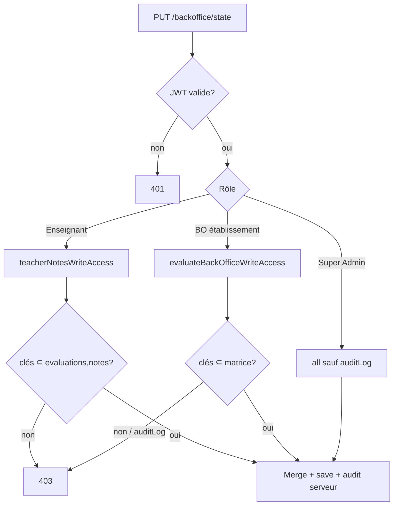
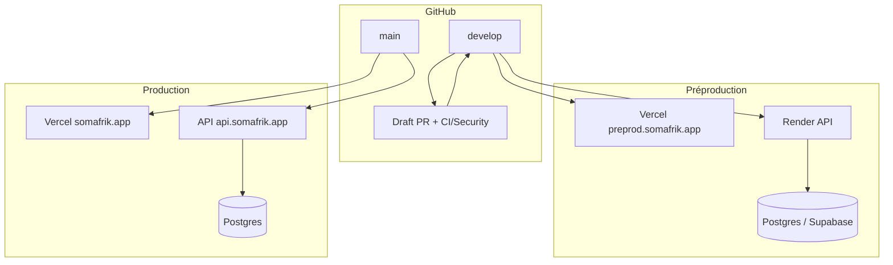

# Architecture — Somafrik

**Statut :** référence technique officielle  
**Dernière mise à jour :** 2026-07-26  
**Compléments :** [../preproduction.md](../preproduction.md) · [../ci-cd-security.md](../ci-cd-security.md) · [../ux/design-system/README.md](../ux/design-system/README.md)

---

## 1. Vue d’ensemble

Somafrik est un monorepo :

| Package | Rôle | Stack |
|---------|------|-------|
| `web/` | Backoffice / plateforme web | React + Vite + TypeScript |
| `backend/` | API HTTP | Express + PostgreSQL |
| `Mobile/` | Applications métier | Expo / React Native |
| `BackOffice/` | Legacy servi par l’API | HTML/JS (dépréciation progressive) |



---

## 2. Frontend (`web/`)

### 2.1 Organisation

```
web/src/
  api/            # client HTTP
  context/        # Auth, Data, ActiveSchool…
  design-system/  # primitives, layouts, feedback, overlays
  hooks/
  lib/            # domaine, permissions, sync, strip audit…
  pages/          # écrans + entity-page workflows
  components/
  types.ts
```

### 2.2 Routing

- React Router (lazy pages via `lazyPages.ts`)
- Routes protégées par permissions (`PermissionRoute` / équivalents)
- Surfaces établissement vs plateforme (Super Admin / Admin Pays)

### 2.3 Context

| Context | Rôle |
|---------|------|
| `AuthContext` | Session JWT, utilisateur, permissions effectives |
| `DataContext` | État backoffice, `refresh` / `update`, outbox sync |
| `ActiveSchoolContext` | Établissement actif (scope UI) |

**Règle HOTFIX-RBAC-ADMIN-01 :** `DataContext.update` retire `auditLog` du payload avant `PUT /backoffice/state` ([`stripClientAuditLog`](../../web/src/lib/stripClientAuditLog.ts)).

### 2.4 Hooks & services

- Hooks métier : édition élève, permissions, etc. (`hooks/`, `lib/`)
- Services HTTP centralisés (`api/client`) — Bearer only, pas de JWT en query
- Workflows EntityPage injectés (pas de hooks dans les cores) : `entityCrudCore`, `teacherAssignmentWorkflow`, `contactAccountWorkflow`, `paymentWorkflow`, …

### 2.5 Design System

Source : `web/src/design-system/`  
Doc : [../ux/design-system/README.md](../ux/design-system/README.md)

Layouts : `ListLayout`, `RecordLayout`, `FormLayout`, `DashboardLayout`, `ToolLayout`.

---

## 3. Backend (`backend/`)

### 3.1 Entrée

- `server.js` — composition Express, routes `/api/*`, auth, backoffice state
- `db/postgresRepository.js` — persistance PG + sync Notes/Présences
- `db/schema.sql` — schéma canonique
- `lib/` — helpers métier (RBAC writable entities, teacher notes, integrity…)
- `services/` — auth, audit, RBAC, establishment, pedagogy, payments…

### 3.2 API

Endpoints principaux :

| Famille | Exemples |
|---------|----------|
| Auth | `/api/backoffice/login`, `/api/login`, `/api/auth/change-password` |
| État BO | `GET/PUT /api/backoffice/state` |
| Établissements | `/api/backoffice/establishments` |
| MVP / mobile | notes, présences, messages (selon rôle) |
| Santé | `/api/health` |

### 3.3 Middleware & sécurité

- `requireAuth` — JWT `Authorization: Bearer` uniquement
- Lockout login (désactivable en E2E seulement)
- CORS selon `APP_ENV` / `CORS_ORIGINS`
- Sanitization des réponses utilisateur (S1.3)
- Fail-closed si principal absent

### 3.4 RBAC

Matrice d’écriture `PUT /backoffice/state` :

- `lib/backOfficeWritableEntities.js` — Admin School, Secrétaire, Comptable, Préfet, Directeur, Admin Pays, Super Admin
- `lib/teacherNotesWriteAccess.js` — Enseignant : **uniquement** `evaluations` + `notes`
- `auditLog` **jamais** dans les entités writables client (S1.4)



### 3.5 Audit

- **Serveur uniquement** : `AuditService.record` + collections critiques (`users`, `payments`, `classes`, `teachers`, `assignments`, …)
- **Client interdit** : présence de `auditLog` dans le body → 403
- Principal authentifié + `schoolCode` session — non falsifiable depuis le navigateur

### 3.6 Synchronisation

| Couche | Rôle |
|--------|------|
| Outbox web (`syncOutbox.ts`) | File durable pending/syncing/synced/failed |
| `syncAck` Notes | ACK par enregistrement (accepted/rejected) |
| HOTFIX-SYNC-01/02/03 | Non-perte, rattachement, RBAC enseignant |
| SYNC-04 | Isolé (SAVEPOINT / `GRADE_*`) |

---

## 4. Database

- **PostgreSQL** obligatoire en préprod/prod (`SOMAFRIK_DB_REQUIRED=true`)
- Tables canoniques : `schools`, `classes`, `subjects`, `teachers`, `students`, `evaluations`, `grades`, `attendance`, audit logs, …
- Snapshot JSON BO encore utilisé pour de nombreux domaines — migration progressive domaine par domaine
- Préprod : Render Postgres et/ou Supabase (`DATABASE_URL`)

---

## 5. Infrastructure



| Composant | Préprod | Prod |
|-----------|---------|------|
| Frontend | Vercel (`develop`) | Vercel (`main`) |
| API | Render | Docker + Caddy |
| DB | Render / Supabase | Postgres managé |
| CI | GitHub Actions | idem |
| Secrets | Gitleaks + env hôtes | idem |

Détails : [../ci-cd-security.md](../ci-cd-security.md) · [../preproduction.md](../preproduction.md) · [../vercel.md](../vercel.md)

### Security checks (required)

Secrets · Security · TypeScript · Lint · Tests · Audit · Lint et build

---

## 6. Mobile (`Mobile/`)

- Expo + SecureStore pour les tokens
- Client HTTP avec refresh / timeouts
- RBAC mobile aligné sur la security matrix
- Hors-ligne : consultation locale + sync (évolution outbox unifiée)

---

## 7. Conventions transverses

1. Toute mutation BO passe par l’API authentifiée — pas d’écriture directe DB depuis le client.
2. Scoping tenant orthogonal à la matrice d’écriture.
3. Les hotfixes sync/RBAC ont priorité sur la roadmap D3.x.
4. La documentation d’architecture se met à jour quand un nouveau sous-système devient canonique (ex. nouvelle table PG).

---

## 8. Documents liés

| Document | Contenu |
|----------|---------|
| [ROADMAP.md](./ROADMAP.md) | Phases produit |
| [DECISIONS.md](./DECISIONS.md) | ADR |
| [CONTRIBUTING.md](./CONTRIBUTING.md) | Workflow Git / qualité |
| [../ux/design-system/SUIVI-MIGRATIONS.md](../ux/design-system/SUIVI-MIGRATIONS.md) | Suivi DS granulaire |
