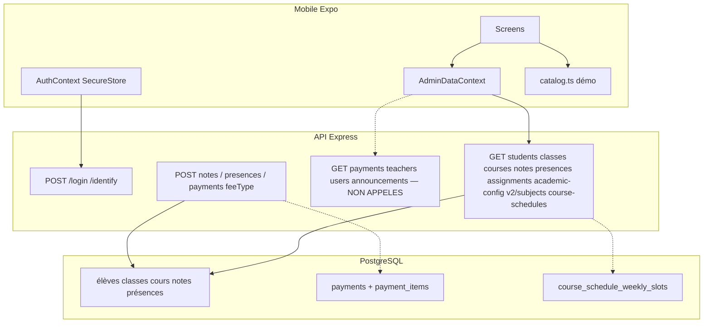

# AUDIT COMPLET EXPO MOBILE & UTILISABILITÉ SOMAFRIK V2

**Mode :** audit uniquement. Aucun correctif. Aucun refactor. Aucune migration. Aucun changement backend / Web / Mobile fonctionnel. Aucun Ready. Aucun merge.

| Champ | Valeur |
| --- | --- |
| Dépôt | `Somafrik-education/Somafrik` |
| Cible | application Mobile Expo / React Native (`Mobile/`) |
| Branche audité | `develop` |
| SHA audité | `25b153059ff07623307ef6ca763d1675cb1282ab` |
| Commit | `Merge pull request #267 from Somafrik-education/cursor/finance-multi-item-payment-b1e7` |
| Date d’audit | 2026-08-19 |
| Branche rapport | `cursor/audit-expo-mobile-usability-v2-9a97` |
| Livrable | `docs/project/AUDIT-EXPO-MOBILE-USABILITY-V2.md` uniquement |
| Verdict | **NO-GO** |

**Question tranchée :** l’application Expo Mobile Somafrik **n’est pas** aujourd’hui suffisamment complète, cohérente, sécurisée et utilisable pour être donnée à un établissement scolaire réel.

Les trois priorités demandées par le mandat (contrats anciens, réseau africain dégradé, ergonomie Android petit écran) sont **toutes défavorables**.

---

## 1. État Git

Commandes exécutées au démarrage :

```text
git fetch origin
git checkout develop
git pull --ff-only origin develop
git status --short --branch   → ## develop
git rev-parse HEAD            → 25b153059ff07623307ef6ca763d1675cb1282ab
```

```text
develop SHA exact     = 25b153059ff07623307ef6ca763d1675cb1282ab
working tree initial  = clean (aucun fichier modifié)
branche d’audit       = cursor/audit-expo-mobile-usability-v2-9a97
date audit            = 2026-08-19
HEAD métier           = merge #267 (finance multi-libellés)
```

Ne pas réutiliser un SHA historique antérieur (#257 planning, #255 notes, etc.). `develop` a avancé jusqu’au merge finance multi-items.

Le suffixe `-9a97` est imposé par la politique de branches Cloud Agent. Nom recommandé métier : `cursor/audit-expo-mobile-usability-v2`.

---

## 2. Versions Expo / RN

| Élément | Valeur |
| --- | --- |
| Dossier | `Mobile/` (pas `mobile/`) |
| Package | `somafrik-mobile` |
| `package.json` version | `1.2.0` |
| `app.json` version | `1.2.1` / `versionCode` 13 |
| Expo SDK (déclaré) | `~54.0.0` |
| Expo installé | `54.0.35` (Doctor attend `~54.0.37`) |
| `sdkVersion` public config | `54.0.0` |
| React Native | `0.81.5` |
| React | `19.1.0` |
| React DOM | `19.1.0` |
| TypeScript | `~5.9.2` |
| Node | `v22.14.0` (`engines`: `>=22.12.0`) |
| Package manager | npm `10.9.7` (`package-lock.json` présent) |
| Navigation | `@react-navigation/native` 7.2.x + native-stack + bottom-tabs |
| UI | React Native Paper 5.15 + NativeWind 4 (peu utilisé) + StyleSheet |
| Secure storage | `expo-secure-store` `~15.0.7` |
| New Architecture | `newArchEnabled=true` |
| Edge-to-edge | `edgeToEdgeEnabled=true` |
| Hermes | `hermesEnabled=true` |
| Orientation | `portrait` (app.json + AndroidManifest) |

---

## 3. Synthèse exécutive

L’app Mobile **n’est plus** un client `GET/PUT /backoffice/state`. Les stubs `getBackOfficeState` / `saveBackOfficeState` rejettent explicitement (`BACKOFFICE_STATE_*_REMOVED`). Auth, JWT, SecureStore, refresh-on-401, HTTPS prod et client HTTP unique sont **réels**.

En revanche, le Mobile est un **client hybride incomplet** :

1. **Hydratation partielle.** Au login, `refreshBackOfficeState` charge élèves / classes / cours / notes / présences / affectations / academic-config / subjects / course-schedules. Il **ne charge jamais** paiements, enseignants, utilisateurs, annonces, messages, notifications, établissements. Ces listes restent `[]`. L’UI les affiche comme « aucune donnée ».
2. **`catalog.ts` reste une source de vérité visible.** Planning vide ou en erreur → emploi du temps de démo. Accueil parent → moyennes calculées sur les notes du catalogue. Bulletins → liste mock. Taux de présence des cartes Classes → `presences` du catalogue.
3. **Les contrats 2026 ne sont pas connus du Mobile.** Planning weekly (`dayOfWeek` 1–7, `schoolCourseId`, `roomId`, `from`/`to`), `?projection=course-options`, salles, remplacements, `teacher_code` canonique, paiements `items[]` / `payment_items`. Mobile POST encore `{ feeType, amount, method, date }` et GET `/course-schedules` sans query.
4. **Notes Mobile ≠ Notes Web.** Mobile POST `/notes` avec un `evaluationId` client. **Aucun appel `/evaluations`.** Pas de workflow Brouillon / À valider / Validée / validation Préfet.
5. **Utilisabilité Android réelle.** Login sans scroll ni `KeyboardAvoidingView`, 5 boutons démo + PIN, cibles 34 dp Modifier/Supprimer, recherche Classes morte, clavier qui recouvre la saisie de notes, double-tap non gardé sur Appel / Notes / Paiement.
6. **Réseau africain.** Timeout 20 s, bannière offline, **pas d’outbox**, **pas de retry métier**, **pas d’idempotence client**. La bannière promet que « les modifications reprendront dès le retour du réseau » — c’est faux.

**Ce qui marche (socle) :** login identify + JWT + SecureStore ; lecture PG élèves/classes/cours/notes/présences quand le refresh réussit ; POST appel ; POST notes (hors workflow eval) ; Metro démarre.

**Ce qui empêche un pilote établissement :** données fausses ou vides sur finance, planning, bulletins, enseignants, utilisateurs, dashboard parent ; sécurité `mustChangePassword` contournable ; identifiants démo en clair dans l’UI de production.

---

## 4. Verdict

```text
NO-GO
```

Pas un GO sous réserves : plusieurs P0 sont des **mensonges de données** (démo présentée comme planning réel, erreur réseau présentée comme liste vide, moyennes parent calculées sur le catalogue). Un établissement réel prendrait des décisions sur des chiffres faux.

| Question | Réponse |
| --- | --- |
| Complet ? | Non. Salles, remplacements, inscriptions élèves, finance multi-libellés, validation eval, Comptable/Directeur absents. |
| Cohérent avec Web/PG ? | Non. Contrats V2 planning / finance / teacher_code inconnus. |
| Sécurisé pour un téléphone établissement ? | Non. Bypass `mustChangePassword`, boutons démo `1234`, `allowBackup=true`, cleartext natif. |
| Utilisable sur petit Android ? | Non comme produit métier. Login/démo/clavier/cibles 34 dp/listes non virtualisées. |

---

## 5. Architecture Mobile

```text
Mobile/
  App.tsx                    SafeAreaProvider + Paper + Auth + AdminData + AppNavigator
  app.json / app.config.js   Expo config + extra.apiUrl / demoMode
  eas.json                   profiles development / preview / production
  src/navigation/            AppNavigator, BottomTabsNavigator, roleTabPreferences
  src/screens/               26 écrans métier + MvpUtilityScreens (7)
  src/components/            OfflineBanner, ScreenScrollView, SectionCard, …
  src/context/               AuthContext, AdminDataContext
  src/services/              api.ts, httpClient.ts, secureStorage.ts, safeLogger.ts
  src/data/catalog.ts        univers démo encore importé par des écrans live
  src/data/*.ts              modèles legacy orphelins (eleves, notes, paiements, …)
  src/domain/                auth, security/permissions, academics/GradeBookService
  src/lib/                   layout, RBAC defaults, coursePlanning (modèle daté)
  android/                   projet natif Prebuild déjà généré
  assets/                    icône PNG, splash JPEG nommé .png, schoollink-logo.png
```



**SoT déclarée :** PostgreSQL via API. **SoT réelle de plusieurs écrans :** React state jamais hydraté, ou `catalog.ts`.

Navigation : stack racine public (`Welcome` → `RoleSelection` → `Login`) puis `Home` = tabs. Écrans stack montés/démontés selon `canReadRoute`. Pas de linking React Navigation malgré `scheme: somafrik`.

---

## 6. Matrice fonctionnelle

Légende : **CANONIQUE** = API PG actuelle, sans mock live. **PARTIEL** = lecture et/ou écriture incomplète. **MOCK** = données démo visibles. **NO-OP** = écran ou bouton sans effet métier. **LEGACY** = ancien contrat / ancien CRUD. **ABSENT** = pas d’écran / pas d’API client.

| Domaine | Écran Mobile | Lecture PG | Écriture PG | RBAC | UX | État |
| --- | --- | ---: | ---: | ---: | ---: | --- |
| Authentification | Welcome, RoleSelection, Login | oui (`/identify`, `/login`, `/schools/:code`) | oui (login, change-password, logout) | rôle serveur | clavier / démo | **PARTIEL** (P0 sécurité) |
| Tableau de bord | HomeScreen | partiel | non | menus filtrés | 4 dashboards | **PARTIEL** / **MOCK** parent |
| Mon établissement | SchoolManagement | non | non | masqué school_admin | hub | **PARTIEL** |
| Comptes utilisateurs | UsersScreen → AdminCrud | **non GET** | POST/PATCH `/backoffice/users` | UI | listes ScrollView | **PARTIEL** |
| Classes | ClassesScreen | oui GET `/classes` | CRUD retiré | READ | search morte | **PARTIEL** |
| Élèves | StudentsScreen, StudentDetail | oui GET `/students` | création **désactivée** | READ | SectionList OK | **PARTIEL** |
| Enseignants | TeachersScreen | **non GET** | CREATE contacts | UI | liste vide | **PARTIEL** |
| Parents & élèves | tabs parent/élève | enfants login | non | scope session | switcher | **PARTIEL** |
| Planning de cours | TimetableScreen | GET `/course-schedules` **sans** V2 | non | route | **MOCK fallback** | **LEGACY** + **MOCK** |
| Salles | — | non | non | — | `room` texte | **ABSENT** |
| Remplacements | — | non | non | — | — | **ABSENT** |
| Appels & présences | TeacherAttendance, StudentPresences | oui GET `/presences` | POST `/presences` | UI + API | cycle 1 tap, double POST | **PARTIEL** |
| Notes & évaluations | TeacherGrades, StudentNotes | GET `/notes`, GET `/evaluation-types` | POST `/notes` | 403 mappé notes | pas de validation | **LEGACY** vs Web |
| Évaluations | — | pas `/evaluations` | pas de PATCH statut | — | — | **ABSENT** |
| Examens | Timetable `kind=exam` | si schedules PG | non | — | inline | **PARTIEL** |
| Bulletins | ReportCardsScreen | PDF API | non | — | **liste catalog** | **MOCK** + PDF **CANONIQUE** |
| Finances / Paiements | PaymentsScreen, AdminCrud, StudentPayments | **non GET** | POST `{feeType,amount}` | UI | liste vide | **LEGACY** |
| Frais & tarifs | — | non fee-grids | non | — | — | **ABSENT** |
| Impayés | filtre AdminCrud `pending` | sur state local vide | non | — | — | **NO-OP** utile |
| Paramètres | ConfigurationScreen | hub | non | view | accents cassés | **PARTIEL** |
| Notifications | Announcements, PlatformNotifications | **non GET** initial | POST/PATCH | super_admin platform | — | **PARTIEL** |
| Profil | StudentDetail / tab Profil | oui élèves | non | — | back 40 dp | **PARTIEL** |
| Déconnexion | MenuScreen | POST `/auth/logout` best-effort | clear SecureStore + reset Welcome | — | OK logout manuel | **CANONIQUE** |
| Messages | MessagesScreen | **non GET** | POST messages | UI | — | **PARTIEL** |
| Documents | DocumentsScreen | non | non | — | hub | **MOCK** |
| Mobile Money | MobilePayment | non | non | — | placeholder | **MOCK** |
| Support | SupportScreen | non | non | — | texte | **NO-OP** |
| Permissions | PermissionsScreen | local | API refusée 403 | super_admin | toggles locaux | **NO-OP** serveur |

---

## 7. Matrice rôles

Rôles session Mobile (`AppNavigator.tsx:43-52`) : `super_admin`, `country_admin`, `school_admin`, `principal`, `prefet`, `secretary`, `teacher`, `parent_student`, `student`.

| Rôle demandé | Session | Tabs métier | CREATE | UPDATE | DELETE | Lecture réelle | Tenant | Verdict rôle |
| --- | --- | --- | --- | --- | --- | --- | --- | --- |
| Admin School | `school_admin` | Classes, Paiements, Utilisateurs, Enseignants, Appel | paiements (legacy), users, teachers contacts | users | selon perm UI | classes/élèves/notes/présences **oui** ; paiements/enseignants/users **non hydratés** | schoolCode session | **NON pilote** |
| Préfet des études | `prefet` | **mêmes tabs enseignant** | notes, appel | notes, appel | non eval | pas de validation eval, pas de remplacements | JWT | **NON pilote** |
| Enseignant | `teacher` | Classes, Élèves, Appel, Notes | notes, appel | idem | non | scope assignments JWT + GET assignments | JWT | **NON pilote** (workflow notes) |
| Parent | `parent_student` | Profil, Notes, Présence, Frais | messages | non | non | notes/présences PG si refresh OK ; **accueil catalog** ; **frais vides** | children login | **NON pilote** |
| Élève | `student` | idem parent | non compose parent | non | non | idem | self | **NON pilote** |
| Secrétaire | `secretary` | Élèves, Appel, Paiements | appel, paiements | — | — | paiements non hydratés | JWT | **NON pilote** |
| Directeur | **aucun session role** | — | — | — | — | defaults `internalRoleDefaults` **non branchés** | — | **ABSENT** |
| Comptable | **aucun session role** | — | — | — | — | idem | — | **ABSENT** |
| Proviseur | `principal` mappé Préfet | tabs enseignant | comme préfet | — | — | libellé « Espace proviseur » vs permissions Préfet | — | **PARTIEL / confus** |

**RBAC : ne pas se fier au bouton caché.**

| Couche | Comportement | 403 HTTP ? |
| --- | --- | --- |
| Montage de routes | écran absent du stack si `canReadRoute` false | non testé (pas d’appel) |
| Boutons | `canMutateEntity` / `hasSecurityPermission` | non |
| Alert local | Appel / Notes / Annonces | **aucun HTTP** |
| POST `/notes` | `TeacherGradesScreen` mappe 400/403/404/409/500 | **oui, unique mapping sérieux** |
| POST `/presences` | catch générique | 403 non distingué |
| POST `/payments` | Alert message erreur | 403 non distingué |
| Backend | matrice `rbacService` sur les routes | **autorité réelle** — non exercée depuis un device dans cet audit |

Live 403 **non rejoué** ici : pas d’émulateur Android, pas de compte de test autorisé. Conclusion code : le Mobile est **UI-first** ; le backend reste fail-closed si le token est utilisé hors UI (Postman). Un parent qui connaîtrait une URL interne n’a pas de deep link, mais le JWT parent sur `GET /payments` backend est autorisé — le client ne l’appelle simplement pas.

Terminologie RBAC legacy encore dans le binaire : `Super Administrateur OKAFRIK` (`orgHierarchy.ts:4`), `ALL_PRIVILEGES`, mapping route `Timetable` → feature « Années Académiques » (`permissions.ts`).

---

## 8. Parité Web / Backend / Mobile

| Chantier récent | Backend | Web | Mobile connaît ? |
| --- | --- | --- | --- |
| Planning weekly canonique (`dayOfWeek` 1–7, `schoolCourseId`, `academicYearId`, TIME local) | `course_schedule_weekly_slots` + APIs | calendrier V2 + tests | **NON.** Type `CourseScheduleSlot.start/end` ISO, `weekdayOf()` via `Date.getDay()` (`coursePlanning.ts:25-28`) — exactement le modèle interdit par `PLANNING-V2-WEEKLY-CANONICAL.md` |
| `GET /course-schedules?projection=course-options` | oui | Planning Web | **NON.** Zéro occurrence `course-options` dans `Mobile/` |
| Salles `roomId` / `/school-rooms` | oui (#265) | placeholders / API | **NON.** `room?: string` affichage seulement |
| Remplacements `/course-schedule-replacements` | oui | overlay | **NON.** Aucun client |
| `teacher_code` canonique | `teacherCodeAllocation.js` | reconcile | **NON / LEGACY.** Demo login `ENS-0001` ; `userTeacherSync` ids `TEACHERS-*` ; pas de GET `/teachers` |
| Teacher/course reconciliation `school_courses` | oui | course-options | **NON.** Assignments `className` + `course` string |
| Paiements multi-libellés `items[]` / `payment_items` | oui (#267, HEAD de cet audit) | `QuickPaymentModal` + `PaymentReceipt` | **NON.** POST `{ feeType, amount, method, date }` (`AdminCrudScreen.tsx:538-544`). Type `PaymentItem` plat (`catalog.ts:150-158`). `cancelSchoolPayment` **défini jamais appelé**. **Pas de GET `/payments`.** |
| Notes workflow eval Brouillon / À valider / Validée | `/evaluations` + `/notes` | GradesEvaluationsPage | **NON.** Mobile n’appelle jamais `/evaluations` (confirmé grep). POST `/notes` avec `evaluationId` local (`TeacherGradesScreen.tsx:281, 291-299`) |
| Suppression `backoffice/state` | 410 | Web convergé | **OUI.** Stubs reject. **Mais** `AdminDataContext` garde la forme d’état BO (`applySyncedState` mort, `persistSyncedState` throw) |

Écart type :

```text
Backend possède API canonique
Web l’utilise
Mobile affiche un écran mais mock / state vide / ancien contrat
→ P0 si l’écran est présenté comme opérationnel (planning, finance, bulletins, dashboard parent)
→ P1 si l’écran est clairement un hub incomplet (salles, remplacements)
```

---

## 9. Data flow / APIs

### 9.1 Inventaire client (`Mobile/src/services/api.ts` + `httpClient.ts`)

| Endpoint | Méthode | Appelé ? | Fichier:ligne |
| --- | --- | --- | --- |
| `/login` | POST | oui | `LoginScreen.tsx:102` |
| `/identify` | POST | oui | `LoginScreen.tsx:68` |
| `/auth/change-password` | POST | oui | `LoginScreen.tsx:163` |
| `/auth/logout` | POST | oui | `api.ts:197` via AuthContext |
| `/auth/refresh` | POST | oui | `httpClient.ts:118` |
| `/auth/effective-permissions` | GET | oui | `AdminDataContext.tsx:344` |
| `/schools/:code` | GET | oui | `RoleSelectionScreen.tsx:77` |
| `/health` | GET | **non** | défini `api.ts:243` |
| `/students` | GET | oui | `AdminDataContext.tsx:276` |
| `/classes` | GET | oui | `:277` |
| `/courses` | GET | oui | `:278` |
| `/notes` | GET | oui | `:279` |
| `/presences` | GET | oui | `:280` |
| `/academic-config` | GET | oui | `:281` |
| `/assignments` | GET | oui | `:282` |
| `/course-schedules` | GET | oui, **sans query** | `:283` + `api.ts:307-308` |
| `/v2/subjects` | GET | oui | `:284` |
| `/evaluation-types` | GET | oui | `TeacherGradesScreen.tsx:81` |
| `/notes` | POST | oui | `TeacherGradesScreen.tsx:291` |
| `/presences` | POST | oui | `TeacherAttendanceScreen.tsx:193` |
| `/payments` | POST | oui, **legacy 1 ligne** | `AdminCrudScreen.tsx:538` |
| `/payments` | GET | **non** | backend `server.js:2018` |
| `/payments/:id/cancel` | POST | **non** | défini `api.ts:455` |
| `/courses` POST/PATCH/DELETE | oui | `AdminCrudScreen` | |
| `/assignments` POST/PATCH/DELETE | oui | `AdminCrudScreen` | |
| `/backoffice/announcements` POST/PATCH | oui | `AdminDataContext` | |
| `/backoffice/messages` POST | oui | idem | |
| `/backoffice/users` POST/PATCH | oui | idem | |
| `/backoffice/notifications` POST/PATCH | oui | idem + PlatformNotifications | |
| `/users/:id/reset-password` | POST | oui | `AdminCrudScreen.tsx:673` |
| PDF bulletin | FileSystem | oui | `api.ts:514` |
| `/evaluations` | — | **absent** | |
| `/teachers` | — | **absent** | |
| `/school-rooms` | — | **absent** | |
| `/course-schedule-replacements` | — | **absent** | |
| `/finance/fee-grids` | — | **absent** | |

### 9.2 Fan-out login (`AdminDataContext.tsx:257-310`)

9 appels parallèles. `getCourseSchedules().catch(() => [])` **seul** à avaler l’erreur en liste vide.

Jamais hydratés : `teachersData`, `paymentsData`, `paymentStatusesData`, `schoolsData`, `usersData`, `countriesData`, `subscriptionsData`, `announcementsData`, `messagesData`, `notificationsData` — initialisés `useState([])` lignes 112-127.

### 9.3 Mocks / hard-code / fallback silencieux

| Fichier:ligne | Quoi | Impact | Sévérité |
| --- | --- | --- | --- |
| `TimetableScreen.tsx:54-67, 52, 72-73` | si `scopedSlots` vide → `timetable` catalog, sous-titre « N créneau(x) planifié(s) » **sans badge démo** | planning faux | **P0** |
| `AdminDataContext.tsx:283` | `catch(() => [])` | 500 planning → vide → démo | **P0** |
| `HomeScreen.tsx:239-243` | `notes` + `courses` catalog pour moyenne parent | bulletin d’accueil faux | **P0** |
| `ReportCardsScreen.tsx:3,20` | `reportCards` catalog | liste bulletins fausse | **P0** |
| `ClassesScreen.tsx:13,177` | `getPresenceRate` lit `catalog.presences` | % présence faux | **P1** |
| `LoginScreen.tsx:126-141, 291-305` | fillDemo + mot de passe `1234` | prod | **P0** |
| `RoleSelectionScreen.tsx:34` | prérempli `CD-2026-0001` | établissement démo | **P1** |
| `RoleSelectionScreen.tsx:50-71` | SUPERADMIN / ADMINPAYS client-side | raccourci plateforme | **P1** |
| `catalog.ts:308+` | 50 écoles/élèves/notes/paiements générés | toute import live | **P0** si écran live |
| `AdminCrudScreen.tsx:675-687` | reset password : catch → update local quand même | mot de passe affiché non persisté | **P1** |
| `data/eleves.ts`, `notes.ts`, `paiements.ts`, `presences.ts`, `school.ts` | démo orpheline | dette | **P2** |
| `HomeScreen.tsx:91-93` | `teacherNotes` catalog **non rendu** | import dangereux latent | **P2** |

`isDemoMode()` (`env.ts:130-135`) **n’est jamais lu** pour masquer les boutons démo. EAS pose `EXPO_PUBLIC_DEMO_MODE=false` sans effet UI.

---

## 10. Auth & sécurité

### 10.1 Flux

```text
lancement → AuthContext bootstrap (token présent ?)
  → Welcome (pas d’auto-Home même si session)
  → RoleSelection (code école GET /schools/:code)
  → Login (debounce identify → POST /login pin=password)
  → persistAuthenticatedSession (SecureStore) AVANT le gate mustChangePassword
  → Home tabs
logout Menu → POST /auth/logout best-effort + clearSecureSession + navigation.reset Welcome
```

### 10.2 Stockage

| Secret / PII | Où | Mécanisme |
| --- | --- | --- |
| access JWT | `secureStorage.ts:7,28-36` | SecureStore `WHEN_UNLOCKED_THIS_DEVICE_ONLY` |
| refresh token | idem `:8,28-40` | SecureStore |
| profil (nom, téléphone, enfants, permissions) | `:9,43-50` | SecureStore JSON |
| PIN / mot de passe | `LoginScreen` state uniquement | pas persisté (OK) |
| mot de passe démo `1234` | `LoginScreen.tsx:140` | **bundle** |
| `temporaryPassword` | `catalog.ts` seeds + AdminCrud liste | bundle / UI |
| AsyncStorage tokens | — | **absent** (script `verify-mobile-security` OK) |

### 10.3 Refresh / expiration

- Refresh single-flight sur 401 (`httpClient.ts:104-145, 195-207`).
- `expiresIn` reçu (`api.ts:94`) **jamais stocké ni utilisé**.
- Rotation refresh ignorée (on réécrit l’ancien refresh).
- PDF `downloadAsync` : pas de retry refresh (`api.ts:514-517`).
- Session expirée : `saveSession(null)` **sans** `navigation.reset` → pile privée possible jusqu’au prochain geste.

### 10.4 `mustChangePassword` — P0

`login()` persiste les tokens **avant** le modal (`api.ts:184-192` + `LoginScreen.tsx:109-114`). Bootstrap (`AuthContext.tsx:49-54`) restaure la session **sans** vérifier le flag. Kill app → réouverture → API utilisable avec mot de passe temporaire.

### 10.5 Autres

| Sujet | Constat |
| --- | --- |
| Logs JWT / password | `safeLogger` rédige ; `verify-mobile-security` OK |
| Certificate pinning | `enabled: false` (`certificatePinning.ts:12-14`) ; flag `certificatePinningReady: true` trompeur |
| HTTPS prod | `app.config.js:31-33` throw si HTTP ; `validateApiRootUrl` |
| Cleartext | `app.config.js:56` false en prod **mais** `AndroidManifest.xml:17` `usesCleartextTraffic="true"` hardcodé (Prebuild non resync — Doctor) |
| `allowBackup="true"` | backup Android peut extraire SecureStore selon ROM / backup rules | risque session |
| Secrets bundle | pas de DB URL / private key (script OK) ; **oui** mot de passe démo `1234` |
| Dev menu | Expo Go uniquement |
| Screenshots / clipboard | pas de `FLAG_SECURE` / pas de prévention capture PIN |
| Tenant | schoolCode session ; pas de fuite multi-tenant évidente côté client hors state vide |

---

## 11. Navigation

```text
NavigationContainer (pas de linking)
  NativeStack
    Welcome, RoleSelection, Login          public
    Home = OfflineBanner + BottomTabs
      Accueil, ≤5 tabs rôle, Menu
      tabs overflow → Home quick actions (max 5, roleTabPreferences)
    Stack conditionnel RBAC : Classes, Students, AdminCrud, Timetable, …
```

| Test | Résultat code |
| --- | --- |
| Android Back | aucun `BackHandler` ; défaut React Navigation |
| Retour fiche | back 40×40 (`studentSubScreenLayout.ts`) |
| Retour après création | AdminCrud `setVisible(false)` ; pas de reset stack |
| Tab → détail → retour | OK conceptuel via stack+tabs |
| Logout → écran privé | `reset` Welcome (`MenuScreen.tsx:116-121`) **OK** |
| Session expirée → login | **incomplet** (session null, pas de reset) |
| Deep links | scheme `somafrik` dans le manifest ; **pas** de `linking` JS |
| Écrans orphelins | `ConfigurationScreen.tsx:132` `navigate("Utilisateurs")` depuis **stack** — route tab, pas dans `RootStackParamList` |
| Params objets | `Login` reçoit `school` complet (`RoleSelectionScreen`) |
| Doublons | `Classes` tab + stack ; `Students` / `TeacherStudents` même composant |
| `principal` | dashboard « proviseur », permissions Préfet |

---

## 12. Usability

Audit **code + specs + Metro**. **Pas d’émulateur Android** dans l’environnement Cloud (`ANDROID_HOME` vide, pas d’`adb`). Les largeurs 320 / 360 / 390 / 412 / tablette sont évaluées contre `responsiveMobileSpec.ts`, les `StyleSheet`, et `windowSoftInputMode=adjustResize`.

### 12.1 Parcours — nombre de taps (conceptuel)

**Admin School** (Welcome → login démo → Accueil) ≈ 6 taps avant Accueil, puis :

| But | Taps après Accueil | Blocage |
| --- | --- | --- |
| Classe → élève | tab Classes (1) + carte (1) + rang (1) ≈ 3 | création élève **absente** |
| Enseignant | tab Enseignants (1) | **liste vide** (pas de GET) |
| Paiement | tab Paiements (1) + Enregistrer (1) | **liste vide** ; POST 1 libellé |
| Planning | Menu (1) + Emploi du temps (1) | **démo ou modèle daté** |
| Logout | Menu (1) + Déconnexion (1) | OK |

Écrans inutiles : Welcome + RoleSelection + Login (3) alors que Web a 1 écran. SchoolManagement **caché** pour `school_admin`.

**Préfet :** tabs = enseignant. Pas d’écran « valider évaluation ». Pas de remplacement. Planning lecture seule legacy.

**Enseignant :** Appel ≈ 3 taps (tab + classe + enregistrer) mais **1 tap cycle** Présent→Absent (erreur tactile métier). Notes : créer session + N champs + enregistrer ; **pas de disabled**.

**Parent :** Notes/Présences tabs OK si GET notes/présences ont réussi. Frais = vide. Accueil moyenne **catalog**. Annonces = liste vide.

Confusion possible : « Frais » vs « Paiements » ; « Professeur » vs « Enseignant » ; « Profs » Home admin ; Planning sans mention démo.

---

## 13. Responsive / petits écrans

| Largeur | Spec projet | Couverture réelle |
| --- | --- | --- |
| ~320 px | **hors spec** (`responsiveMobileSpec.ts:19-26` commence à 360) | Login `justifyContent:center` + 5 boutons démo **déborde** ; titres 34 px Classes |
| ~360 px | Small Android 360×640 | Login critique ; Students 10 px ; CRUD 34 dp |
| ~390/412 | iPhone 13 / Large Android | utilisable sur dashboards qui usent `useResponsiveLayout` |
| Tablette | 768+ / `supportsTablet` iOS | Home/Menu/Classes/Teacher* OK partiel ; Students/Payments/Timetable **sans** hook |

Contrôles :

| Contrôle | Constat |
| --- | --- |
| Texte coupé | `numberOfLines` sur Classes/Students ; **absent** Home noms longs |
| Bouton hors écran | Login bouton connexion + démo + clavier |
| Tableau | pas de DataTable type Web ; listes cartes |
| Overflow horizontal | peu de Row figées ; Students colonnes denses 58 px classe |
| Modal trop grande | AdminCrud bottom sheet `ScrollView` imbriqué |
| Footer inaccessible | bouton « Enregistrer un paiement » **sous** la liste ScrollView non virtualisée |
| Clavier | Android `adjustResize` aide ; **pas de KAV** Login (`LoginScreen.tsx:184-338`) ; RoleSelection KAV `behavior=undefined` sur Android (`:92-94`) |
| SafeArea | Welcome/Login OK ; écrans auth `paddingTop` 42–52 vs edge-to-edge |
| Notch / status bar | risque recouvrement edge-to-edge |
| Scroll imbriqué | AdminCrud modal |
| Orientation | portrait lock — OK produit, contradictoire avec viewports landscape de la spec E2E |

---

## 14. Formulaires

| Formulaire | keyboardType | autoCapitalize | secureTextEntry | required | inline | erreur serveur | disabled POST | conservation | KAV | Double tap |
| --- | --- | --- | --- | --- | --- | --- | --- | --- | --- | --- |
| Login identifiant / PIN | dynamique | none | PIN oui | oui | bannière | oui | `loginReady` | oui | **non** | OK |
| Change password modal | default | — | oui | min 6 client | Alert | oui | `isChangingPassword` | — | **non** | OK |
| RoleSelection code | characters | characters | — | trim | bannière | oui | loading | — | iOS only | OK |
| Classes search | default | — | — | — | — | — | — | **non branché** | — | N/A |
| Inscription élève | — | — | — | — | — | — | — | — | — | **ABSENT** |
| Utilisateur AdminCrud | mixte | — | — | métier | Alert | partiel | **non** | modal reste | **non** | **P1** |
| Enseignant | CREATE contacts | — | — | — | — | — | **non** | — | **non** | P1 |
| Planning | — | — | — | — | — | — | — | — | — | lecture seule |
| Présences | pas de champ | — | — | roster | Alert | générique | **non** `saveCall` | locale | — | **P0 réseau** |
| Notes session | `numeric` | — | — | toutes notes | Alert | 403 mappé | **non** `saveSession` | session state | **non** | **P0 réseau** |
| Paiement | numeric amount | — | — | élève/montant | Alert | message | **non** | modal | **non** | **P0 réseau** |
| Frais / grilles | — | — | — | — | — | — | — | — | — | **ABSENT** |

Confirmation destructive : delete AdminCrud présent visuellement ; annonce delete local. Annulation reçu : **renvoyée au Web** (`AdminCrudScreen.tsx:531-534`).

Focus / scroll auto vers erreur : **absent**.

---

## 15. Réseau faible / offline

Timeout unique : `REQUEST_TIMEOUT_MS = 20_000` (`httpClient.ts:29`). Message timeout : « Délai de requête dépassé… ». Message offline fetch : « Connexion Internet indisponible… ».

Simulation **non instrumentée runtime** (pas de Network Link Conditioner dans ce pod). Analyse de contrat :

| Condition | Comportement actuel |
| --- | --- |
| latence 500 ms | spinner login OK ; Appel/Notes **pas** de spinner bouton |
| latence 2–5 s | utilisateur re-tape → **double POST** notes/présences/paiements |
| perte connexion | `refreshBackOfficeState` catch → `syncStatus=offline` ; **catch schedules = []** |
| retour connexion | listener `window.online` (`AdminDataContext.tsx:330-332`) — **peu fiable sur RN natif** ; pas de NetInfo |
| timeout 20 s | erreur ; saisie notes **conservée** dans `gradeSession` ; appel local conservé |
| POST réponse tardive + double tap | **duplication possible** (pas d’idempotency-key client) |
| retry | **aucun** outbox |
| stale | listes jamais GET restent `[]` même online |

Bannière (`OfflineBanner.tsx` + `offlineModeSpec.ts:7-8`) :

> « Les données déjà chargées restent consultables. Les modifications reprendront dès le retour du réseau. »

**Faux.** Aucune queue. Un POST échoué est perdu. `SYNC_INTERVAL_MS` défini dans `env.ts` **jamais utilisé**.

| Opération | Réseau faible | Hors ligne |
| --- | --- | --- |
| Login | fiable si < 20 s | **inutilisable** |
| GET élèves/classes/notes/présences | fragile (Promise.all : 1 échec → tout offline) | lecture cache mémoire seulement (perdu si kill) |
| Planning GET | **erreur → démo** | démo |
| POST appel / notes / paiement | **fragile, non idempotent** | **inutilisable** |
| Finance GET | N/A (jamais appelé) | vide |
| PDF bulletin | 401 sans refresh retry | inutilisable |

Ne pas inventer un mode offline complet : **il n’existe pas**, malgré l’écran `OfflineMode` et la copie qui le suggère.

---

## 16. Performance

| Sujet | Constat |
| --- | --- |
| Démarrage | Metro up `localhost:8081` (timeout volontaire 35 s). Pas de mesure TTI device. |
| Login | identify debounce + login + persist + **9 GET parallèles** + GET permissions |
| Dashboard | pas de skeleton Home ; stats sur state (paiements 0, users 0) |
| FlatList | Students `SectionList` ; sous-écrans élève `FlatList` |
| ScrollView `.map()` | Payments, Teachers, Timetable, TeacherAttendance, TeacherGrades, AdminCrud, Home, Classes |
| Pagination | **aucune** |
| Recherche serveur | **aucune** ; Classes search UI morte ; Students filtre client |
| Images | logos ; pas de FastImage ; splash JPEG 1024 |
| Rerenders | AdminDataContext gros value `useMemo` ; session permissions effect dépend `session?.accessToken` déjà strippé |
| « Charger toute l’école au login » | **oui pour la pédagogie** (tous les élèves/notes/présences/cours). **Non** pour finance/enseignants — l’inverse du besoin Admin. Risque scalabilité **notes+présences+élèves** dès 2 000 élèves |

### Listes longues (conceptuel)

| Charge | StudentsScreen | Appel | Notes session | Paiements | Users AdminCrud |
| --- | --- | --- | --- | --- | --- |
| 50 | OK | OK | OK | OK si hydraté | OK |
| 500 | OK virtualisé | **jank** ScrollView | **jank** | **P1** | **P1** |
| 2 000 | OK liste ; RAM GET unique | **inutilisable** | **inutilisable** | **P0** | **P0** |
| 100 enseignants | — | — | — | — | Teachers ScrollView OK si GET existait |
| 1 000 paiements | — | — | — | ScrollView **P0** | — |

`keyExtractor` : Students SectionList présent ; Payments `key={payment.id}`.

---

## 17. Accessibilité

Objectif : blocages, pas certification WCAG.

| Contrôle | Constat |
| --- | --- |
| `accessibilityLabel` | Welcome, RoleSelection, Login, tabs, logout, Classes loading, OfflineBanner |
| Métier | Home cards, Appel cycle, CRUD actions, listes élèves **sans** label |
| `accessibilityRole` | partiel (button, progressbar, alert) |
| Icon-only | CommunicationHeaderIcons 40×40 |
| Contraste | bleu `#2563EB` / fond blanc OK approximatif ; badges jaunes |
| Taille texte | Students **10–11 px** vs contrat `MIN_BODY_FONT_SIZE = 12` |
| Dynamic Type | pas d’`allowFontScaling` maîtrisé ; titres 28–34 |
| Screen reader | cycle Présent/Absent **non annoncé** comme bouton radio |
| Focus order | Login champs puis 5 boutons démo (pollution VoiceOver) |
| Disabled | Login OK ; save Appel/Notes **pas** disabled |
| Erreur accessible | Login error text ; pas de `accessibilityLiveRegion` |

Contrat interne `MIN_TOUCH_TARGET = 48` **largement violé** : back 40, CRUD 34, icônes 40, inputs notes ~38.

---

## 18. Expo configuration

| Champ | Valeur | Risque store / EAS |
| --- | --- | --- |
| slug | `somafrik` | OK |
| scheme | `somafrik` | OK, linking JS absent |
| Android package | `com.somafrik.app` | OK |
| iOS bundleId | `com.somafrik.app` | OK |
| version | 1.2.1 app.json vs 1.2.0 package | **P1** désalignement |
| runtimeVersion | **absent** | OTA impossible |
| updates | `expo.modules.updates.ENABLED=false` | OTA off |
| plugins | font, image-picker, secure-store | OK |
| icon | PNG 1024 | OK |
| splash | **JPEG nommé .png** | Doctor **FAIL** |
| adaptive icon | configuré | OK |
| orientation | portrait | OK |
| new architecture | true | monitorer crash standalone |
| permissions app.json | CAMERA, READ_MEDIA_IMAGES | |
| permissions natives extra | RECORD_AUDIO, SYSTEM_ALERT_WINDOW, storage legacy | Play review **P1** |
| EAS projectId | `47b217aa-3d96-4d50-a9f5-fc0ec8a3cef5` | OK |
| preview API | `https://somafrik-api-preprod.onrender.com` | OK HTTPS |
| production API | `https://api.somafrik.app` | OK HTTPS |
| autoIncrement | false | versionCode manuel |

### Expo Doctor (ne pas corriger dans cette PR)

```text
14/18 checks passed. 4 failed.

1. Expo config schema
   - android.usesCleartextTraffic additional property (poussé par app.config.js)
   - Splash.image : extension .png, contenu JPEG

2. Peer dependency manquante : react-native-worklets
   (requise par react-native-reanimated) — crash possible hors Expo Go

3. android/ios folders + app.config.js Prebuild
   EAS ne sync PAS : orientation, icon, splash, plugins, android, ios, scheme
   → le manifest natif (cleartext, permissions) peut diverger d’app.config.js

4. Versions SDK
   expo 54.0.35 vs expected ~54.0.37
   expo-constants 18.0.13 vs ~18.0.14
   expo-file-system 19.0.23 vs ~19.0.24
```

`npx expo config --type public` (runtime audit, **pas** profil EAS production) :

- `extra.apiUrl`: `http://localhost:5000`
- `extra.demoMode`: false
- `android.usesCleartextTraffic`: true
- `android.permissions` inclut `RECORD_AUDIO` (image-picker)

### Expo Go vs build réel

| Fonction | Expo Go | Dev Build | Standalone | Risque |
| --- | --- | --- | --- | --- |
| Login / fetch HTTPS | OK | OK | OK | config URL |
| SecureStore | OK | OK | OK | backup Android |
| Image picker / caméra | OK limité | OK | OK | permissions |
| Reanimated / worklets | Go embarque | **manquant déclaré** | **crash possible** | **P1** |
| Certificate pinning | no-op | no-op | no-op | P2 |
| NFC / QR | non implémenté | — | — | futur |
| NetInfo / true online | `window.online` | idem | idem | P1 |
| OTA | N/A | off | off | P2 |
| Cleartext localhost | Go OK | debug OK | prod **doit** HTTPS ; manifest dit true | **P1** |
| Demo fill 1234 | visible | visible | **visible** | **P0** |
| New Architecture | Go 54 | natif true | natif true | P2 stabilité |

---

## 19. Planning

Mobile **ne supporte pas** le contrat weekly V2.

| Attendu V2 | Mobile |
| --- | --- |
| weekly slots | non |
| `dayOfWeek` 1–7 | dérivé `Date.getDay()` 0–6 (`coursePlanning.ts:11-18, 25-28`) |
| `schoolCourseId` | absent du type (`catalog.ts:43-59`) |
| `academicYearId` | absent |
| `roomId` | absent ; `room?: string` |
| projection serveur `from`/`to` | GET nu `/course-schedules` |
| salles | ABSENT |
| remplacements | ABSENT |
| teacher read-only | lecture seule UI, modèle faux |

Modèle encore basé sur `className`, `subject` string, timestamp `start`/`end`, `room` string, **et mock** `timetable` si vide.

Si l’API weekly ne remplit pas `start`/`end` ISO comme l’ancien DTO, Mobile affichera **zéro créneau réel** puis **la démo**. C’est le P0 le plus visible pour un préfet/enseignant.

Édition planning : **absente** (volontaire côté Mobile — le Web est censé être l’éditeur). Inutile si la lecture est fausse.

---

## 20. Présences

| Attendu | Mobile |
| --- | --- |
| Classe canonique | `className` texte, `classNameMatches` |
| Roster enrollments | élèves GET `/students` filtrés classe — **pas** l’API roster dédiée |
| Teacher assignments JWT | `resolveTeacherAssignmentsForSession` + GET `/assignments` | OK partiel |
| Dates | `todayLabel` local |
| Statut | Présent / Absent / Retard / Justifié **par cycle de tap** (`getNextStatus`) |
| Batch save | POST `{ className, date, hour, items }` (`TeacherAttendanceScreen.tsx:193-198`) | |
| Double submission | **non gardé** | P0 |
| Offline / retry | non | |
| `savedCalls` | `useState` local uniquement (`:203-214`) — historique UI ≠ serveur |

Capacité **future** NFC / QR / appel manuel :

| Canal | Aujourd’hui | Insertion future |
| --- | --- | --- |
| Appel manuel | **existe** (cycle + Tout présent) | base à durcir (boutons explicites, disabled, FlatList) |
| QR | absent, pas de `expo-camera` barcode | plugin natif + Dev Build (pas Go) |
| NFC | absent, pas de `react-native-nfc-manager` | **standalone uniquement**, hors Go |

Ne pas implémenter dans cette PR. Le chantier NFC/QR est **bloqué** par l’absence d’idempotence et de roster canonique, pas seulement par un SDK.

---

## 21. Notes & évaluations

| Attendu (audit notes V2 + Web actuel) | Mobile |
| --- | --- |
| Liste évaluations canonique | **non** — sessions reconstruites depuis `notesData` (`buildSessionSummaries`) |
| Brouillon / À valider / Validée | **absent** |
| Enseignant | POST notes si perm CREATE |
| Validation Préfet | **absent** |
| Saisie seulement après validation | **non** — saisie directe |
| Correction | update via `gradeBook.updateGrade` + POST `/notes` |
| Périodes | `academicConfigData` GET |
| Cours JWT | assignments `className` + `course` **string** |
| Types | GET `/evaluation-types` **canonique** (point positif) + mapping 403 |

Divergence documentée dans `AUDIT-NOTES-EVALUATIONS-V2.md` : « Mobile n’appelle jamais `/evaluations`. » **Toujours vrai** au SHA `25b15305`.

`GradeBookService` exclut certains `gradeStatus` (`EXCLUDED_GRADE_STATUSES`) mais l’UI enseignant ne pilote pas ces statuts.

---

## 22. Finance

HEAD `develop` = merge **#267** multi-libellés. Mobile **n’a pas suivi**.

| Contrat #267 | Mobile |
| --- | --- |
| `payments` parent + `payment_items[]` | type plat `amount` only |
| un reçu, plusieurs libellés | POST 1 `feeType` |
| total serveur | client envoie `amount` |
| annulation reçu | helper **non branché** ; Alert « depuis le web » |
| PDF / détail lignes | StudentPayments affiche `amount` + statut PAYE/EN_ATTENTE |

`1 payment = 1 feeType` : **dette de migration confirmée** (`AdminCrudScreen.tsx:538-544`, `:1540-1542`).

Plus grave pour un établissement : **GET `/payments` n’existe pas dans le client**. `paymentsData` reste `[]`. L’onglet Paiements, le dashboard « 0 paiement(s) validé(s) », l’onglet Frais parent, les impayés = **vide permanent**, même si PostgreSQL est plein. Un 500 n’est même pas nécessaire : le succès de login produit déjà « aucun paiement ».

---

## 23. Legacy / mocks

| Élément | Statut |
| --- | --- |
| `GET/PUT /backoffice/state` | stubs reject — **aligné backend 410** |
| `AdminDataContext` shape BO | **legacy structurel** encore là |
| `catalog.ts` | **live** Timetable, ReportCards, Home parent, Classes rate |
| `data/eleves.ts` etc. | mort |
| `AuthResolver.ts` | mort (non importé) |
| `DEFAULT_SUBJECTS` | encore dans catalog ; subjects refresh `/v2/subjects` |
| BackOffice HTML | non utilisé Mobile |
| `rolePermissions` catalog | PermissionsScreen local |
| `messageThemes` catalog | MessagesScreen labels |
| Asset `schoollink-logo.png` | relique branding |
| Copie « OKAFRIK » | `orgHierarchy.ts` |

---

## 24. P0

Chaque anomalie : ID, sévérité, domaine, scénario, actuel, attendu, fichiers, cause, impact, reco, dépendances.

### MOB-P0-001 — Bypass `mustChangePassword`

- **Domaine :** Auth / sécurité
- **Scénario :** Admin ou enseignant mot de passe temporaire, kill app pendant le modal
- **Actuel :** JWT déjà en SecureStore ; bootstrap restaure la session sans modal
- **Attendu :** aucune API métier tant que le changement n’est pas confirmé ; tokens non utilisables
- **Fichiers :** `Mobile/src/services/api.ts:153-166,184-192` ; `Mobile/src/screens/LoginScreen.tsx:109-114` ; `Mobile/src/context/AuthContext.tsx:41-54`
- **Cause :** persist-before-gate + bootstrap ignorant le flag
- **Impact :** compte temporaire utilisable à vie jusqu’à expiration JWT
- **Reco :** persister seulement après change-password, ou flag `pendingPasswordChange` + interceptor fail-closed
- **Dépendances :** contrat `user.mustChangePassword` backend déjà émis

### MOB-P0-002 — Boutons démo + PIN `1234` en production

- **Domaine :** Auth / sécurité / store
- **Scénario :** APK preview/production dans un établissement ; élève ouvre Login
- **Actuel :** 5 boutons « Remplir … demo » toujours rendus ; `setPassword("1234")`
- **Attendu :** absents si `!__DEV__` ou `!isDemoMode()`
- **Fichiers :** `Mobile/src/screens/LoginScreen.tsx:126-141,291-305` ; `Mobile/src/config/env.ts:130-135` ; `Mobile/eas.json:22`
- **Cause :** `EXPO_PUBLIC_DEMO_MODE` jamais lu par l’UI
- **Impact :** attaque triviale si comptes seed existent encore en préprod/prod
- **Reco :** gate compile-time ; purge seed `1234` hors environnements de démo
- **Dépendances :** politique comptes de test backend

### MOB-P0-003 — Erreur / vide planning → emploi du temps démo présenté comme réel

- **Domaine :** Planning / réseau / données
- **Scénario :** Préfet ou enseignant ouvre Emploi du temps ; API lente, 500, ou DTO weekly sans `start` ISO
- **Actuel :** `catch(() => [])` puis `hasRealPlanning=false` puis `timetable` catalog ; sous-titre « N créneau(x) planifié(s) » sans mention démo
- **Attendu :** état error + retry ; **jamais** de faux cours
- **Fichiers :** `Mobile/src/context/AdminDataContext.tsx:283` ; `Mobile/src/screens/TimetableScreen.tsx:52-73,127-151` ; `Mobile/src/data/catalog.ts` (export `timetable`)
- **Cause :** fallback silencieux + modèle V1
- **Impact :** l’école organise la journée sur un planning **inventé**
- **Reco :** supprimer le fallback ; typer l’erreur ; adopter DTO weekly
- **Dépendances :** `PLANNING-V2-WEEKLY-CANONICAL.md` ; Web déjà sur weekly

### MOB-P0-004 — Paiements jamais lus (liste vide = « aucun paiement »)

- **Domaine :** Finance
- **Scénario :** Admin / secrétaire / parent ouvre Paiements ou Frais
- **Actuel :** `paymentsData = []` pour toujours ; stats 0 FC ; parent « reste à payer » 0
- **Attendu :** `GET /api/payments` (et/ou `/students/:id/payments`) projetant `items[]`
- **Fichiers :** `Mobile/src/context/AdminDataContext.tsx:118,257-285` ; `Mobile/src/screens/PaymentsScreen.tsx:13-86` ; `Mobile/src/screens/StudentPaymentsScreen.tsx:23-33` ; `Mobile/src/screens/HomeScreen.tsx:62,242,657`
- **Cause :** fan-out post-`backoffice/state` incomplet
- **Impact :** finance Mobile **inutilisable** ; confusion « tout est payé »
- **Reco :** GET canonique + empty vs error distincts
- **Dépendances :** #267 ; `web/src/lib/financeApi.ts`

### MOB-P0-005 — Dashboard parent/élève : moyennes sur `catalog.notes`

- **Domaine :** Notes / dashboard
- **Scénario :** Parent ouvre Accueil
- **Actuel :** `getStudentAcademicSummary(..., notes, courses)` imports catalog, pas `notesData`
- **Attendu :** moyennes = GET `/notes` scopé enfant
- **Fichiers :** `Mobile/src/screens/HomeScreen.tsx:10-15,239-243`
- **Cause :** copie d’écran MVP jamais rebranchée
- **Impact :** parent voit des notes d’élèves démo ou 0 trompeur
- **Reco :** remplacer par `notesData` / `coursesData` ; fail-closed si vide
- **Dépendances :** GET notes déjà hydraté (ironiquement)

### MOB-P0-006 — Liste bulletins 100 % mock

- **Domaine :** Bulletins
- **Scénario :** Menu → Bulletins
- **Actuel :** `reportCards` catalog filtré par ids ; PDF API réel si on tape un id catalog qui matche un élève réel (aléatoire / faux)
- **Attendu :** `GET /api/report-cards` ou liste d’élèves PG + périodes
- **Fichiers :** `Mobile/src/screens/ReportCardsScreen.tsx:3,14-20,47-58` ; `Mobile/src/services/api.ts:499-539`
- **Cause :** écran MVP
- **Impact :** bulletins « Publié » / commentaires proviseur **fictifs**
- **Reco :** liste PG ; conserver le téléchargement Bearer
- **Dépendances :** backend `GET /api/report-cards`

### MOB-P0-007 — Notes Mobile hors workflow évaluations

- **Domaine :** Notes & évaluations
- **Scénario :** Enseignant saisit une session ; Préfet « valide »
- **Actuel :** POST `/notes` + `evaluationId` client ; pas de `/evaluations` ; pas de statuts ; saisie immédiate
- **Attendu :** créer eval brouillon → Préfet valide → saisie ; aligné Web
- **Fichiers :** `Mobile/src/screens/TeacherGradesScreen.tsx:245-319` ; `Mobile/src/services/api.ts:336-340` ; grep `/evaluations` = 0 dans Mobile
- **Cause :** client antérieur au workflow V2
- **Impact :** notes en PG **sans** le gate Préfet ; divergence avec l’audit notes (P0-002 Web) **reproduite et empirée** sur Mobile
- **Reco :** port du contrat eval ; **interdire** POST notes orphelines
- **Dépendances :** backend pedagogy eval ; audit notes V2

### MOB-P0-008 — Planning ignore le contrat weekly / course-options / salles / remplacements

- **Domaine :** Planning
- **Scénario :** après #263–#266, Préfet compare Web et Mobile
- **Actuel :** timestamp + `className`/`subject` ; pas de `course-options`, `roomId`, replacements, `teacher_code`
- **Attendu :** DTO weekly + occurrences projetées serveur
- **Fichiers :** `Mobile/src/data/catalog.ts:43-59` ; `Mobile/src/lib/coursePlanning.ts:25-28,51-65` ; `Mobile/src/services/api.ts:307-308`
- **Cause :** Mobile non inclus dans les lots planning
- **Impact :** même sans mock, l’EDT affiché peut être **l’ancien grain daté** ou vide
- **Reco :** nouveau client planning read-only V2 ; pas d’édition Mobile tant que lecture fausse
- **Dépendances :** docs planning V2, rooms, course-options, teacher-course reconcile

### MOB-P0-009 — Enseignants / utilisateurs / annonces / messages jamais GET

- **Domaine :** Comptes / communication / Admin
- **Scénario :** Admin ouvre Enseignants ou Utilisateurs
- **Actuel :** listes `[]` ; CREATE local+POST possible puis append ; au relance, **vide à nouveau**
- **Attendu :** GET `/teachers`, GET `/backoffice/users`, GET announcements/messages
- **Fichiers :** `AdminDataContext.tsx:112-126,257-285` ; `TeachersScreen.tsx:18-32` ; `UsersScreen.tsx`
- **Cause :** suppression BO state sans fan-out de remplacement
- **Impact :** « aucun enseignant » / « aucun utilisateur » alors que l’école existe en PG
- **Reco :** hydrater ou retirer les onglets jusqu’au GET
- **Dépendances :** APIs déjà existantes backend

### MOB-P0-010 — Double soumission Appel / Notes / Paiement (réseau 2–5 s)

- **Domaine :** Réseau / intégrité
- **Scénario :** Enseignant double-tap « Enregistrer l’appel » ou session notes ; secrétaire paiement ; latence 2 s
- **Actuel :** boutons non `disabled` pendant POST (`TeacherAttendanceScreen.tsx:153-227,326` ; `TeacherGradesScreen.tsx:245-319,406` ; `AdminCrudScreen.tsx:529-553`)
- **Attendu :** disabled + spinner ; idempotence serveur ou clé client
- **Cause :** pas de `isSaving`
- **Impact :** doubles appels, doubles notes, **doubles encaissements** (1 payment = 1 reçu)
- **Reco :** guard UI immédiat ; idempotency backend paiements/présences
- **Dépendances :** finance #267 (rejeu) ; présences batch

---

## 25. P1

### MOB-P1-001 — Login / formulaires : clavier et petit écran

- **Domaine :** Usability Android
- **Scénario :** téléphone 360×640, clavier PIN
- **Actuel :** pas de ScrollView/KAV ; `justifyContent: "center"` ; 5 boutons démo
- **Attendu :** champs + bouton toujours visibles ; KAV Android `padding`
- **Fichiers :** `LoginScreen.tsx:184-348` ; `RoleSelectionScreen.tsx:92-94` ; `TeacherGradesScreen.tsx:324-409` ; `AdminCrudScreen.tsx:1076-1183`
- **Impact :** impossible de se connecter ou de valider une note sans fermer le clavier au hasard
- **Reco :** `KeyboardAvoidingView` + `ScrollView` + `windowSoftInputMode` déjà `adjustResize` (insuffisant seul)

### MOB-P1-002 — Cibles tactiles Modifier / Supprimer / back / Appel

- **Domaine :** Touch
- **Scénario :** doigt sur liste users ; Présent vs Absent
- **Actuel :** `minHeight: 34` (`AdminCrudScreen.tsx:2786-2808`) ; back 40 (`studentSubScreenLayout.ts:10-17`) ; statut par **cycle** 1 cible (`TeacherAttendanceScreen.tsx:333-356,412-415`)
- **Attendu :** ≥ 48 dp ; boutons Présent | Absent séparés
- **Impact :** fausse absence, faux delete
- **Reco :** 48 dp + `hitSlop` ; 4 boutons statut

### MOB-P1-003 — Recherche Classes non fonctionnelle

- **Fichiers :** `ClassesScreen.tsx:106-113`
- **Actuel :** `TextInput` sans `value`/`onChangeText`
- **Impact :** dead UI, perte de confiance
- **Reco :** brancher ou retirer

### MOB-P1-004 — POST paiement legacy 1 libellé (dette #267)

- **Fichiers :** `AdminCrudScreen.tsx:538-544,1540-1542` ; `catalog.ts:150-158`
- **Actuel :** alias LOT 4 encore envoyé
- **Attendu :** `items[]` ; reçu multi-lignes ; total serveur
- **Impact :** Mobile ne peut pas encaisser Minerval+Cantine en un reçu
- **Dépendances :** MOB-P0-004 GET

### MOB-P1-005 — `teacher_code` / GET teachers / ENS-0001

- **Fichiers :** `LoginScreen.tsx:137` ; `userTeacherSync.ts` ; absence `/teachers`
- **Impact :** reconcile Seke invisible ; demo identifier legacy
- **Dépendances :** `TEACHER-COURSE-CANONICAL-RECONCILE.md`

### MOB-P1-006 — Rôles Comptable / Directeur absents

- **Fichiers :** `AppNavigator.tsx:43-52` ; `internalRoleDefaults.ts:39-60` ; `orgHierarchy.ts:39-48`
- **Impact :** defaults morts ; pas de parcours finance dédié

### MOB-P1-007 — Session expirée sans `navigation.reset`

- **Fichiers :** `AuthContext.tsx:67-71` ; `httpClient.ts:195-207`
- **Impact :** écran privé zombie jusqu’au tap

### MOB-P1-008 — Manifest : cleartext, RECORD_AUDIO, SYSTEM_ALERT_WINDOW, allowBackup

- **Fichiers :** `Mobile/android/app/src/main/AndroidManifest.xml:4-9,17`
- **Cause :** Prebuild folders + config JS divergents (Doctor check 3)
- **Impact :** Play policy ; HTTP en prod possible côté OS ; backup tokens

### MOB-P1-009 — `react-native-worklets` manquant + New Arch

- **Preuve :** Expo Doctor
- **Impact :** crash standalone Reanimated

### MOB-P1-010 — Splash JPEG nommé PNG + versions package

- **Preuve :** `file assets/somafrik-logo.png` = JPEG ; Doctor ; `1.2.0` vs `1.2.1`
- **Impact :** store assets / confusion versioning

### MOB-P1-011 — Taux de présence Classes depuis catalog

- **Fichiers :** `ClassesScreen.tsx:13,177` ; `catalog.ts:1376-1388`
- **Impact :** cartes classes mentent sur l’assiduité

### MOB-P1-012 — RBAC UI-only (hors POST notes)

- **Fichiers :** `TeacherAttendanceScreen.tsx:154-157` ; `permissions.ts` ; `AppNavigator.tsx:176-268`
- **Impact :** faux sentiment de 403 ; besoin tests HTTP live par rôle

### MOB-P1-013 — Reset mot de passe : fallback local + affichage temp password

- **Fichiers :** `AdminCrudScreen.tsx:675-687,1016-1018,1731`
- **Impact :** admin croit avoir réinitialisé ; secret affiché dans la liste

### MOB-P1-014 — Bannière offline promet une queue inexistante

- **Fichiers :** `offlineModeSpec.ts:7-8` ; `OfflineBanner.tsx`
- **Impact :** secrétaire « enregistre » offline, données perdues

### MOB-P1-015 — `window.online` comme seul reconnect

- **Fichiers :** `AdminDataContext.tsx:326-336`
- **Impact :** pas de resync auto sur Android réel

### MOB-P1-016 — PDF bulletin hors wrapper refresh

- **Fichiers :** `api.ts:514-517`
- **Impact :** 401 PDF après expiry access token

### MOB-P1-017 — Création élève absente ; CRUD classes/écoles retiré sans alternative Mobile

- **Fichiers :** `StudentsScreen.tsx:203-205` ; `AdminCrudScreen.tsx:42-45,312-320`
- **Impact :** Admin School Mobile = consultation + paiement cassé ; onboarding école impossible sur téléphone

### MOB-P1-018 — Listes admin non virtualisées / pas de pagination

- **Fichiers :** `PaymentsScreen.tsx:21,62` ; `AdminCrudScreen.tsx:994-1044` ; `TeacherAttendanceScreen.tsx:332-358`
- **Impact :** 500–2000 lignes = freeze

### MOB-P1-019 — Accessibilité métier quasi absente + texte 10 px

- **Fichiers :** `StudentsScreen.tsx:871-1085` ; écrans Teacher*
- **Impact :** lecteurs d’écran, malvoyance, doigts

### MOB-P1-020 — Navigate `Utilisateurs` depuis stack Configuration

- **Fichiers :** `ConfigurationScreen.tsx:132` ; `RootStackParamList` sans cette route
- **Impact :** crash navigation selon contexte

### MOB-P1-021 — API URL affichée + codes SUPERADMIN client

- **Fichiers :** `RoleSelectionScreen.tsx:37,50-71,130`
- **Impact :** info disclosure ; confusion utilisateur terrain

### MOB-P1-022 — Edge-to-edge vs paddingTop fixe

- **Fichiers :** `gradle.properties:47` ; `ClassesScreen.tsx` / `StudentsScreen.tsx` paddingTop
- **Impact :** notch / status bar

### MOB-P1-023 — `Promise.all` refresh : une erreur → tout `offline`

- **Fichiers :** `AdminDataContext.tsx:265-309`
- **Impact :** notes OK mais subjects fail → écran « hors ligne » global, ou l’inverse schedules avalé

### MOB-P1-024 — PermissionsScreen no-op serveur

- **Fichiers :** `api.ts:415-421` ; `PermissionsScreen.tsx`
- **Impact :** super_admin croit modifier la matrice

---

## 26. P2

| ID | Sujet | Fichiers | Note |
| --- | --- | --- | --- |
| MOB-P2-001 | Terminologie Cours/Matière, Enseignant/Professeur/Profs, Établissement/École, Notes/Évaluations, Paiement/Frais | `permissions.ts:59` ; `ClassesScreen.tsx:207` ; `HomeScreen.tsx:726` ; `TeacherGradesScreen` « session » |  |
| MOB-P2-002 | NativeWind quasi mort vs StyleSheet | `SectionCard.tsx` | 2 langages visuels |
| MOB-P2-003 | `ScreenScrollView` sous-employé | `components/ScreenScrollView.tsx` |  |
| MOB-P2-004 | Accents manquants Configuration (« Periodes », « retire ») | `ConfigurationScreen.tsx` ; `AdminCrudScreen.tsx:42-45` |  |
| MOB-P2-005 | `schoollink-logo.png` relique | `Mobile/assets/` |  |
| MOB-P2-006 | `AuthResolver`, `data/eleves.ts`, models PIN | non importés | dette |
| MOB-P2-007 | `isDemoMode` / `SYNC_INTERVAL_MS` morts | `env.ts` |  |
| MOB-P2-008 | Pinning `enabled: false` + extra `certificatePinningReady: true` | `certificatePinning.ts` ; `app.config.js:45` |  |
| MOB-P2-009 | Pas de `runtimeVersion` / OTA | app.json, manifest |  |
| MOB-P2-010 | Spec responsive ignore 320 px | `responsiveMobileSpec.ts:19-26` |  |
| MOB-P2-011 | Pas de `refreshControl` | grep vide |  |
| MOB-P2-012 | Deep link scheme sans `linking` | `app.json:40` ; `AppNavigator.tsx:150` |  |
| MOB-P2-013 | `expiresIn` ignoré ; refresh non rotaté | `httpClient.ts:131-133` |  |
| MOB-P2-014 | Home `teacherNotes` catalog non affiché | `HomeScreen.tsx:91-93` | import à tuer |
| MOB-P2-015 | `getHealth` / `saveAcademicConfig` / `uploadSecureFile` unused | `api.ts` |  |
| MOB-P2-016 | Documents / MobilePayment / Support MOCK/NO-OP | `MvpUtilityScreens.tsx` | honnêtes si masqués |
| MOB-P2-017 | `principal` vs Préfet vs Proviseur | `HomeScreen.tsx:405` |  |
| MOB-P2-018 | `allowFontScaling` non audité | — |  |
| MOB-P2-019 | Expo Go vs standalone non distingué dans l’UI | — |  |
| MOB-P2-020 | Tests Mobile = 2 fichiers lib, pas de tests écran | `package.json` scripts |  |
| MOB-P2-021 | npm audit 20 vulns lockfile (à inventorier, pas à « fix auto ») | `npm ci` output |  |
| MOB-P2-022 | Pas de FLAG_SECURE sur Login PIN | Android |  |
| MOB-P2-023 | `activeSchool` mémoire perdue cold start | `activeSchool.ts` |  |
| MOB-P2-024 | Annonces lues en mémoire (`announcementsRead.ts`) | reset au kill |  |

---

## 27. Plan de correction recommandé

**Aucun correctif dans cette PR.** Ordre proposé pour des PRs **séparées**, après revalidation CTO :

1. **Données vraies (P0 lecture)**  
   Supprimer fallbacks `catalog` live (Timetable, Home parent, ReportCards, getPresenceRate). Distinguer empty / error / loading. GET payments, teachers, users, announcements, messages.
2. **Sécurité auth (P0)**  
   Gate `mustChangePassword` ; retirer fillDemo des builds non-dev ; aligner manifest cleartext/backup.
3. **Contrats 2026 (P0/P1)**  
   Client planning weekly read-only ; notes via `/evaluations` ; paiements `items[]` + GET + interdire double POST.
4. **Réseau (P0-010 / P1-014)**  
   `isSaving` partout ; corriger la copie offline ; NetInfo ; ne pas promettre d’outbox avant d’en avoir une.
5. **Android petit écran (P1)**  
   Login scroll+KAV ; cibles 48 dp ; Présent|Absent séparés ; FlatList Appel/Notes/Paiements ; search Classes.
6. **Expo Doctor / store (P1)**  
   worklets, splash PNG réel, sync Prebuild ou CNG, versions SDK, permissions minimales.
7. **Rôles**  
   Décider Comptable/Directeur Mobile : absents assumés ou parcours dédiés. Préfet : validation eval + planning vrai avant pilote.
8. **NFC/QR**  
   Seulement après appel manuel fiable + roster canonique + Dev Build.

Ne pas « remettre un bouton » salles/remplacements/Mobile Money tant que lecture finance/planning/notes est honnête.

---

## 28. Tableau final obligatoire

| Domaine | Fonctionnel | PostgreSQL canonique | Sécurisé | Utilisable Mobile | Verdict |
| --- | --- | ---: | ---: | ---: | --- |
| Authentification | 60 % | login JWT oui | **non** (P0-001/002) | **non** petit écran | **NO-GO** |
| Tableau de bord | 50 % | partiel | N/A | parent **mock** | **NO-GO** |
| Établissement | 20 % | non Mobile | N/A | hub incomplet | **NO-GO** |
| Utilisateurs | 30 % | write sans GET | temp password UI | liste vide | **NO-GO** |
| Classes | 55 % | GET oui, CRUD non | N/A | search morte, % mock | **GO SOUS RÉSERVES** lecture |
| Élèves | 55 % | GET oui, create non | scope parent OK | liste OK | **GO SOUS RÉSERVES** lecture |
| Enseignants | 15 % | **non GET** | N/A | vide | **NO-GO** |
| Planning | 20 % | **mauvais contrat** | N/A | mock/legacy | **NO-GO** |
| Salles | 0 % | non | — | — | **NO-GO** |
| Remplacements | 0 % | non | — | — | **NO-GO** |
| Présences | 65 % | POST/GET oui | double POST | cycle tactile | **GO SOUS RÉSERVES** |
| Notes / évaluations | 40 % | notes sans eval | bypass workflow | clavier / double POST | **NO-GO** |
| Examens | 20 % | si DTO exam | — | inline planning | **NO-GO** |
| Bulletins | 25 % | PDF oui, liste mock | JWT PDF OK | liste fausse | **NO-GO** |
| Finance | 15 % | **GET absent**, POST legacy | double encaissement | vide + 1 libellé | **NO-GO** |
| Notifications | 25 % | write sans GET | — | vide | **NO-GO** |
| Paramètres | 20 % | hub | — | copy | **NO-GO** |
| Navigation / logout | 70 % | — | expiry nav P1 | tabs OK | **GO SOUS RÉSERVES** |
| Expo / store | 50 % | — | manifest | Doctor 4 fails | **NO-GO** Play |

```text
Nombre P0 : 10
Nombre P1 : 24
Nombre P2 : 24
```

### 10 problèmes Mobile les plus importants (ordre de correction)

1. MOB-P0-003 — Planning démo / erreur silencieuse (mensonge métier quotidien)
2. MOB-P0-004 — Finance jamais lue (mensonge « 0 F »)
3. MOB-P0-005 — Moyennes parent catalog
4. MOB-P0-006 — Bulletins mock
5. MOB-P0-007 — Notes hors workflow évaluations
6. MOB-P0-008 — Contrat planning V2 inconnu
7. MOB-P0-009 — GET teachers/users/comms absents
8. MOB-P0-001 — Bypass mustChangePassword
9. MOB-P0-002 — Demo `1234` en prod
10. MOB-P0-010 — Double POST réseau lent (appel, notes, paiement)

---

## 29. Décision de release

Peut-on confier aujourd’hui cette application à :

| Rôle | Décision | Justification |
| --- | --- | --- |
| un Admin School ? | **NON** | Enseignants/utilisateurs/paiements vides ; pas d’inscription élève ; planning faux ; démo login |
| un Préfet ? | **NON** | Pas de validation d’évaluation ; pas de remplacements ; planning legacy/mock ; tabs = enseignant |
| un Enseignant ? | **NON** | Appel existe mais double POST + cycle tactile ; notes hors contrat ; planning faux |
| un Parent ? | **NON** | Accueil notes catalog ; frais vides ; bulletins mock ; annonces vides |

```text
Expo Go pour développement : GO SOUS RÉSERVES
  Metro démarre. SecureStore / fetch fonctionnent dans Go.
  Réserves : API localhost par défaut, démo UI, pas de NFC, worklets à surveiller,
  données encore mock. Convient à debugger l’UI, pas à valider un établissement.

APK interne test : GO SOUS RÉSERVES (équipe interne uniquement)
  Profil EAS preview pointe préprod HTTPS. Utile pour tester login + navigation.
  Interdit comme source de vérité métier (P0 données). Retirer démo avant distribution école.

pilote établissement : NO-GO

Play Store : NO-GO
  Doctor 4 fails, splash JPEG, permissions extra, démo 1234, cleartext manifest,
  pas de runtimeVersion, New Arch + worklets manquant, P0 métier.
```

---

## 30. Limites de cet audit (honnêteté device)

| Test demandé | Fait ? | Commentaire |
| --- | --- | --- |
| Android emulator / Expo Go interactif | **Non device** | `ANDROID_HOME` vide, pas d’`adb`, pas de compte test autorisé, pas de secrets prod |
| Metro compile | **Oui** | `Waiting on http://localhost:8081` en 35 s |
| Login live préprod | **Non** | `EXPO_PUBLIC_API_URL` unset ; interdiction secrets production |
| Latence 500 ms / 2 s / 5 s réelle | **Non instrumenté** | déduit du code (timeout 20 s, pas de guard) |
| 403 HTTP live par rôle | **Non** | analyse statique + mapping notes |
| Tablette physique | **Non** | spec 768 + `supportsTablet` |

Ces limites **n’affaiblissent pas** les P0 de données : un GET payments absent est un fait de code, pas une hypothèse d’émulateur.

---

## Annexe A — Commandes exécutées et résultats

```text
git fetch origin && git checkout develop && git pull --ff-only origin develop
git status --short --branch
git rev-parse HEAD
  → 25b153059ff07623307ef6ca763d1675cb1282ab

node -v          → v22.14.0
npm -v           → 10.9.7

npm ci --prefix Mobile
  → 750 packages, 20 vulnerabilities (2 moderate, 18 high) — non corrigées (audit only)

npm --prefix Mobile run lint --if-present
  → no-op (pas de script lint dans Mobile/package.json)

npm --prefix Mobile run typecheck
  → tsc --noEmit  EXIT 0

npm --prefix Mobile run test:user-teacher-sync
  → OK

npm --prefix Mobile run test:platform-notification-sync
  → OK

npm --prefix Mobile run verify:mobile-security
  → SUCCESS (ne détecte pas fillDemo 1234 ni mustChangePassword bypass ni catalog live)

npx expo-doctor          (cwd Mobile)
  → 14/18 passed, 4 failed  EXIT 1

npx expo config --type public
  → EXIT 0  (apiUrl http://localhost:5000, usesCleartextTraffic true, sdk 54.0.0)

timeout 35s npx expo start --non-interactive --offline
  → Metro « Waiting on http://localhost:8081 » puis timeout 124 (attendu)

npm run lint / npm run build / npm test  (racine)
  → lint = ESLint Web hors périmètre ; pas de script test racine unique
  → non exécutés pour ne pas élargir l’audit hors Mobile
```

Compilation Android (`expo run:android`) : **non exécutée** (pas de SDK). EAS Build / Play : **non publiés** (mandat).

---

## Annexe B — Inventaire fichiers écrans

| Fichier | Route principale |
| --- | --- |
| WelcomeScreen.tsx | Welcome |
| RoleSelectionScreen.tsx | RoleSelection |
| LoginScreen.tsx | Login |
| HomeScreen.tsx | tab Accueil |
| MenuScreen.tsx | tab Menu |
| ClassesScreen.tsx | Classes |
| StudentsScreen.tsx | Students / TeacherStudents |
| StudentDetailScreen.tsx | StudentDetail / Profil |
| StudentNotesScreen.tsx | StudentNotes / Notes |
| StudentPresencesScreen.tsx | StudentPresences / Presences |
| StudentPaymentsScreen.tsx | StudentPayments / FraisEleve |
| TeachersScreen.tsx | Teachers / Enseignants |
| UsersScreen.tsx | Utilisateurs → AdminCrud users |
| PaymentsScreen.tsx | Paiements |
| TeacherAttendanceScreen.tsx | TeacherAttendance |
| TeacherGradesScreen.tsx | TeacherGrades |
| TimetableScreen.tsx | Timetable |
| ReportCardsScreen.tsx | ReportCards |
| SchoolManagementScreen.tsx | SchoolManagement |
| AdminCrudScreen.tsx | AdminCrud |
| AnnouncementsScreen.tsx | Announcements |
| MessagesScreen.tsx | Messages |
| ConfigurationScreen.tsx | Configuration |
| PermissionsScreen.tsx | Permissions |
| PlatformNotificationsScreen.tsx | PlatformNotifications |
| MvpUtilityScreens.tsx | Documents, Reports, Audit, MobilePayment, OfflineMode, Synchronization, Support |

---

**Arrêt pour revalidation CTO GitHub indépendante.** Aucun Ready. Aucun merge. Aucun correctif dans cette branche hors ce document.
