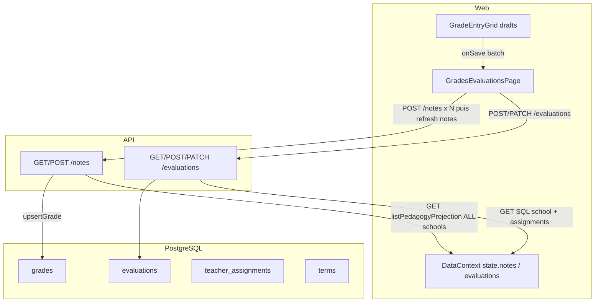

# AUDIT COMPLET — NOTES & ÉVALUATIONS V2

**Mode :** audit uniquement. Aucun correctif métier. Aucune migration PostgreSQL.

| Champ | Valeur |
| --- | --- |
| Dépôt | `Somafrik-education/Somafrik` |
| Branche audité | `develop` |
| SHA audité | `f80eaa5fc3e8ec240f6922c814967ed15eefd1b2` |
| Commit | `Merge pull request #255 from Somafrik-education/cto/p0-grade-entry-batch-no-refresh` |
| Date d’audit | 2026-08-18 |
| Branche rapport | `audit/notes-evaluations-v2-complet` |
| Verdict module | **NO-GO** (P0-002 = contournement du workflow de validation) |

Les PRs **#251 à #255** sont traitées comme **du code à auditer**, pas comme des preuves suffisantes.

Revalidation CTO GitHub indépendante du HEAD `dd350340` : les 3 P0 sont **confirmés**. Le verdict général « GO SOUS RÉSERVES » a été rejeté comme incohérent avec P0-002. Ce document aligne le verdict module sur **NO-GO**. Aucun correctif métier.

---

## 1. SHA audité

```text
git fetch origin
git checkout develop
git pull --ff-only origin develop
git status --short --branch   → ## develop
git rev-parse HEAD            → f80eaa5fc3e8ec240f6922c814967ed15eefd1b2
```

`develop` a avancé depuis `70c6efe3` (merge #254) jusqu’à **`f80eaa5f` (merge #255)**. Le P0 « Enregistrer tout » est donc **déjà dans develop** au moment de cet audit.

---

## 2. État Git

```text
## develop (au démarrage de l’audit)
HEAD = f80eaa5fc3e8ec240f6922c814967ed15eefd1b2
working tree clean
```

Branche de livrable : `audit/notes-evaluations-v2-complet` (fast-forward depuis le SHA ci-dessus). **Seul fichier ajouté : ce rapport.**

---

## 3. Architecture actuelle

```text
UI Web (GradesEvaluationsPage / GradeEntryGrid)
    → pedagogyApi  POST/PATCH /api/evaluations
    → pedagogyApi  POST /api/notes
    → GET /api/evaluations  (SQL scopé établissement + enseignant)
    → GET /api/notes        (projection mémoire puis filtre)
    → pedagogyService + withTransaction
    → postgresRepository.upsertEvaluationFromLegacy / upsertGrade
    → tables PostgreSQL evaluations + grades
```

Faits structurants :

1. **Il n’existe pas de table `notes`.** La persistance canonique est `grades`. L’API projette `notes`.
2. **PostgreSQL est la source de vérité des écritures Web** de ce module : `GradesEvaluationsPage` n’appelle plus `DataContext.update()` pour notes/évaluations ; `GET /api/backoffice/state` et `PUT /api/backoffice/state` répondent « removed ».
3. **Le client reste un agrégat de lecture** (`state.notes`, `state.evaluations`) hydraté par `domainLoaders`. Ce n’est pas SoT, mais c’est encore le moteur des stats, exports, vues classe/élève.
4. **Deux vocabulaires de statut** coexistent : UI française (`Brouillon`, `Validée`, `Saisie`) vs PG (`draft`, `locked`, `graded`). Le pont est `backend/lib/gradesCanonical.js`.
5. **Le grain évaluation PG est UUID** (`school_id`, `class_id`, `subject_id`, `term_id`). L’**ingress et l’UI** utilisent encore massivement `className` / `subject` / `period` texte.
6. **Mobile n’appelle jamais `/evaluations`.** Il POST `/notes` avec un `evaluationId` client. Ce n’est pas le même produit que le Web.



---

## 4. Cartographie PostgreSQL

### 4.1 Tables liées (direct / indirect)

| Table | Rôle Notes/Éval | Fichier |
| --- | --- | --- |
| `evaluations` | Entité pédagogique | `backend/db/schema.sql` 325–351 |
| `grades` | Notes (pas de table `notes`) | `schema.sql` 370–402 |
| `evaluation_types` | Catalogue de types | `schema.sql` ~260–287 |
| `classes` | FK `evaluations.class_id` | `schema.sql` 143–154 |
| `subjects` | FK technique « cours V2 » | `schema.sql` 165–176 |
| `school_courses` | Cours (classe+sujet+enseignant) — **non FK directe** des évaluations | `backend/db/pedagogySchema.js` |
| `teachers` | FK optionnelle évaluation, obligatoire note | `schema.sql` 204–214 |
| `teacher_assignments` | Scope enseignant GET évaluations + garde POST notes | `schema.sql` 251–262 |
| `students` / `enrollments` | Élève + inscription classe/année | `schema.sql` 221–249 |
| `academic_years` / `terms` | Année / période (`term_id` obligatoire) | `schema.sql` 118–141 |
| `school_settings` | Mode période, barème défaut | `schema.sql` 293–303 |
| `users` / `user_roles` | Acteurs RBAC | `schema.sql` 53–93 |
| `audit_logs` | Audit pédagogie | `schema.sql` 602–614 |
| `exams` / `exam_results` | Module Examens **distinct** | `schema.sql` 414–451 |
| `report_cards` | Enveloppe bulletin (pas de snapshot de notes) | `schema.sql` 471–485 |

### 4.2 `evaluations` — colonnes et contraintes

Statuts PG autorisés : `draft | open | locked | published | archived`.

- FK : `school_id`, `class_id`, `subject_id`, `term_id` (NOT NULL) ; `teacher_id` nullable ; `evaluation_type_id` nullable.
- CHECK : `max_score > 0`, `coefficient > 0`.
- Soft-delete : `active BOOLEAN DEFAULT TRUE`. Pas de `deleted_at`.
- **Pas de `academic_year_id`** : l’année passe par `terms.academic_year_id`.
- **Pas de `validated_by` / `published_at` / `corrected_by`.**
- `created_by` / `updated_by` existent au schéma, **non écrits** dans `upsertEvaluationFromLegacy` (`postgresRepository.js` 2844–2878).
- UNIQUE métier identité (titre+classe+cours+période) : **absent**. Seul unique partiel : `(school_id, legacy_json_id)` si legacy id non null.
- `ON DELETE` : pas de CASCADE vers `grades` (RESTRICT par défaut).

Mapping UI ↔ PG (`gradesCanonical.js` 10–34) :

| UI | PostgreSQL |
| --- | --- |
| Brouillon | `draft` |
| Ouverte / Saisie terminée | `open` |
| **Validée** | **`locked`** |
| Publiée | `published` |
| Annulée | `archived` |

### 4.3 `grades` — colonnes et contraintes

- FK UUID : `school_id`, `student_id`, `class_id`, `subject_id`, `teacher_id`, `term_id`, `evaluation_id` (nullable au schéma, obligatoire à l’upsert applicatif).
- CHECK score : `0 ≤ score ≤ max_score` ; cohérence `graded ⇒ score NOT NULL`, autres statuts ⇒ `score IS NULL`.
- UNIQUE runtime : `uq_grades_school_evaluation_student` sur `(school_id, evaluation_id, student_id)` WHERE `evaluation_id IS NOT NULL` (`backend/lib/gradeUniqueness.js`).
- `version` incrémenté (optimistic lock).
- `publication_status` et `locked` : **colonnes mortes** (jamais lues/écrites hors schéma).
- Statuts PG : `graded | absent | excused | not_submitted | exempt`.

Mapping notes UI ↔ PG (`gradesCanonical.js` 36–63) :

| UI | PostgreSQL |
| --- | --- |
| Saisie / **Validée** / **Corrigée** | **`graded`** |
| Absente | `absent` |
| Justifiée | `excused` |
| Non justifiée / En attente | `not_submitted` |
| Dispensée | `exempt` |

**Conséquence :** `Validée` et `Corrigée` **ne sont pas des statuts PostgreSQL**. Après GET, `fromGradeStatus('graded')` renvoie toujours **`Saisie`**. Voir `NOTES-EVAL-P0-001`.

### 4.4 Autorité relationnelle vs display

| Identifiant | Stockage PG | Ingress API | UI Web |
| --- | --- | --- | --- |
| Classe | `class_id` UUID | `className` ou `classId` (`evaluationAttachment.js` 80–90) | sélecteur **nom** |
| Cours | `subject_id` UUID | `subject` nom | sélecteur **Cours** (champ interne `subject`) |
| Période | `term_id` UUID | `period` texte, résolu sur **l’année courante** uniquement (`evaluationAttachment.js` 106–118) | `period` texte |
| Élève | `student_id` UUID | code / UUID | `studentId` |
| Évaluation | `evaluations.id` UUID + `legacy_json_id` | UUID ou id client `EVAL-…` | id client puis UUID projeté |

Les noms **peuvent** servir au display. Ils **servent encore** à l’autorisation secondaire (filtre enseignant GET `/notes` par `className`) et à tout le matching UI. Voir `NOTES-EVAL-P1-003`.

---

## 5. Cartographie API

### 5.1 Endpoints Notes / Évaluations

| Méthode | Route | Permission | Tenant | Tx | Audit | Tests PG/HTTP |
| --- | --- | --- | --- | --- | --- | --- |
| GET | `/api/evaluations` | `Notes:READ` | JWT `schoolCode` ; SQL `school_id` ; enseignant = `teacher_assignments` actives classe+sujet ; parent/élève = `active AND published` | non | non | `verify-pedagogy-management.js` |
| POST | `/api/evaluations` | `Notes:CREATE` OR `Notes:UPDATE` + `write_notes` | `ignoreClientScope` ; école = JWT | oui | `create_evaluation` | idem + `pedagogyRepository.pg.test.js` |
| PATCH | `/api/evaluations/:id` | `Notes:UPDATE` + `write_notes` | JWT ; IDOR autre tenant → 404 `EVALUATION_NOT_FOUND` | oui | `update_evaluation` | idem |
| GET | `/api/notes` | `Notes:READ` | **charge toute la projection PG** puis filtre élèves scopés | non | non | lecture 14/20 |
| GET | `/api/students/:id/notes` | `Notes:READ` | élève autorisé sinon `[]` | non | non | RBAC live |
| POST | `/api/notes` | `Notes:CREATE` OR `Notes:UPDATE` + `write_notes` | `ignoreClientScope` ; garde éval `locked` ; enseignant class+cours | oui | `upsert_grade` | flux complet |

Examens / bulletins (frontière, pas le même modèle de notes) :

| Méthode | Route | Permission |
| --- | --- | --- |
| GET/POST/PATCH | `/api/exams`, `/validate`, `/cancel`, `/archive` | module `Examens` |
| GET | `/api/report-cards` | `Bulletins:READ` |
| POST | `/api/report-cards/generate`, `/:id/publish`, `/:id/archive` | `Bulletins:UPDATE` |

### 5.2 Codes métier observés

| Code | HTTP | Usage |
| --- | --- | --- |
| `EVALUATION_NOT_VALIDATED` | 409 | saisie si non `locked`, inactive, publiée |
| `EVALUATION_VALIDATION_FORBIDDEN` | 403 | enseignant PATCH vers `locked`/`published` |
| `EVALUATION_NOT_FOUND` | 404 | PATCH/lookup |
| `STUDENT_NOT_ENROLLED` | 409 | élève hors `class_id` de l’éval |
| `GRADE_INVALID` / contrat score | 400 | barème / coefficient |
| `GRADE_TEACHER_UNRESOLVED` | 409 | enseignant note ambigu |
| `TENANT_MISMATCH` | 400/403 | école |
| `PERMISSION_DENIED` | 403 | RBAC |
| `ACADEMIC_YEAR_CLOSED` | 409 | année fermée |
| `EVALUATION_TYPE_REQUIRED` | 400 | type canonique manquant |
| *(aucun code)* | 403 | « Accès refusé: cours non affecté. » (POST notes enseignant) |
| *(aucun code)* | 403 | abonnement `write_notes` |

### 5.3 Qualité API — écarts

- **GET `/api/notes`** n’est pas une requête SQL scopée : `listPedagogyProjection()` lit **toutes** les `grades` et `evaluations` (`pedagogyPgStore.js` 382–418), puis `server.js` 1557–1566 filtre en mémoire. Défense en profondeur insuffisante. `NOTES-EVAL-P1-001`.
- Pas de `POST /notes/batch`. Batch UI = N POST séquentiels. `NOTES-EVAL-P1-002`.
- 403 enseignant notes **sans code métier stable**.
- Fallback mémoire `saveNotesViaBackOfficeState` existe encore dans `server.js` 5570+ si `engine !== postgresql` — chemin non canonique.

---

## 6. Cartographie Web

Page unique : `web/src/pages/GradesEvaluationsPage.tsx`. Route `/notes` hydrate `notes`, `evaluations`, `students`, `classes` (`routeDomainMap.ts`) — **pas** `courses` / `assignments` par défaut.

| Onglet | Source réelle | Matching classe | Filtre publication |
| --- | --- | --- | --- |
| Évaluations | GET `/evaluations` → `state.evaluations` | file préfet : période/statut, **pas** le select Classe | n/a |
| Saisie | `evaluationsEligibleForGradeEntry` (statut UI `Validée`) + `allGrades(state)` | `classNamesMatch(className)` | n/a (staff) |
| Par classe | `GradeBookService` **client** sur `state.notes` | `normalize(className)` | non (staff) |
| Par élève | `scopedGrades` + grade book | `studentId` | parent/élève seulement |
| Statistiques | **réutilise** `ClassGradesOverview` | nom | non (staff) |

**#255 — Enregistrer tout (code actuel, à auditer) :**

- Draft local `{ value, gradeStatus, dirty }` ; aucun `onBlur` ; aucun bouton par ligne.
- `onSave: (grades) => Promise<void>` ; `async function saveAll` ; `await onSave` **puis** `delete next[studentId]`.
- `saving` / `Enregistrement…` / `savingRef` anti double-clic.
- Parent : N `upsertNote` puis **un** `refresh(["notes"])`.
- Échec : drafts conservés ; POST déjà réussis **restent en PG** (`NOTES-EVAL-P1-002`).
- Garde dirty : onglet / période / classe / évaluation.

Vocabulaire UI : libellé **Cours** (pas « Matière »). Champ interne `subject`. Alias documenté `evaluationCourseOptions.ts`.

---

## 7. Cartographie Mobile

Répertoire : `Mobile/` (React Native / Expo).

| Capacité | Mobile | Preuve |
| --- | --- | --- |
| GET `/evaluations` | **jamais** | `Mobile/src/services/api.ts` |
| POST/PATCH `/evaluations` | **jamais** | idem |
| GET `/notes` | oui | `AdminDataContext` |
| POST `/notes` | oui, **1 POST / élève**, `evaluationId: EVAL-${Date.now()}` | `TeacherGradesScreen.tsx` ~181–303 |
| Validation / publication | **non** | aucun PATCH |
| Statuts d’absence | **non** | session note simple |
| Outbox / offline durable | **non** | bandeau hors-ligne trompeur |
| Bulletins liste | **catalogue mock** `data/catalog.ts` | PDF réel seulement |
| GET `/report-cards` | **jamais** | — |

Le backend **exige** une évaluation existante (`evaluation_id obligatoire`, `postgresRepository.js` 2036–2041). Un `EVAL-${Date.now()}` mobile ne résout pas une ligne PG → **404**. La saisie mobile n’est **pas** au niveau Web et n’est **pas** « compatible PostgreSQL canonique ».

**Verdict Mobile : NO-GO.** Voir `NOTES-EVAL-P0-003`.

---

## 8. Workflow statuts

### 8.1 Cycle évaluation (attendu vs réel)

```text
Enseignant POST /evaluations
  Web envoie status "Ouverte" (createEvaluation défaut)
  HTTP nu sans status → PG draft / UI Brouillon
    ↓
Préfet / Admin PATCH status "Validée" → PG locked
  Enseignant PATCH Validée/Publiée → 403 EVALUATION_VALIDATION_FORBIDDEN
  Enseignant POST create avec status Validée → NON GARDÉ  → P0-002
    ↓
Enseignant POST /notes seulement si locked + active
  published / archived / draft / open → 409 EVALUATION_NOT_VALIDATED
    ↓
Admin PATCH "Publiée" → PG published ; nouvelle saisie refusée
    ↓
Désactiver : PATCH active=false (+ UI status Annulée)
  Enseignant NON bloqué pour archived  → P1-004
```

### 8.2 Transitions — fiche

| Transition | Acteur réel | RBAC route | UI | PG | Endpoint | Tables | Audit | Retour | Après login |
| --- | --- | --- | --- | --- | --- | --- | --- | --- | --- |
| Créer | Enseignant, Préfet, Admin School (si CREATE/UPDATE Notes) | POST `/evaluations` | Ouverte (Web) / Brouillon (API nu) | `open` / `draft` | POST `/api/evaluations` | `evaluations` | `create_evaluation` | n/a | GET relit |
| Valider | Rôle contenant prefet/admin/directeur/proviseur **et** `Notes:UPDATE` | PATCH | Validée | `locked` | PATCH | `evaluations` | `update_evaluation` (pas `validated_by`) | pas de dé-validation dédiée | oui PG |
| Saisir | Enseignant affecté class+cours ; staff avec clé enseignant | POST `/notes` | draft local puis Saisie | `graded` + score | POST `/api/notes` | `grades` | `upsert_grade` | upsert même clé | oui |
| Corriger | UI : `canCorrectValidatedGrades` = mêmes rôles que valider | POST `/notes` | Corrigée + motif | **redevient `graded`** | POST `/notes` | `grades.comment` seulement | `upsert_grade` sans old/new métier | n/a | **verrou perdu** |
| Publier | mêmes rôles que valider | PATCH | Publiée | `published` | PATCH + `reportCardsApi.generate` | `evaluations`, `report_cards` | `update_evaluation` + generate | pas d’unpublish dédié | oui |
| Désactiver | `canUpdate` (y compris enseignant) si pas de notes UI Validée/Corrigée et éval ≠ Publiée | PATCH | Annulée / `active: false` | `active=false` (status UI Annulée) | PATCH | `evaluations` | `update_evaluation` | pas de réactivation UI dédiée | éval masquée `active !== false` |

### 8.3 Statuts de note — contrat réel

| Statut UI | Valeur autorisée | Modifiable enseignant (grille) | Qui corrige | PG après round-trip | API |
| --- | --- | --- | --- | --- | --- |
| Saisie | 0…barème | oui si éval Validée | n/a | `graded` → **Saisie** | POST |
| Absente / Justifiée / Non justifiée / Dispensée | score null | oui jusqu’au save | n/a | absent/excused/not_submitted/exempt | POST |
| Validée (note) | nombre | verrou **local** seulement | préfet/admin UI | **Saisie** | perdu |
| Corrigée | nombre + motif UI | verrou local | préfet/admin UI | **Saisie** | motif dans `audit[]` client **non stocké PG** |

Décimales : Web `Number(raw.replace(",", "."))`, input `step=0.25`. PG `NUMERIC(8,2)`. Négatif / > barème : CHECK PG + `validateGradeValue` client. Champ vide : `undefined` (pas 0). **0 est une note graded valide.**

---

## 9. Matrice RBAC réelle

Permissions **route** (`rbacService.js` 402–407) :

- Lecture : `Notes:READ` (ou `COUNTRY_PRIVILEGES` / `ALL_PRIVILEGES`)
- Écriture notes / create éval : `Notes:CREATE` **OR** `Notes:UPDATE`
- PATCH éval : `Notes:UPDATE` seulement

Garde **métier Web** `canValidateGrades` : heuristique `role.includes("prefet"|"proviseur"|"directeur"|"admin")` — **pas** le jeton RBAC `Notes:*`. Un compte `Enseignant` avec `Notes:UPDATE` **voit** Désactiver, **ne voit pas** Valider/Publier/Corriger.

| Action | Enseignant | Préfet | Admin School | Parent | Élève | Superadmin |
| --- | ---: | ---: | ---: | ---: | ---: | ---: |
| Créer évaluation | oui si CREATE/UPDATE ; **sans garde d’affectation API** | oui si UPDATE | oui | ❌ route | ❌ | oui si privileges |
| Voir (GET évaluations) | ses `class_id+subject_id` actifs | tout l’établissement | tout l’établissement | publiées actives | publiées actives | selon scope |
| Voir notes | élèves de ses **classNames/classCodes JWT** (tous cours de la classe) | établissement | établissement | enfant lié + éval publiée | soi + publiée | selon scope |
| Modifier brouillon | UI `canEditEvaluation` (Brouillon/Ouverte) | oui | oui | ❌ | ❌ | oui |
| Valider | ❌ PATCH ; **⚠️ POST create status forge** | oui si UPDATE | oui | ❌ | ❌ | oui |
| Saisir note | oui si affecté + éval locked | oui (staff, `allowMissingTeacher` chemin non-enseignant) | oui | ❌ | ❌ | oui |
| Corriger | ❌ UI | UI oui ; **PG ne conserve pas Corrigée** | idem | ❌ | ❌ | idem |
| Publier | ❌ PATCH | oui | oui | ❌ | ❌ | oui |
| Désactiver | **oui UI si canUpdate** et pas de notes UI Validée | oui | oui | ❌ | ❌ | oui |

Cohérence frontend / route / repository :

- Valider : UI rôle ∩ PATCH `Notes:UPDATE` ∩ `assertTeacherCannotValidateEvaluation` — **OK sauf POST create**.
- Saisir : UI `canEnterGradesForEvaluation` ∩ POST notes ∩ `assertEvaluationAllowsGradeEntry` + assignment — **OK**.
- Désactiver : UI `canUpdate` **sans** équivalent backend « seul préfet » — **écart**.
- Export : `canExportGrades` **non branché** ; tout `Notes:READ` exporte.

Rôles demandés (`PREFET_ETUDES`, `PROVISEUR`, `DIRECTEUR`, `ADMIN_SCHOOL`, `SUPERADMIN`, `ENSEIGNANT`) : la garde validation Web est **textuelle sur `user.role`**, pas sur `role_key` `user_roles`. Un `PREFET_ETUDES` affiché « Préfet des études » passe ; un libellé atypique peut échouer côté UI tout en passant PATCH si `Notes:UPDATE`.

---

## 10. Tenant isolation

Preuves HTTP PG (`verify-pedagogy-management.js`) :

| Tentative | Résultat réel |
| --- | --- |
| POST éval `schoolCode: BI` depuis JWT CD | 201, persisté **CD** (`ignoreClientScope`) |
| GET admin CD lit éval BI | absent |
| PATCH UUID étranger | 404 |
| POST note `schoolCode: BI` + éval CD | 201 **sur CD** (scope JWT) |
| Enseignant non affecté POST note | 403 |
| GET enseignant autre classe / autre cours | titres absents |

Campagne conceptuelle école A / école B, mêmes noms :

- **Écritures** : scellées au JWT. Pas d’IDOR write observé sur UUID étranger (404/403).
- **Lectures GET `/evaluations`** : `WHERE e.school_id = $1`. Correct.
- **Lectures GET `/notes`** : projection **globale** puis filtre élèves. Le filtre `tenantScopeService.filterRows` + IDs élèves est la **seule** barrière. Pas de `WHERE grades.school_id = …` sur cet endpoint.

Homonymes **intra-école / années** : `uq_classes_school_year_normalized_name` rend le nom unique **par année**, pas globalement. JWT `classNames` est un libellé → mélange possible d’années. `NOTES-EVAL-P1-003`.

---

## 11. Legacy résiduel

| Reliquat | Nature | Gravité |
| --- | --- | --- |
| `gradesToLegacyNotes` / `legacyNotesToGrades` | **Pont actif** UI `StudentGrade` ↔ payload `/notes`. Nom historique, contrat vivant. | documentation |
| `state.notes` / `state.evaluations` | Cache lecture DataContext, pas SoT write | P2 agrégat |
| `evaluations.legacy_json_id` | Compat ids client `EVAL-…` | P2 |
| `upsertEvaluationFromLegacy` | Nom du writer canonique PG | documentation |
| `GET/PUT /api/backoffice/state` | **Removed** (410 métier) | OK |
| Table `backoffice_state` | Encore présente ; tests pédagogie exigent 0 projection notes | P2 infrastructure |
| `saveNotesViaBackOfficeState` | Chemin mémoire si engine ≠ PG | P2 |
| Mobile `data/notes.ts`, `models/Note.ts` | Dead code | P2 |
| Mobile `catalog.reportCards` | Mock présenté comme bulletins | P1 |

Cible « Web + Backend + Mobile PostgreSQL canonique, BackOffice inopérant » : **Web write + Backend PG : largement atteint. Mobile : non. Lecture Web : agrégat encore central.**

---

## 12. Audit logs

`writePedagogyAudit` dans la **même transaction** que l’écriture (`pedagogyService.js` 370–434) → rollback si insert audit échoue.

| Action | `audit_logs.action` | old_value | new_value | actor | school |
| --- | --- | --- | --- | --- | --- |
| Créer éval | `create_evaluation` | non | payload projeté | `user_id` | oui |
| PATCH éval (valider/publier/désactiver) | `update_evaluation` | **non** (pas d’old) | newValue saved | oui | oui |
| Upsert note | `upsert_grade` | **non** | saved (sans historique correction) | oui | oui |

Manques :

- pas de `validated_by` sur `evaluations` ;
- pas d’old/new de statut ;
- correction : pas d’action `grade.correct` persistée ; `grades.audit[]` GET est **synthétique** (`mapGrade` 5818–5824 : teacher_code + created_at uniquement).

---

## 13. Sync / offline

Web :

- `OFFLINE_CAPABLE_DOMAIN_KEYS` inclut `notes` et `evaluations`.
- Outbox `somafrik.syncOutbox.v1` **existe**, mais **GradesEvaluationsPage n’enqueue pas** : API directe + `refresh()`.
- Commentaire « Conservée localement (outbox failed) » dans `handleSaveEvaluation` est **obsolète** (pas de mutation locale sur échec).

Mobile : pas d’outbox. Un POST raté est perdu. Le bandeau affirme le contraire.

Conflit : `grades.version` + `assertNoteOptimisticLock`. Le batch Web **n’envoie pas** `version` → premier update OK ; second onglet peut **écraser** (lost update si version non renvoyée). `NOTES-EVAL-P1-006`.

---

## 14. Concurrence

| Scénario | Comportement réel |
| --- | --- |
| Double clic Enregistrer tout | bloqué `savingRef` (#255) |
| Deux onglets / deux appareils | upsert même `(school, evaluation, student)` ; last-write-wins si `version` absent du client |
| Validation pendant saisie | POST notes refuse si plus `locked` (publiée) ; si encore locked, saisie continue |
| Désactivation pendant saisie | `active=false` → 409 `EVALUATION_NOT_VALIDATED` sur POST suivants ; drafts UI conservés |
| POST A OK, B OK, C KO | PG partiel + drafts UI conservés (re-POST A/B = upsert) |
| Idempotence HTTP | `withIdempotency` sur POST notes/évaluations |
| Unique PG notes | oui |
| Unique PG évaluations titre/classe/cours/période | **non** — doublons possibles `NOTES-EVAL-P1-007` |
| Transaction batch notes | **non** |

Recommandation API `POST /notes/batch` transactionnelle : **P1**, pas P0 — l’upsert rend le retry global sûr vis-à-vis des doublons, mais pas vis-à-vis d’un utilisateur qui croit que rien n’est sauvé alors que A et B le sont.

---

## 15. Tests existants

| Suite | Couvert réellement | Mock / statique | Non couvert |
| --- | --- | --- | --- |
| `verify:pedagogy-management` | HTTP+PG : create, tenant seal, self-validate PATCH, note avant/après locked, GET scope enseignant, autre cours 403, publish bloque saisie, deactivate `active` | — | login cycle, correction, POST create status Validée, POST éval hors affectation enseignant, homonymes, GET notes cross-subject |
| `evaluationGradeEntry.test.js` | gardes statuts + self-validate PATCH | unitaire | create forge |
| `pedagogyRepository.pg.test.js` | tx, audit, tenant | PG réel | — |
| `notesEvaluationsRbacLive.test.js` | overlay live Notes:* | grants mémoire/PG selon fichier | UI |
| `GradeEntryGrid.test.tsx` | A–I #255, pending, reject conserve drafts | `onSave` mock | HTTP |
| `GradesEvaluationsPage.test.tsx` | N upsert + 1 refresh ; confirm dirty | APIs mockées | — |
| `verify:teacher-login-scope` | guards source + tests scope | mixte | — |
| `verify:functional-rbac` | Notes routes live | — | workflow pédagogique |
| `verify:e2e-0008` / `0028` | chaînes historiques | à ne pas prendre pour V2 locked | — |
| Mobile notes | quasi aucun test API évaluations | — | tout le workflow |

---

## 16. Résultats E2E PostgreSQL

Scénario CTO vs `backend/scripts/verify-pedagogy-management.js` (exécuté **OK** le 2026-08-18) + tests Web.

Jeu proche : école `CD-2026-0001`, enseignant `ENS-0001` / Seke, classe **6ème A** (pas 2ème A), cours Mathématiques, titre **LES ADVERBES**, note **14**.

| # | Étape mandat | Résultat | Preuve |
| ---: | --- | --- | --- |
| 1 | Création LES ADVERBES | OK HTTP 201 | `verify-pedagogy-management.js` ~560 |
| 2 | PG Brouillon | OK `status=draft` si body sans status | ~544, ~561 |
| 3 | Saisie avant validation | OK 409 `EVALUATION_NOT_VALIDATED` | ~581 |
| 4 | Auto-validation enseignant | OK 403 `EVALUATION_VALIDATION_FORBIDDEN` **sur PATCH** | ~568 |
| 5 | Préfet/admin valide | OK 200 UI Validée | ~597 |
| 6 | PG `locked` | OK | ~606 |
| 7 | Saisie 14 | OK 201 | ~623 |
| 8 | Aucun POST avant Enregistrer tout | OK **uniquement tests Web** | `GradeEntryGrid.test.tsx` A/B/C |
| 9 | Enregistrer tout | OK tests Web (1 `onSave`) | D/H |
| 10 | PG = 14 | OK | ~634 |
| 11–12 | refresh GET `/notes` = 14 | OK | ~637–641 |
| 13–14 | logout/login | **non exécuté** (persistance PG implique relecture, pas de cycle session) | — |
| 15 | Autre enseignant | OK 403 | ~746 |
| 16 | Autre classe | GET liste OK (invisible) ; **POST create enseignant autre classe non testé** | ~708 |
| 17 | Autre cours | OK 403 POST notes | ~754+ |
| 18 | Autre tenant | OK lecture/écriture scellées | ~399–442, ~711 |
| 19 | Correction selon rôle | **non testé E2E** ; code montre perte de statut | P0-001 |
| 20 | Publication | OK ; POST note 409 | ~871–888 |
| 21 | Visibilité parent/élève publiée | **code présent**, pas d’assert E2E dans ce script | `filterNotesForPrincipal` |

Aucun mock mémoire pour le script HTTP-PG. Les tests Web #255 sont des mocks d’`onSave` / `upsertNote`.

---

## 17. Anomalies P0

### NOTES-EVAL-P0-001 — Statuts note Validée/Corrigée et historique de correction non persistés

- **Priorité :** P0
- **Fichiers :** `backend/lib/gradesCanonical.js` 36–51, 83–91 ; `backend/db/postgresRepository.js` 2069–2072, 5788–5824 ; `web/src/lib/evaluations.ts` 595–630 ; `web/src/components/grades/GradeEntryGrid.tsx` 170–171
- **Scénario :** Préfet corrige 14 → 12 avec motif. POST `/notes` mappe `Corrigée` → PG `graded`. GET `/notes` projette `Saisie`. L’enseignant peut remodifier après refresh. `audit[]` réel n’est pas relu.
- **Impact :** le verrou « note Validée » est **cosmétique**. La correction **écrase silencieusement** la valeur. Impossible d’auditer l’ancienne note depuis PG. Bloque les chantiers correction / publication / contestation.
- **Preuve :** `GRADE_STATUS_FROM_UI` fusionne `validee`/`corrigee` vers `graded` ; `fromGradeStatus` ne renvoie que `Saisie` ; `mapGrade.audit` est synthétique.
- **Correctif recommandé :** distinguer en PG `graded | validated | corrected` (ou colonnes `validated_at` / `corrected_at` / `correction_reason` / `previous_score`) ; ne plus collapser côté `gradesCanonical` ; GET doit renvoyer le statut UI réel.

### NOTES-EVAL-P0-002 — Un enseignant peut créer une évaluation déjà Validée/Publiée

- **Priorité :** P0
- **Fichiers :** `backend/db/postgresRepository.js` 2804, 2816–2821 ; `backend/lib/evaluationGradeEntry.js` 77–86
- **Scénario :** `POST /api/evaluations` `{ status: "Validée", ... }` avec JWT enseignant. `assertTeacherCannotValidateEvaluation` n’est appelé que si `existing && patchTouches(["status"])`.
- **Impact :** contournement total du workflow Préfet. Saisie immédiate sans validation. Les tests HTTP ne couvrent que le PATCH.
- **Preuve :** garde limitée au PATCH ; create utilise `toEvaluationStatus(evaluation.status, "draft")` sans assert enseignant.
- **Correctif recommandé :** appeler `assertTeacherCannotValidateEvaluation` aussi à l’insert ; forcer `draft`/`open` pour rôle enseignant ; test HTTP dédié.

### NOTES-EVAL-P0-003 — Mobile Notes incompatible avec le modèle Evaluation canonique

- **Priorité :** P0 (produit Mobile)
- **Fichiers :** `Mobile/src/screens/TeacherGradesScreen.tsx` 181–303 ; `Mobile/src/services/api.ts` 247–341 ; `backend/db/postgresRepository.js` 2036–2041
- **Scénario :** enseignant mobile « Créer une session » → `evaluationId: EVAL-${Date.now()}` → POST `/notes` sans POST `/evaluations`.
- **Impact :** 404 évaluation introuvable, ou pire si un legacy id collisionne. Pas de file Préfet, pas de `locked`, bulletins mock. Affirmer « Mobile compatible PG » serait faux.
- **Preuve :** grep Mobile = zéro `/evaluations` ; upsertGrade exige `evaluationId`.
- **Correctif recommandé :** aligner Mobile sur le cycle Web (créer éval → attendre Validée → batch notes) ou désactiver explicitement l’écriture mobile jusqu’au lot dédié.

---

## 18. Anomalies P1

### NOTES-EVAL-P1-001 — GET `/api/notes` charge toutes les notes de toutes les écoles

- **Fichier :** `backend/db/pedagogyPgStore.js` 401–418 ; `backend/server.js` 1557–1566, 3330–3341
- **Scénario :** n’importe quel `Notes:READ` déclenche `SELECT` global `grades`.
- **Impact :** perf (2000 élèves × 20 évals) ; la sécurité tenant repose sur un filtre JS après coup. Un bug de filtre = fuite cross-tenant.
- **Correctif :** SQL `WHERE school_id = $1` (+ assignments enseignant, + publication parent).

### NOTES-EVAL-P1-002 — Batch « Enregistrer tout » non transactionnel

- **Fichiers :** `web/src/pages/GradesEvaluationsPage.tsx` 330–344 ; `GradeEntryGrid.tsx` 101–155
- **Scénario :** POST A ✅ B ✅ C ❌ → drafts conservés, A et B déjà en PG.
- **Impact :** l’enseignant croit que rien n’est sauvé ; retry réécrit A/B (idempotent upsert) — acceptable court terme, pas pour clôture officielle.
- **Correctif :** `POST /notes/batch` + une transaction PG. **Ne pas implémenter dans cet audit.** Priorité P1 (pas P0 : pas de perte silencieuse grâce aux drafts).

### NOTES-EVAL-P1-003 — `className` encore clé fonctionnelle UI / lecture enseignant

- **Fichiers :** `GradesEvaluationsPage.tsx` 75–78, 163, 568 ; `GradeEntryGrid.tsx` 47 ; `ClassGradesOverview.tsx` 32 ; `evaluations.ts` 143–154, 216–231 ; `tenantScopeService.js` 111–138
- **Scénario :** deux classes UUID distinctes « 2ème A » (années différentes) ; JWT `classNames=["2ème A"]`.
- **Impact :** roster, stats, export, GET notes enseignant fusionnent. L’écriture note, elle, utilise `class_id` de l’éval (plus sûr).
- **Correctif :** sélecteurs `class_id` ; GET notes enseignant par `class_id` + `subject_id` comme GET évaluations.

### NOTES-EVAL-P1-004 — Désactiver une évaluation Validée (bouton préprod)

- **Fichiers :** `GradesEvaluationsPage.tsx` 264–273, 457 ; `evaluations.ts` 280–285 ; `evaluationGradeEntry.js` 77–86
- **Qui le voit :** tout `canUpdate` (enseignant inclus).
- **API :** PATCH `{ active: false, status: "Annulée" }`.
- **Soft-delete :** `active=false` ; notes **non supprimées**.
- **Scénario :** workflow actuel = valider **avant** saisie ⇒ notes encore `Saisie` ⇒ `canDeleteEvaluation` **autorise** la désactivation d’une Validée.
- **Impact :** pas une disparition destructive PG (donc pas P0), mais **casse le lock pédagogique**. Enseignant peut PATCH `archived` (non couvert par `assertTeacherCannotValidateEvaluation`).
- **Correctif :** interdire Désactiver si `status ∈ {locked, published}` sauf rôle admin explicite ; garder historique ; API `EVALUATION_DEACTIVATE_FORBIDDEN`.

### NOTES-EVAL-P1-005 — POST `/evaluations` sans garde `teacher_assignments`

- **Fichier :** `postgresRepository.js` `upsertEvaluationFromLegacy` (pas d’assert assignment) vs POST notes 2177–2198
- **Scénario :** enseignant POST une éval `className` + `subject` hors JWT (hors UI).
- **Impact :** ligne PG créée ; elle n’apparaît pas dans son GET (filtre assignments) mais pollue l’établissement / un autre prof.
- **Correctif :** même garde classe+cours que POST notes.

### NOTES-EVAL-P1-006 — Optimistic lock notes non utilisé par le Web

- **Fichiers :** `postgresRepository.js` 2278–2281 ; `GradeEntryGrid` / `handleSaveGrades` n’envoient pas `version`
- **Impact :** deux navigateurs → last write wins.
- **Correctif :** renvoyer `version` au client ; 409 si conflit ; UI « la note a changé ».

### NOTES-EVAL-P1-007 — Doublons d’évaluations (même titre/classe/cours/période)

- **Fichier :** `schema.sql` 325–365 (pas d’unique métier)
- **Impact :** plusieurs « LES ADVERBES » coexistent ; saisie/stats ambiguës.
- **Correctif :** UNIQUE partiel actif `(school_id, class_id, subject_id, term_id, lower(title)) WHERE active`.

### NOTES-EVAL-P1-008 — Période = texte sur l’année courante

- **Fichier :** `evaluationAttachment.js` 106–118
- **Scénario :** deux années avec « Trimestre 1 » ; create éval sans `term_id` → `getCurrentAcademicYear` puis `ensureTerm(name)`.
- **Impact :** une éval « Trimestre 1 » d’une année fermée ne peut pas être ciblée par le libellé seul ; changement d’année active ré-attache au mauvais `term_id`.
- **Correctif :** exiger `termId` / `academicYearId` dans l’API et l’UI.

### NOTES-EVAL-P1-009 — Stats / export / vues classe-élève calculés client sur notes non publiées

- **Fichiers :** `gradeBook.ts` 65–68 ; `GradesEvaluationsPage.tsx` 368–391 ; `ClassGradesOverview.tsx`
- **Impact :** moyennes staff incluent `Saisie` ; export CSV ignore le select Classe et la publication ; `canExportGrades` mort.
- **CSV injection :** `escapeCsv` RFC 4180 **sans** préfixe `'=` pour formules Excel. P1 données personnelles + injection tableur.
- **Correctif :** API stats scopée ; export = même scope GET évaluations enseignant ; option published-only ; sanitiser `=+\-@`.

### NOTES-EVAL-P1-010 — GET notes enseignant fuit les notes des autres cours de la même classe

- **Fichiers :** `server.js` 1557–1566 ; `tenantScopeService.js` 111–138
- **Scénario :** teacher A Math, teacher B Français, même 6ème A. A reçoit les notes de B (lecture).
- **Impact :** confidentialité pédagogique intra-établissement.
- **Correctif :** filtrer `grades.subject_id` via assignments, comme `listSchoolEvaluations`.

### NOTES-EVAL-P1-011 — Publication / bulletins sans snapshot de notes

- **Fichiers :** `schema.sql` 471–485 (`report_cards` sans scores) ; `GradesEvaluationsPage.tsx` 315–327 ; `evaluations.ts` `syncBulletinsForClass`
- **Impact :** SoT bulletin = recalcul ultérieur depuis `grades`. Une correction post-publication change le PDF suivant sans journal.
- **Correctif :** snapshot JSONB des lignes de notes au publish, ou gel `grades` + statut publication réel (colonne `publication_status` aujourd’hui morte).

### NOTES-EVAL-P1-012 — Dual modèle Examens vs Évaluations

- **Fichiers :** `exams` + `exam_results` vs `evaluations` + `grades` ; `evaluations.linked_exam_id` sans FK
- **Impact :** deux notes possibles pour le même élève/période ; import `buildEvaluationsFromExams` côté Web.
- **Correctif :** documenter la frontière produit ; une seule écriture de résultat scolaire.

---

## 19. Anomalies P2

### NOTES-EVAL-P2-001 — `evaluations.created_by` / `updated_by` jamais écrits

`schema.sql` 342–343 vs INSERT 2874–2878.

### NOTES-EVAL-P2-002 — Colonnes mortes `grades.publication_status`, `grades.locked`

Confusion avec le lock évaluation.

### NOTES-EVAL-P2-003 — Web create = « Ouverte », API nu = « Brouillon »

`evaluations.ts` 433 vs `toEvaluationStatus(..., "draft")`. File Préfet « à valider » les avale tous les deux, mais les tests et l’UI divergent.

### NOTES-EVAL-P2-004 — `/notes` ne charge pas `courses` / `assignments`

Formulaire admin « Aucun cours affecté » si l’utilisateur n’a pas visité d’autres routes.

### NOTES-EVAL-P2-005 — `handleValidateEvaluation` marque aussi les notes existantes « Validée »

Sémantique héritée (valider des notes déjà saisies) vs workflow actuel (valider l’éval **avant** saisie). Confusion + collision avec P0-001.

### NOTES-EVAL-P2-006 — Commentaire outbox obsolète ; domaines offline-capable sans enqueue

`GradesEvaluationsPage.tsx` ~256–258 ; `canonicalDomains.ts`.

### NOTES-EVAL-P2-007 — Impression = `window.print()` page entière

Pas de document notes dédié.

### NOTES-EVAL-P2-008 — 403 notes enseignant sans code métier

Messages texte « cours non affecté » / « élève hors classe ».

### NOTES-EVAL-P2-009 — N POST séquentiels + refresh domaine notes (perf)

Estimer 50 classes × 40 élèves × 20 évals : GET notes actuel = table scan global. POST batch 40 round-trips. P2 une fois P1-001/002 traités, ou P1 perf si production > 1 k notes.

### NOTES-EVAL-P2-010 — Dead code Mobile (`upsertNoteItem`, `data/notes.ts`)

### NOTES-EVAL-P2-011 — `history[]` évaluation côté client non relu depuis `audit_logs`

### NOTES-EVAL-P2-012 — Fallback `repository.engine !== postgresql`

Chemin mémoire encore compilé dans `POST /api/notes`.

---

## 20. Dette technique

1. Agrégat `DataContext` comme moteur analytique (stats, rang, CSV) alors que PG est SoT write.
2. Double langage UI/PG sans tests de round-trip des statuts note étendus.
3. Ingress par noms (`className`, `subject`, `period`) alors que le schéma est UUID.
4. `subject` = cours V2 dans le code / « Cours » à l’écran / table `subjects` — cohérent V2 si on **ne** réintroduit **pas** « Matière » métier ; la table ne doit pas être renommée dans un lot Notes.
5. Examens + évaluations + bulletins : trois cycles de vie.
6. Mobile MVP notes vs Web D3.6b : divergence produit, pas un simple retard d’écran.
7. Absence de pagination GET notes/évaluations.

---

## 21. Recommandations (sans implémentation)

Ordre suggéré après revalidation CTO de **ce rapport** :

1. **Lot A — Intégrité des statuts note** (P0-001) : modèle PG `validated/corrected` + motif + old score.
2. **Lot B — Gardes create/validate/deactivate** (P0-002, P1-004, P1-005) : insert enseignant forcé `draft`/`open` ; assignment obligatoire ; Désactiver réservé.
3. **Lot C — Lectures SQL scopées** (P1-001, P1-010) : GET `/notes` comme GET `/evaluations`.
4. **Lot D — Identifiants UI** (P1-003, P1-008) : `classId` / `termId` dans sélecteurs.
5. **Lot E — Batch transactionnel** (P1-002) : `POST /notes/batch`.
6. **Lot F — Mobile** (P0-003) : soit parité cycle Web, soit lecture seule explicite.
7. **Lot G — Bulletins snapshot** (P1-011) avant d’ajouter des fonctions publication avancées.

Ne pas enchaîner correction / publication / statistiques **produit** tant que A–C ne sont pas clos : ces écrans consommeraient aujourd’hui un statut note **mensonger** après refresh.

---

## 22. Verdict CTO

Un P0 **exploitable** sur le workflow central (ici **P0-002** : un enseignant peut forger `POST /evaluations` déjà `Validée` / `locked`) **interdit** un verdict module « GO sous réserves ». Les sous-domaines partiellement sains ne relèvent pas le module.

| Domaine | Verdict | Motif court |
| --- | --- | --- |
| Identité PG / GET évaluations | **GO sous réserves** | UUID + GET SQL scopé + tenant write OK ; create sans assignment ; doublons titre ; période texte |
| Création / validation globale | **NO-GO** | **P0-002** : garde `assertTeacherCannotValidateEvaluation` absente à l’insert ; le PATCH ne suffit pas |
| Validation PATCH | **GO sous réserves** | Enseignant bloqué et testé HTTP+PG ; pas de `validated_by` |
| Saisie Web après validation réelle | **GO sous réserves** | #255 drafts + 1 refresh + E2E 14/20 OK **si** l’éval est déjà `locked` par un Préfet ; batch partiel ; roster `className` |
| Corrections | **NO-GO** | **P0-001** : Corrigée/Validée (note) collapse en `graded` puis relues `Saisie` |
| Publication | **GO sous réserves** | Transition PATCH testée ; saisie post-publish bloquée ; pas de snapshot bulletin |
| Statistiques | **GO sous réserves** | Calcul client, notes non publiées, homonymes |
| Vue classe | **GO sous réserves** | Matching nom, pas UUID |
| Vue élève | **GO sous réserves** | `studentId` OK ; pas d’historique multi-années dédié |
| Mobile | **NO-GO** | **P0-003** : pas d’API `/evaluations` ; `EVAL-${Date.now()}` puis POST `/notes` |
| Bulletins | **GO sous réserves** | Enveloppe `report_cards` sans lignes de notes ; génération au publish via noms |
| Sécurité tenant (write) | **GO sous réserves** | JWT scellé, IDOR write testé |
| Sécurité tenant (read notes) | **GO sous réserves** | Filtre JS après scan global ; fuite inter-cours enseignant |

### Verdict général

```text
MODULE NOTES & ÉVALUATIONS V2
= NO-GO
```

Le **chemin heureux Web** (créer en Brouillon/Ouverte → refus de saisie → validation Préfet **via PATCH** → `locked` → saisie 14 → PostgreSQL → GET = 14) est **réel et testé HTTP+PG**. Il ne rend pas le module GO : le même rôle enseignant peut **contourner** la validation par un `POST /evaluations` déjà `locked` (P0-002). Les corrections perdent leur statut après relecture PG (P0-001). Le Mobile n’implémente pas le cycle canonique (P0-003).

Comptage inchangé :

- 3 P0 (statut note / forge validation create / Mobile) ;
- 12 P1 (dont batch, className, Désactiver Validée, GET notes, période, stats, examens) ;
- 12 P2.

**Aucun Ready. Aucun merge de correctif dans cette PR.** Nouvelle revalidation CTO GitHub indépendante obligatoire sur le HEAD de cette correction documentaire.

---

## Annexe A — Identité canonique d’une évaluation

| Champ attendu | Présent PG | Présent API projection | Clé d’auth |
| --- | --- | --- | --- |
| `school_id` | oui | `schoolCode` | write JWT ; read SQL |
| `evaluation.id` | UUID | `id` souvent `legacy_json_id` projeté | lookup |
| `academic_year_id` | via `terms` seulement | `academicYearName` | non envoyé create |
| `term_id` | oui | `period` = `term_name` **et** `termId` | ingress nom année courante |
| `class_id` | oui | `classId` + `className` | GET enseignant UUID ; UI nom |
| `subject_id` | oui | `subjectId` + `subject`/`course` | GET enseignant UUID |
| `teacher_id` | nullable | `teacherId` code | POST notes résolu ; create libre |
| type | `evaluation_type` + `evaluation_type_id` | oui | create exige type id |
| title / scale / coefficient / status | oui | oui | status forge P0-002 |

Intitulés `LES ADVERBES` / `Mathématiques` / `2ème A` / `Trimestre 1` : **display + ingress**, pas PK. Ils restent utilisés pour autoriser/filtrer côté Web et GET notes.

---

## Annexe B — Commandes exécutées

```bash
git fetch origin
git checkout develop
git pull --ff-only origin develop
git status --short --branch
git rev-parse HEAD
# → f80eaa5fc3e8ec240f6922c814967ed15eefd1b2

git checkout -b audit/notes-evaluations-v2-complet

npm run verify:pedagogy-management          # OK (HTTP mémoire + HTTP PG)
npm run verify:teacher-login-scope          # OK
npm --prefix web run test -- \
  src/components/grades/GradeEntryGrid.test.tsx \
  src/pages/GradesEvaluationsPage.test.tsx \
  src/lib/evaluationQueue.test.ts \
  src/lib/evaluations.test.ts               # OK 59 tests
```

Lecture statique : `schema.sql`, `postgresRepository.js`, `pedagogyPgStore.js`, `evaluationGradeEntry.js`, `gradesCanonical.js`, `pedagogyService.js`, `server.js` routes notes/évaluations, `GradesEvaluationsPage.tsx`, `GradeEntryGrid.tsx`, `evaluations.ts`, `gradePermissions.ts`, `Mobile/src/screens/TeacherGradesScreen.tsx`, `Mobile/src/services/api.ts`.

**Aucune modification métier. Aucun schéma altéré.**
