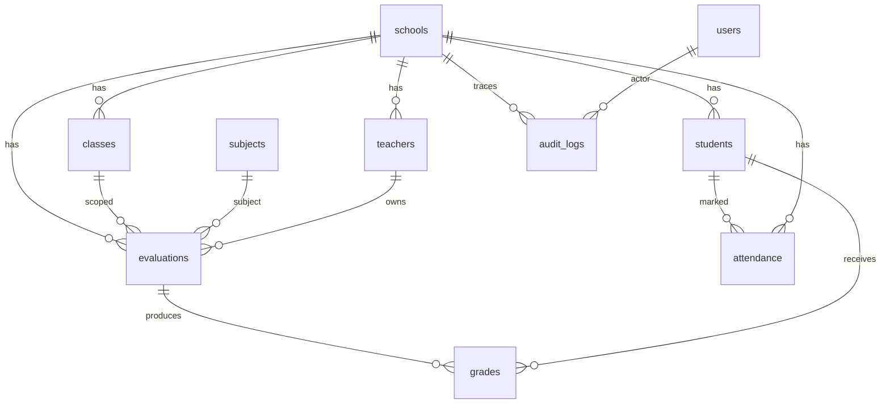

# Base de données — Somafrik

**Statut :** référence schéma & conventions  
**Dernière mise à jour :** 2026-08-13  
**Sources :** `backend/db/schema.sql` · `backend/db/postgresRepository.js` · [ARCHITECTURE.md](./ARCHITECTURE.md)

---

## 1. Principes

1. **PostgreSQL** est obligatoire en préprod/prod (`SOMAFRIK_DB_REQUIRED=true`).
2. Domaines **canoniques PG** : établissements (`schools` + `profile_payload`), notes (`evaluations` / `grades`), présences (`attendance`), classes — le JSON BO n’est plus source de vérité pour ces écritures.
3. Beaucoup de domaines restent encore dans le **snapshot JSON** `backoffice_state` (migration progressive).
4. Pas de dossier `/migrations` versionné classique : le schéma est appliqué via `schema.sql` à l’init, puis des **ensures / migrations runtime** dans le repository.

---

## 2. Application du schéma

Au démarrage (`postgresRepository.init()`) :

1. Exécution de `backend/db/schema.sql` (`CREATE TABLE IF NOT EXISTS`…)
2. Ensures runtime (unicité attendance, contraintes grades, colonnes `schools.profile_payload` / `deleted_at`, etc.)
3. Migrations de données éventuelles (ex. `migrateEvaluationsFromBackOffice`, `migrateNotesFromBackOffice`)

Helper annexe : `backend/scripts/migrate-test-data.js`.

**Convention :** toute nouvelle table/contrainte → mettre à jour `schema.sql` **et** ce document **et** les ensures si nécessaire.

---

## 3. Conventions de nommage

| Élément | Convention |
|---------|------------|
| Tables | `snake_case` pluriel métier (`schools`, `grades`) |
| PK | `id UUID DEFAULT gen_random_uuid()` |
| Codes métier | `*_code` TEXT UNIQUE (school_code, class_code, student_code…) |
| FK | `<entity>_id UUID REFERENCES …` |
| Horodatage | `created_at` / `updated_at` TIMESTAMPTZ |
| Soft legacy | `legacy_json_id` pour pont JSON → PG |
| JSONB | `state_payload`, `old_value` / `new_value` audit |

---

## 4. Tables clés

### 4.1 Socle

| Table | Rôle | Contraintes notables |
|-------|------|----------------------|
| `countries` | Référentiel pays canonique | UNIQUE `iso_code` — pas d’auto-création d’un ISO inconnu (refus `COUNTRY_NOT_FOUND`) |
| `schools` | Établissements (SoT LOT 1) | UNIQUE `school_code` · FK country · `profile_payload` JSONB · `deleted_at` |
| `users` | Comptes | liens école / rôle |
| `academic_years` / `terms` | Calendrier | FK school |
| `subjects` | Matières | FK school |
| `classes` | Classes | UNIQUE `class_code` · FK school + année |
| `teachers` | Enseignants | UNIQUE `teacher_code` · FK school · `user_id` optionnel |
| `students` | Élèves | UNIQUE `student_code` · FK school |
| `enrollments` | Inscriptions | liens élève / classe / année |
| `assignments` | Affectations enseignant | classe / matière / enseignant |

### 4.2 Notes (canonique PG)

| Table | Rôle | Contraintes notables |
|-------|------|----------------------|
| `evaluations` | Devoirs / contrôles | FK school, class, subject, term, teacher? · UNIQUE `(school_id, legacy_json_id)` · CHECK status |
| `grades` | Notes élève | FK evaluation, student, … · CHECK score · UNIQUE school+eval+student (ensure runtime après dédup) |

### 4.3 Présences (canonique PG)

| Table | Rôle | Contraintes notables |
|-------|------|----------------------|
| `attendance` | Appel du jour | UNIQUE `(school_id, student_id, attendance_date)` |

### 4.4 Audit & état

| Table | Rôle | Contraintes notables |
|-------|------|----------------------|
| `audit_logs` | Journal serveur | FK school/user · JSONB old/new |
| `backoffice_state` | Snapshot JSON BO | PK `state_key` · `state_payload` JSONB |
| `sessions` | Refresh sessions | hash refresh token |

Autres domaines (paiements, examens, documents…) : voir `schema.sql` — souvent encore synchronisés via snapshot JSON.

---

## 5. Relations (vue simplifiée)

---

## 6. Index & unicité (critiques)

| Objet | Pourquoi |
|-------|----------|
| UNIQUE `schools.school_code` | Identifiant établissement |
| UNIQUE class/teacher/student codes | Identifiants métier |
| UNIQUE attendance (school, student, date) | Un appel / élève / jour (D3.5b) |
| UNIQUE grades (school, evaluation, student) | Une note / élève / évaluation (D3.6b) |
| UNIQUE evaluations (school, legacy_json_id) | Pont anti-doublon JSON→PG |
| Index FK usuels | Jointures sync / lectures scoped |

Les index uniques « post-dédup » peuvent être créés en runtime après nettoyage (voir repository).

---

## 7. JSON snapshot vs PG

| Domaine | Source de vérité actuelle |
|---------|--------------------------|
| Notes / évaluations | **PG** (+ syncAck) |
| Présences | **PG** |
| Classes / students | **PG** ; projections `state.classes` / `state.students` strictement read-only |
| Teachers (CRUD BO) | Snapshot JSON via `PUT /backoffice/state` (migration LOT 3) |
| Finance, messages, config… | Majoritairement JSON BO |
| Audit | **PG** `audit_logs` |

Lorsqu’un domaine bascule en PG canonique : contrat DS + entrée CHANGELOG + mise à jour de ce fichier.

---

## 8. Migrations — bonnes pratiques

1. Ajouter / ajuster dans `schema.sql` de façon **idempotente** (`IF NOT EXISTS`)
2. Prévoir un ensure runtime si l’ordre (dédup → index) compte
3. Tester avec `SOMAFRIK_BOOTSTRAP_REQUIRED` / `verify:runtime-bootstrap`
4. Jamais de migration destructive en prod sans backup ([OPERATIONS.md](./OPERATIONS.md))
5. Documenter le pont `legacy_json_id` si données historiques

---

## 9. Accès & sécurité données

- L’API applique le **tenant scope** (école / pays) en lecture comme en écriture
- Pas d’accès DB direct depuis le navigateur
- Credentials uniquement via env (`DATABASE_URL`)
- Préprod : `SOMAFRIK_SKIP_DEMO_SEED=true`

---

## 10. Checklist auteur PR (DB)

- [ ] `schema.sql` à jour
- [ ] Ensures / tests de contrainte si unicité
- [ ] Ce document mis à jour
- [ ] `verify:runtime-bootstrap` ou test domaine concerné
- [ ] Plan de rollback / backup évoqué si migration sensible
