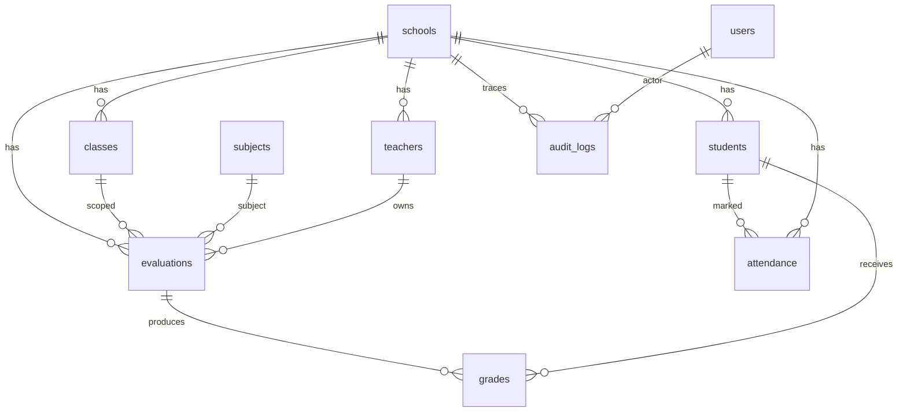

# Base de données — Somafrik

**Statut :** référence schéma & conventions  
**Dernière mise à jour :** 2026-08-14  
**Sources :** `backend/db/schema.sql` · `backend/db/postgresRepository.js` · [ARCHITECTURE.md](./ARCHITECTURE.md)

---

## 1. Principes

1. **PostgreSQL** est obligatoire en préprod/prod (`SOMAFRIK_DB_REQUIRED=true`).
2. Domaines **canoniques PG** : établissements (`schools` + `profile_payload`), **référentiels pédagogiques** (`education_levels`, `education_streams`, `school_levels`, `school_streams`), **rôles établissement** (`establishment_roles` + permissions), **types d’évaluation** (`evaluation_types`), **paramètres établissement** (`school_settings` + `terms`), notes (`evaluations` / `grades`), présences (`attendance`), classes, élèves, enseignants/affectations, **Finance** (paiements, grilles, obligations, reminders), **examens/bulletins/documents**, **lockout** (`login_lockouts`) — le JSON BO n’est plus source de vérité pour ces écritures.
3. Beaucoup de domaines restent encore dans le **snapshot JSON** `backoffice_state` (migration progressive).
4. Pas de dossier `/migrations` versionné classique : le schéma est appliqué via `schema.sql` à l’init, puis des **ensures / migrations runtime** dans le repository.

---

## 2. Application du schéma

Au démarrage (`postgresRepository.init()`) :

1. Exécution de `backend/db/schema.sql` (`CREATE TABLE IF NOT EXISTS`…)
2. Ensures runtime (unicité attendance, contraintes grades, colonnes `schools.profile_payload` / `deleted_at`, etc.)
3. Migrations de données éventuelles (ex. `migrateEvaluationsFromBackOffice`, `migrateNotesFromBackOffice`)

Helper annexe : `backend/scripts/migrate-test-data.js`.

**Convention :** toute nouvelle table/contrainte → mettre à jour `schema.sql` **et** ce document **et** les ensures si nécessaire.

---

## 3. Conventions de nommage

| Élément | Convention |
|---------|------------|
| Tables | `snake_case` pluriel métier (`schools`, `grades`) |
| PK | `id UUID DEFAULT gen_random_uuid()` |
| Codes métier | `*_code` TEXT UNIQUE (school_code, class_code, student_code…) |
| FK | `<entity>_id UUID REFERENCES …` |
| Horodatage | `created_at` / `updated_at` TIMESTAMPTZ |
| Soft legacy | `legacy_json_id` pour pont JSON → PG |
| JSONB | `state_payload`, `old_value` / `new_value` audit |

---

## 4. Tables clés

### 4.1 Socle

| Table | Rôle | Contraintes notables |
|-------|------|----------------------|
| `countries` | Référentiel pays canonique | UNIQUE `iso_code` — pas d’auto-création d’un ISO inconnu (refus `COUNTRY_NOT_FOUND`) |
| `schools` | Établissements (SoT LOT 1) | UNIQUE `school_code` · FK country · `profile_payload` JSONB · `deleted_at` |
| `users` | Comptes / identité | `role` nullable (dénormalisation du rôle primaire) · `user_code` UNIQUE généré backend |
| `user_roles` | Rôles actifs / révoqués | UNIQUE partiel actif `(user_id, school_id, role_key)` et plateforme `(user_id, role_key)` |
| `user_code_counters` | Séquence atomique `USR-{année}-{n}` | PK `year` + advisory lock |
| `academic_years` / `terms` | Calendrier | FK school |
| `subjects` | Matières | FK school |
| `classes` | Classes | UNIQUE `class_code` · FK school + année |
| `teachers` | Enseignants | UNIQUE `teacher_code` · FK school · `user_id` optionnel |
| `students` | Élèves | UNIQUE `student_code` · FK school |
| `enrollments` | Inscriptions | liens élève / classe / année |
| `assignments` | Affectations enseignant | classe / matière / enseignant |

### 4.1bis Identité ≠ rôle ≠ profil métier ≠ relation

```text
IDENTITÉ UTILISATEUR (users)
        ↓
PROFILS / RELATIONS MÉTIER (teachers, contacts, contact_relations)
        ↓
RÔLES ET PERMISSIONS (user_roles → RBAC PostgreSQL)
```

- Un compte peut exister **sans rôle** (`users.role` NULL, aucune ligne `user_roles` active) : état UI `Sans affectation`.
- `user_code` et `users.id` sont générés côté PostgreSQL/backend. Le client ne peut pas les fournir.
- GRANT / REVOKE sont des opérations explicites (`POST /api/backoffice/users/:id/roles/grant|revoke`). Pas de remplacement d’un JSON `roles`.
- `PARENT` et `STUDENT` ne sont pas attribuables depuis Attribuer (`school_assignable = FALSE`). L’accès parent vient de `contact_relations` ; un enseignant parent réutilise le même `users.id`.
- La hiérarchie d’affichage des rôles est **uniquement UI**. Les permissions restent l’union RBAC des `role_key` actifs.
- Migration : `backend/db/migrations/20260820_user_roles_canonical.sql` + boot `ensureUserRolesCanonicalSchema()` (inventaire fail-closed `USER_ROLES_MIGRATION_AMBIGUOUS`).

### 4.2 Référentiels pédagogiques (canonique PG — LOT 1 Paramètres)

| Table | Rôle | Contraintes notables |
|-------|------|----------------------|
| `education_levels` | Niveaux scolaires par pays | FK `country_id` · UNIQUE `(country_id, level_code)` · `status` active/archived |
| `education_streams` | Filières / séries / options par pays | FK `country_id` · optionnel `level_id` · `stream_type` filiere/serie/option · UNIQUE `(country_id, stream_code)` |
| `school_levels` | Activation niveau par établissement | PK `(school_id, level_id)` · FK school + level · cross-country interdit |
| `school_streams` | Activation filière par établissement | PK `(school_id, stream_id)` · FK school + stream · cross-country interdit |

`PUT /api/academic-config` refuse `levels` et `tracks` ; lecture `GET /api/academic-config` projette `levels`/`tracks` depuis ces tables (noms actifs pour l'établissement).

**Boot (ordre obligatoire)** : preflight (`countries`, `schools`) → inventaire legacy `school_academic_configs` (échec `LEGACY_ACADEMIC_REFERENCE_AMBIGUOUS` si valeurs non vides) → création tables canoniques → strip JSON `levels`/`tracks` uniquement après inventaire propre.

### 4.2bis Rôles généraux d'établissement (canonique PG — LOT 2 Paramètres)

| Table | Rôle | Contraintes notables |
|-------|------|----------------------|
| `establishment_roles` | Catalogue rôles internes (Secrétaire, Préfet, …) | UNIQUE `role_code`, `role_name` · `scope` school/platform/country · `school_assignable` |
| `establishment_role_permissions` | Matrice permissions par rôle | PK `(role_id, permission)` · FK cascade |
| `establishment_role_delegation_permissions` | Plafond de délégation Admin School | PK `(role_id, permission)` · FK cascade |

`PUT /api/academic-config` refuse `userRoles` ; `GET /api/academic-config` projette `userRoles` depuis le catalogue assignable. JWT : `getRolePermissionsMap()` fusionne `role_permissions` (plateforme) + matrice établissement.

**Boot** : preflight → inventaire legacy `userRoles` JSON (`LEGACY_ESTABLISHMENT_ROLES_AMBIGUOUS`) → schéma → strip `userRoles` → bootstrap seed si vide.

### 4.2ter Types d’évaluation (canonique PG — LOT 3 Paramètres)

| Table | Rôle | Contraintes notables |
|-------|------|----------------------|
| `evaluation_types` | Catalogue des types (Devoir, Interrogation, …) **par établissement** | FK `school_id` · UNIQUE `(school_id, code)` · unique `(school_id, lower(btrim(name)))` · `status` active/archived |

`evaluations.evaluation_type_id` = **source de vérité** (FK). `evaluations.evaluation_type` TEXT = projection / compatibilité uniquement.

`PUT /api/academic-config` refuse `evaluationTypes` (`LEGACY_EVALUATION_TYPES_WRITE_FORBIDDEN`) ; `GET /api/academic-config` projette les **noms actifs** depuis PostgreSQL. Jamais le JSON historique.

**Boot (ordre obligatoire)** : preflight (`schools`, `evaluations`) → inventaire legacy `config_payload.evaluationTypes` → STOP `LEGACY_EVALUATION_TYPES_AMBIGUOUS` si le catalogue n’est pas **exactement** équivalent aux 8 types défaut (sous-ensemble, sur-ensemble ou combinaison différente) → schéma canonique → strip JSON → bootstrap contrôlé (seed défauts si l’établissement n’a aucune ligne). `absent` / `null` / `[]` autorisent le bootstrap. Nouvelle évaluation avec principal : type canonique explicite obligatoire, sinon `400 EVALUATION_TYPE_REQUIRED` (aucun fallback `"Devoir"`).

Migration SQL : `backend/db/migrations/20260817_evaluation_types_canonical.sql`.

### 4.2quater Paramètres établissement (canonique PG — LOT 4 Paramètres)

| Table | Rôle | Contraintes notables |
|-------|------|----------------------|
| `school_settings` | Scalaires établissement : `period_mode`, `default_scale`, `report_card_mode` | PK `school_id` FK `schools` · CHECK modes / barème `> 0` et `<= 100` |
| `terms` | Périodes académiques (année ouverte) | UNIQUE `(academic_year_id, name)` — **pas** de seconde table `periods` |

`default_scale` = préremplissage UI uniquement. `evaluations.max_score` reste la valeur d’instance.

`PUT /api/academic-config` refuse `periods`, `periodMode`, `classNames`, `subjects`, `subjectsByClass`, `defaultScale`, `reportCardMode`, `schoolYear`, `academicYear`, `allowCustom*`, `bulletinDesignByClass`, `defaultGradeScale`. `GET /api/academic-config` projette depuis PostgreSQL.

**Boot (ordre obligatoire)** : preflight (`schools`, `academic_years`, `terms`) → inventaire JSON + **capture des scalaires B validés** (`periodMode`, `defaultScale`/`defaultGradeScale`, `reportCardMode`) → STOP `LEGACY_SCHOOL_SETTINGS_AMBIGUOUS` (ou codes spécialisés périodes/classes/matières) si non exactement équivalent → schéma `school_settings` (table + trigger `AFTER INSERT ON schools` + backfill) → bootstrap/matérialisation **depuis les valeurs capturées** (jamais relire le JSON) → vérification PostgreSQL = capturé → **puis** strip JSON.

Un `INSERT` ultérieur dans `schools` crée transactionnellement la ligne `school_settings` (défauts SQL). `GET /api/school-settings` et `projectAcademicConfig()` matérialisent la ligne en PostgreSQL si elle manque ; ils ne synthétisent plus `trimestre` / `20` / `period` en mémoire.

Migration SQL : `backend/db/migrations/20260818_school_settings_canonical.sql`.

### 4.2quinquies Examens, bulletins et documents (canonique PG — LOT 5)

| Table | Rôle | Contraintes notables |
|-------|------|----------------------|
| `exams` | Instances d'examen (réutilise la table V2, pas de 3e SoT) | FK `school_id`, `class_id`, `subject_id`, `term_id`, `academic_year_id`, `evaluation_type_id` ; CHECK status `draft\|scheduled\|validated\|completed\|cancelled\|archived` |
| `exam_results` | Scores par élève | UNIQUE `(exam_id, student_id)` |
| `report_cards` | Publication de bulletin (pas de copie des notes) | UNIQUE `(school_id, student_id, academic_year_id, term_id)` ; moyenne **calculée** depuis `grades` à la lecture |
| `report_card_templates` | Layout de rendu uniquement | JSONB `layout` allowlist ; unique actif école/classe/type |
| `school_documents` | Métadonnées documents établissement | pas de binaire PG ; `student_documents` reste le dossier élève V2 |

`PUT /api/backoffice/planning-exams` / `report-cards` / `establishment-documents` → `400 LEGACY_*_WRITE_FORBIDDEN`. GET = projection relationnelle.

`GET /api/students/:id/report.pdf` applique le layout depuis `report_card_templates` (classe puis défaut établissement). `academicConfigs.bulletinDesignByClass` n'est plus lu.

**Boot (ordre obligatoire)** : preflight read-only → inventaire residual exam/bulletin/document → inventaire des `exams.status` → STOP `LEGACY_*_AMBIGUOUS` / `LEGACY_EXAM_STATUS_AMBIGUOUS` si ambigu → **ensuite** DDL (`DOCUMENTS_EXAMS_SCHEMA_DDL_SQL`) → normalisation déterministe uniquement (`published` → `completed`, backfill `academic_year_id` depuis `terms`) → CHECK status → strip residual. Aucune création heuristique d'examen / élève / classe. Aucun statut inconnu → `scheduled`.

Migration SQL : `backend/db/migrations/20260819_exams_report_cards_documents_canonical.sql`.

### 4.2sexies Export établissement + lockout login (LOT 6)

| Table | Rôle | Contraintes notables |
|-------|------|----------------------|
| `login_lockouts` | SoT du lockout de connexion | UNIQUE `(school_scope, identifier_normalized)` · `school_id` nullable (plateforme = `school_scope='*'`) · compteur atomique `INSERT … ON CONFLICT DO UPDATE` |

Clé : `school_scope` = code établissement UPPER, ou `*` pour un compte plateforme. Identifiant = trim + lower (email, téléphone, `user_code`, identifiant enseignant). Politique : 5 échecs → `locked_until` + 15 min. Succès → `DELETE`. Expiration → reset lazy. Pas de Map processus lorsque le moteur PostgreSQL est actif.

Export : `GET /api/data-export` (enveloppe `format=somafrik-export`, `version=1`, `includedDomains` = domaines réellement lus). **Snapshot consistency = PostgreSQL `REPEATABLE READ`** : toutes les lectures (existence établissement + domaines) s’exécutent dans une transaction `READ ONLY ISOLATION LEVEL REPEATABLE READ` sur une seule connexion ; l’écriture d’audit `export_school_data` a lieu **après** le COMMIT du snapshot (fail-closed si l’audit échoue). Pas de `PUT /api/backoffice/state`. Pas de restauration globale. Moteur mémoire : pas de snapshot SQL (processus unique).

Migration SQL : `backend/db/migrations/20260820_login_lockouts_canonical.sql`.

### 4.3 Notes (canonique PG)

| Table | Rôle | Contraintes notables |
|-------|------|----------------------|
| `evaluations` | Devoirs / contrôles | FK school, class, subject, term, teacher? · FK `evaluation_type_id` → `evaluation_types` · UNIQUE `(school_id, legacy_json_id)` · CHECK status · `evaluation_type` TEXT = projection |
| `grades` | Notes élève | FK evaluation, student, … · CHECK score · UNIQUE school+eval+student (ensure runtime après dédup) |

### 4.4 Présences (canonique PG)

| Table | Rôle | Contraintes notables |
|-------|------|----------------------|
| `attendance` | Appel du jour | UNIQUE `(school_id, student_id, attendance_date)` |

### 4.5 Audit & état

| Table | Rôle | Contraintes notables |
|-------|------|----------------------|
| `audit_logs` | Journal serveur | FK school/user · JSONB old/new |
| `backoffice_state` | Snapshot JSON BO | PK `state_key` · `state_payload` JSONB |
| `sessions` | Refresh sessions | hash refresh token |

Autres domaines (examens, documents, messages…) : voir `schema.sql` — souvent encore synchronisés via snapshot JSON.

### 4.6 Finance (canonique PG — LOT 4)

| Table | Rôle | Contraintes notables |
|-------|------|----------------------|
| `payments` | Reçu / encaissement (référence serveur `payment_code`) | UNIQUE `payment_code` · `amount` = total serveur `SUM(payment_items.amount)` · `cancelled_at` / `cancel_reason` / `cancelled_by` (soft cancel) · aucun COPY depuis JSON |
| `payment_items` | Lignes de libellés d’un reçu | FK `payment_id` · `amount > 0` · trigger tenant (`PAYMENT_ITEM_TENANT_MISMATCH` / `FEE_ITEM_TENANT_MISMATCH`) · backfill historique 1:1 (jamais fusion élève+date) |
| `audit_logs` | Effets Finance (`create_payment`, `cancel_payment`) | Même transaction que le paiement / l'annulation ; pas d'audit post-COMMIT |
| `student_fee_obligations` | Dettes élève | UNIQUE active (élève + type + période) · soldes ≥ 0 |
| `payment_allocations` | Ventilation paiement → obligation | FK payment + obligation · réversion `reversed_at` |
| `payment_reminders` | Relances unpaid | cooldown serveur · pas de mutation snapshot |
| `payment_statuses` | Référentiel statuts | UNIQUE (école, `status_code`) |
| `fee_grids` / `school_fee_items` | Grilles et lignes | UNIQUE classe/année/période par établissement |
| `fee_tariff_history` | Historique d'application | traçabilité d'activation / apply |

Aucun script ne recopie les anciennes données Finance de `backoffice_state` vers ces tables. V2 repart propre ; un seed de démonstration contrôlé reste possible.

### 4.6 Pédagogie (canonique PG — LOT 5)

| Table | Rôle | Contraintes notables |
|-------|------|----------------------|
| `school_courses` | Matières / cours par classe | UNIQUE `(school_id, course_code)` · UNIQUE actif `(school_id, class_id, subject_id)` |
| `course_schedule_slots` | Emplois du temps | contrainte horaire `ends_at > starts_at` · détection conflits serveur |
| `evaluations` / `grades` / `attendance` | Évaluations, notes, présences | tables existantes ; écritures via APIs dédiées uniquement |

Migration : `backend/db/migrations/20260813_pedagogy_canonical.sql` (idempotente, sans COPY ni backfill JSON).

Clés PUT `/api/backoffice/state` interdites : `courses`, `courseSchedules`, `evaluations`, `notes`, `presences` → `LEGACY_PEDAGOGY_STATE_WRITE_FORBIDDEN`.

### 4.7 Plateforme (canonique PG — LOT 6)

| Table | Rôle | Contraintes notables |
|-------|------|----------------------|
| `countries` | Référentiel pays (SoT) | UNIQUE `iso_code` · `profile_payload` (politique abonnement, fuseau) |
| `subscriptions` | Abonnement établissement | FK `school_id` · `profile_payload` (offre, cycle, accès) |
| `subscription_offers` | Offres commerciales | `offer_code` · pays cibles JSONB |
| `subscription_payments` / `subscription_invoices` / `subscription_discounts` | Collections abonnement | FK établissement · audit dédié `subscription_audit_log` |
| `notifications` | Notifications plateforme | FK école optionnelle · statut lu/archivé |
| `role_permissions` | Matrice RBAC | UNIQUE `role_name` · permissions JSONB |
| `dashboard_chart_config` | Overrides graphiques | clé `scope_key` (`platform` / `establishment`) |

Migration : `backend/db/migrations/20260813_platform_canonical.sql` (idempotente, sans backfill JSON).

APIs : `/api/backoffice/countries`, `/subscriptions`, `/notifications`, `/role-permissions`, `/dashboard-chart-config`, `/subscription-offers`, `/subscription-payments`, `/subscription-discounts`.

Clés PUT `/api/backoffice/state` interdites : `countries`, `subscriptions`, `subscriptionOffers`, `subscriptionPayments`, `subscriptionInvoices`, `subscriptionDiscounts`, `subscriptionAuditLog`, `notifications`, `rolePermissions`, `dashboardChartConfig` → `LEGACY_PLATFORM_STATE_WRITE_FORBIDDEN`.

### 4.8 Clients / comptes (canonique PG — LOT 7)

| Table | Rôle | Contraintes notables |
|-------|------|----------------------|
| `users` | Comptes applicatifs (réutilisée) | `profile_payload` · `must_change_password` · aucun secret en projection |
| `contacts` | Carnet CRM établissement | FK `school_id` / `country_id` · UNIQUE téléphone/email par école |
| `contact_relations` | Liens parent → élève | FK `contact_id` → `contacts`, `student_id` → `students` · UNIQUE `(school_id, contact_id, student_id)` |
| `school_conversations` / `school_conversation_participants` | Fil de messagerie | participants par `user_id` |
| `school_messages` / `school_message_reads` | Messages et accusés de lecture | expéditeur = `sender_user_id` (principal serveur) |
| `announcements` | Annonces (réutilisée) | `profile_payload` ciblage rôle/classe · FK pays |

Migration : `backend/db/migrations/20260814_clients_canonical.sql` (idempotente, sans backfill JSON).

APIs : `/api/backoffice/users`, `/contacts`, `/contacts/:id/provision-account`, `/relations`, `/messages`, `/messages/:id/read`, `/announcements`.

Clés PUT `/api/backoffice/state` interdites : `users`, `contacts`, `relations`, `messages`, `announcements` → `LEGACY_CLIENTS_STATE_WRITE_FORBIDDEN`.

---

## 5. Relations (vue simplifiée)



---

## 6. Index & unicité (critiques)

| Objet | Pourquoi |
|-------|----------|
| UNIQUE `schools.school_code` | Identifiant établissement |
| UNIQUE class/teacher/student codes | Identifiants métier |
| UNIQUE attendance (school, student, date) | Un appel / élève / jour (D3.5b) |
| UNIQUE `payments.payment_code` | Référence comptable serveur, anti-doublon |
| UNIQUE obligations actives (école, élève, type, période) | Pas d'obligation en double sous concurrence |
| UNIQUE fee_grids (école, classe, année, période) | Une grille naturelle par tenant |
| UNIQUE grades (school, evaluation, student) | Une note / élève / évaluation (D3.6b) |
| UNIQUE evaluations (school, legacy_json_id) | Pont anti-doublon JSON→PG |
| Index FK usuels | Jointures sync / lectures scoped |

Les index uniques « post-dédup » peuvent être créés en runtime après nettoyage (voir repository).

---

## 7. JSON snapshot vs PG

| Domaine | Source de vérité actuelle |
|---------|--------------------------|
| Notes / évaluations | **PG** (+ syncAck) |
| Présences | **PG** |
| Classes / students | **PG** ; projections `state.classes` / `state.students` strictement read-only |
| Teachers / affectations | **PG** (`teachers`, `teacher_assignments`) ; projections `state.teachers` / `state.assignments` strictement read-only |
| Finance | **PG** (`payments`, obligations, allocations, grilles, reminders) ; projections GET `state` read-only, jamais fusionnées avec l'ancien JSON ; PUT Finance **interdit** |
| Plateforme | **PG** (`countries`, `subscriptions`, collections abonnement, `notifications`, `role_permissions`, `dashboard_chart_config`) ; projection GET read-only ; PUT plateforme **interdit** |
| Messages, config, contacts… | Majoritairement JSON BO (lots 7–8 bloqués) |
| Audit | **PG** `audit_logs` |

Lorsqu’un domaine bascule en PG canonique : contrat DS + entrée CHANGELOG + mise à jour de ce fichier.

---

## 8. Migrations — bonnes pratiques

1. Ajouter / ajuster dans `schema.sql` de façon **idempotente** (`IF NOT EXISTS`)
2. Prévoir un ensure runtime si l’ordre (dédup → index) compte
3. Tester avec `SOMAFRIK_BOOTSTRAP_REQUIRED` / `verify:runtime-bootstrap`
4. Jamais de migration destructive en prod sans backup ([OPERATIONS.md](./OPERATIONS.md))
5. Documenter le pont `legacy_json_id` si données historiques

---

## 9. Accès & sécurité données

- L’API applique le **tenant scope** (école / pays) en lecture comme en écriture
- Pas d’accès DB direct depuis le navigateur
- Credentials uniquement via env (`DATABASE_URL`)
- Préprod : `SOMAFRIK_SKIP_DEMO_SEED=true`

---

## 10. Checklist auteur PR (DB)

- [ ] `schema.sql` à jour
- [ ] Ensures / tests de contrainte si unicité
- [ ] Ce document mis à jour
- [ ] `verify:runtime-bootstrap` ou test domaine concerné
- [ ] Plan de rollback / backup évoqué si migration sensible
