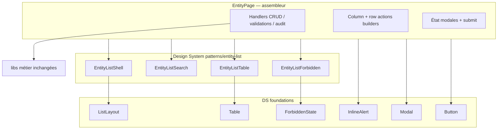

# Architecture cible — D2.7 EntityPage

**Statut :** premier jalon livré (chrome liste)  
**Code briques :** `web/src/design-system/patterns/entity-list/`  
**Orchestrateur :** `web/src/pages/EntityPage.tsx` (API publique inchangée)

---

## 1. Principe

`EntityPage` devient un **assembleur** :

- conserve toute la logique métier (C) et l’adaptation d’entité (D) ;
- délègue le chrome liste à des **patterns DS** réutilisables (A/B) ;
- compose `ListLayout` (P-002) plutôt qu’un `Card` + `SectionHeader` ad hoc.

Aucune règle métier, API, permission ou navigation n’est réécrite.

---

## 2. Architecture cible (vision)

---

## 3. Briques — responsabilités uniques

| Brique | Responsabilité | Hors scope |
|--------|----------------|------------|
| **EntityListShell** | Orientation + header + actions + filters + alerts + content via ListLayout | Filtrage données, permissions |
| **EntityListSearch** | Input recherche accessible | Filtrer les rows |
| **EntityListTable** | Defaults tri + pageSize=25 sur `Table` | Définition colonnes / actions |
| **EntityListForbidden** | Message accès refusé module | Calcul `canRead` |
| **EntityPage** (restant) | Métier, variantes, modales, colonnes | — |

### Briques planifiées (lots suivants)

| Brique future | Contenu | Risque |
|---------------|---------|--------|
| EntityFormDialog | Chrome modale create/edit + field loop générique | Moyen — ne pas emporter validations |
| EntityRowActions | Slot actions ligne générique | Moyen — beaucoup de branches D |
| EntityToolbar | Regroupement print/export | Faible |
| EntityPagination | Si pagination sort de Table | Faible — aujourd’hui dans Table |
| EntityDialogs (payments / teachers / contact) | Shells spécialisés | Élevé — rester proches des handlers |

---

## 4. Intégration Design System (lot actuel)

| Avant | Après |
|-------|-------|
| `Card` + `SectionHeader` | `EntityListShell` → `ListLayout` |
| `Input` search ad hoc | `EntityListSearch` |
| `Table` direct | `EntityListTable` |
| Texte denial dans `Card` | `EntityListForbidden` → `ForbiddenState` |
| Bannières `
` | `InlineAlert` |
| `Button` / `Modal` via `ui/*` | Import `@/design-system` |

Conservé en coexistence (DO-045) : `PrintButton`, `Field`/`Select`/`Input` formulaire, `DatePicker`, `usePrompt`, toasts/confirm via re-exports ui.

---

## 5. Stratégie de coexistence

1. **API `EntityPage` stable** — routes et wrappers inchangés.
2. **Patterns exportés** depuis `@/design-system` pour réutilisation (D3.2b, listes futures).
3. **Pas de fork** par module : tous les consommateurs EntityPage bénéficient du chrome DS immédiatement.
4. **Extraction incrémentale** : une brique UI pure à la fois ; métier reste dans la page jusqu’à lot dédié explicite.
5. **Pas de migration métier D3.x** dans D2.7 — attendre validation CTO avant D3.2b / D3.3.

---

## 6. Mapping slots ListLayout

| Slot ListLayout | Contenu EntityPage |
|-----------------|--------------------|
| (nav Orientation hors slot) | Lien « Retour aux classes » si `classScope` |
| Header | Titre module / classe / relations |
| Description | Description + périmètre école |
| SecondaryActions | Print, Export CSV/Excel, Import CSV |
| PrimaryActions | Saisie rapide, Ajouter contact, Ajouter / Lier |
| Filters | `EntityListSearch` |
| Content | `InlineAlert*` + `EntityListTable` |
| Kpis / Footer | Non utilisés (pas de KPI inventés ; pagination dans Table) |

---

## 7. Critères d’extraction future

Une portion de code ne sort du monolithe **que si** :

1. elle est purement A ou B (ou shell UI sans règle) ;
2. aucun contrat API / permission / payload n’est modifié ;
3. les tests de brique + typecheck passent ;
4. la cartographie d’impact modules est mise à jour dans le rapport.
