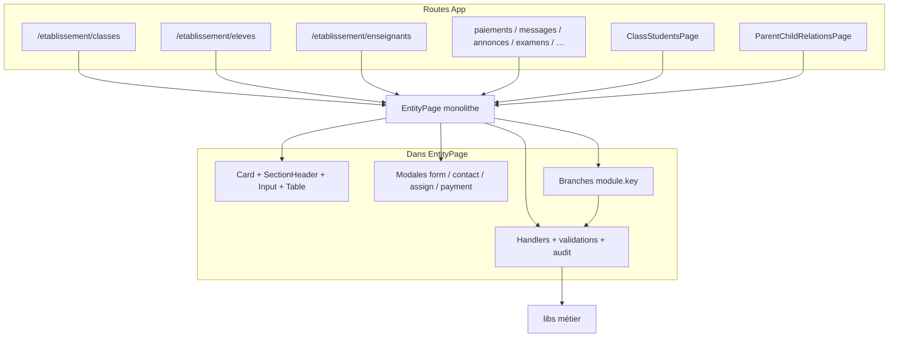

# Audit architectural — D2.7 EntityPage

**Nature :** infrastructure UI (pas une migration métier)  
**Fichier :** `web/src/pages/EntityPage.tsx` (~2600 LOC)  
**Date :** 2026-07-22  
**Déclencheurs :** audits D3.1 (liste Élèves différée) et D3.2 (Classes bloquées sur EntityPage)

---

## 1. Synthèse

`EntityPage` est un shell CRUD générique multi-entités : chrome liste + handlers métier + variantes par clé. Il est devenu la **principale dette UI transversale**. D2.7 le décompose progressivement en briques Design System **sans déplacer la logique métier**.

---

## 2. API publique (conservée)

```ts
function EntityPage({
  entity,           // SchoolEntityKey
  mode?,            // "parentChildRelations"
  classScope?,      // filtre élèves d’une classe
}: EntityPageProps)
```

Wrappers : `ClassStudentsPage`, `ParentChildRelationsPage` ; routes directes dans `App.tsx`.

**Aucune dépréciation d’API dans ce lot.**

---

## 3. Responsabilités actuelles

| Zone (approx.) | Contenu | Classe |
|----------------|---------|--------|
| Setup / scope / permissions | Auth, école, `canRead`… | A + D |
| Option builders select | Levels, tracks, classNames… | C / D |
| Filtrage lignes + search | scoped rows | A + D |
| `persistPatch`, export CSV/Excel | Infra données | A |
| `handleSubmit` / delete / assignments / payments | CRUD métier | C |
| Colonnes + actions ligne | Rendu + branches | B + D |
| Chrome liste (header, search, table) | UI | A / B → **extrait D2.7** |
| Modales (form, contact, assign, payment) | UI + handlers | B + C + D |

**Légende :** A Infrastructure UI · B Présentation · C Logique métier · D Adaptation d’entité

---

## 4. Schéma architecture actuelle (pré-D2.7)



---

## 5. Variantes d’entité (extrait)

| Clé | Branches notables | UI / Métier |
|-----|-------------------|-------------|
| `classes` | effectif, lien Élèves, unicité, delete cascade | Both |
| `students` | classScope, dossier, fees, contacts | Both |
| `teachers` | identifiers, affectations nested, pedagogy | Both |
| `payments` | saisie rapide, reçu, annulation | Both |
| `relations` + mode parentChild | bundle UI | Both |
| `exams` / planningManaged | bannière planning | UI + gates |
| `announcements` / `messages` | scope Super Admin | Métier |
| `contacts` / `courses` / `assignments` | chemins code encore vivants | Both |

---

## 6. Dette technique

1. Monolithe ~2600 LOC, multi-responsabilités.
2. Imports historiques `components/ui` (partiellement re-export DS depuis D2.6).
3. Pas de tests EntityPage avant D2.7.
4. Modales et builders de colonnes encore dans le monolithe.
5. Bloque D3.2b (liste Classes) et accélération des listes cœur.

---

## 7. Points de personnalisation à préserver

- `entity`, `mode`, `classScope`
- Permissions feature par module
- `entityModules` (fields, columns, labels, gates)
- Handlers et validations par clé
- Navigation (liens dossier, élèves de classe, planning, comptes)

---

## 8. Décision D2.7 (premier lot)

Extraire **uniquement** les briques A/B du chrome liste :

- `EntityListShell` → `ListLayout`
- `EntityListSearch`
- `EntityListTable`
- `EntityListForbidden`
- Bannières → `InlineAlert`

**Ne pas déplacer** handlers, validations, builders métier, modales spécialisées.
